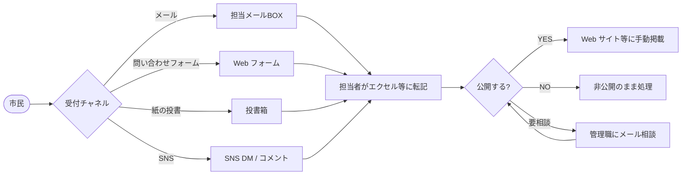

# 現在の業務フロー

「今、どうやって回しているか」を Claude が要件を抽出する素材として記述する。
**理想形ではなく現実** を書く。例外フローや手作業も省略しない。

## 注記：本プロジェクトの位置付け

本アプリは **新規構築**（greenfield）であり、既存システムをリプレースするものではない。
ただし「自治体・コミュニティで現状どうやって市民提案を扱っているか」を背景として整理する。
これは要件抽出の参照点にするためで、特定の組織を対象とした業務改善ではない。

## 主要フロー

### フロー 1: 既存の市民提案受付（典型例）

#### ステップ詳細
1. **受付**: チャネルが分散しており、同じ案件が複数経路で来ることがある。
2. **転記**: 担当者がエクセル / 紙台帳に転記。**判断理由はほぼ書かれない**。
3. **判断**: 担当者または管理職が口頭・メールで判断。記録は残らないことが多い。
4. **公開**: Web 公開する場合は別の Web 担当者が手動掲載。
5. **問合せ対応**: 投稿者が「どうなったか」を聞いてきても、即答できないことが多い。

#### 例外・エッジケース
- 投稿者の連絡先が無く、追加質問できない → 一方的に却下になる。
- センシティブ相談が公開フォームから来ると、転記時点で関係者間に拡散してしまう。
- 同じ投稿者から大量の投稿が来た場合、レート制限の手段がない。
- 担当者退職時、判断基準・継続案件の引継ぎが属人化している。

#### 関連 PROB
- PROB-001: 公開前レビュー無しに投稿が公開されてしまうリスク
- PROB-002: 投稿時の個人情報・センシティブ情報の混入
- PROB-003: レビュー判断の理由が記録されず説明責任が果たせない
- PROB-004: 管理者操作の追跡可能性がない
- PROB-006: 投稿者が公開範囲をコントロールできない

## 用語

このファイル内で使う業務用語のうち、`docs/02-requirements/05-glossary.md` に未登録のものを仮置き。

| 用語 | 暫定定義 | 出典 |
| --- | --- | --- |
| 提案 (proposal) | 市民・住民・組織メンバーが投稿する内容（提案・報告・申請・相談を包含） | プロダクトオーナーのプロンプト |
| 公開範囲 (visibility) | 投稿の閲覧範囲。`private` / `internal` / `public` の 3 段階 | プロダクトオーナーのプロンプト |
| レビュアー (reviewer) | 投稿内容を確認して承認・差し戻し・却下を行うロール | プロダクトオーナーのプロンプト |
| 監査担当 (auditor) | 監査ログのみ閲覧可能なロール。書き込み・編集は不可 | プロダクトオーナーのプロンプト |
| 監査ログ (audit log) | 結果を変える操作を append-only で記録するログ | プロダクトオーナーのプロンプト |

## 参照

- 上流: 一次インタビュー、業務観察、既存ドキュメント
- 下流: `docs/01-requirement-refinement/04-requirement-classification.md` でフロー単位の RC を整理
