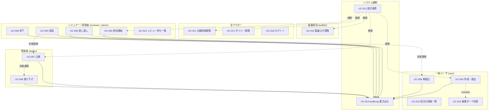
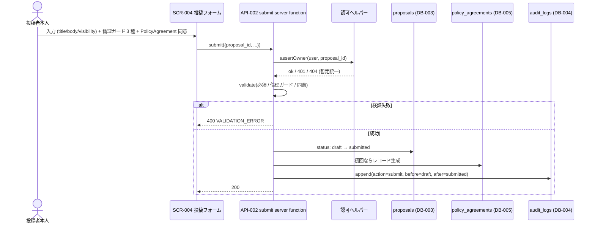
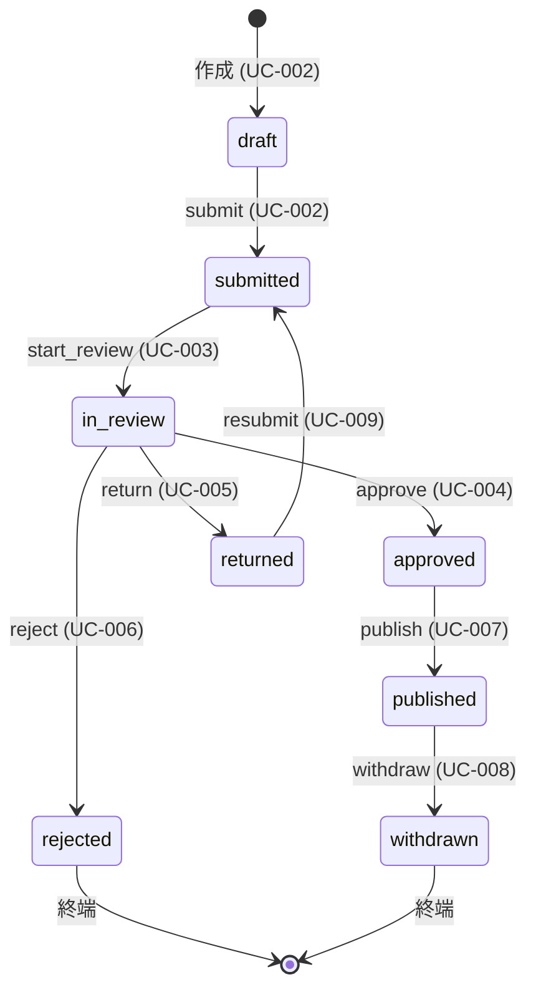

# システム全体像

> 注記: 本ドキュメントは Phase 3 (Basic Design) の起点。Phase 2 で起票された REQ-002〜REQ-015 (status=candidate) と NFR-002〜NFR-007 (status=candidate) を入力とする。
> 既存サンプル (UC-001 / SCR-001 / API-001 / DB-001 / DB-002 / NFR-001 / REQ-001) は AMB-001 で人間判断待ちのため温存し、本プロジェクト固有の新規 ID は UC-002 / SCR-002 / API-002 / DB-003 から採番する。

## 目的

一般市民の提案・報告・申請を、**公開前レビュー** と **AuditLog による説明責任** を備えた経路で受け止めるための、ロール分離された Web アプリケーションの基本設計を定義する。

主要価値：

- 公開前レビュー必須化による個人情報・誹謗中傷投稿の構造的抑止 (GOAL-01)
- 結果を変える **5 種・8 操作（visibility 変更は RC-005 needs-clarification のため MVP 対象外）** の append-only 監査記録による説明責任の担保 (GOAL-02)
- 5 ロールを server function 側で強制する設計の確立 (GOAL-03)
- 投稿者による公開範囲の自己決定 (GOAL-04)
- TanStack Start + Cloudflare Workers + shadcn/ui + Tailwind v4 の学習 (GOAL-05, GOAL-06)

## スコープ

| 区分 | 内容 |
| --- | --- |
| スコープ内 (MVP) | 投稿の作成・提出・倫理ガード (REQ-002, REQ-013) / 公開前レビュー (REQ-003) / 公開と公開範囲適用 (REQ-004, REQ-008) / 取り下げ (REQ-005) / 再提出 (REQ-006) / 自分の投稿一覧 (REQ-007) / レビュー待ち一覧 (REQ-009) / 5 ロール権限分離 (REQ-010) / AuditLog 書き込み・閲覧 (REQ-011, REQ-012) / ポリシー公開ページ (REQ-014) / モック認証 (REQ-015) / Workers 互換 (NFR-002) / 認可境界 (NFR-003) / AuditLog append-only (NFR-004) / ログ PII 除外 (NFR-005) / セキュリティ最低線 (NFR-006) / 可観測性 (NFR-007) |
| スコープ外 | 公開範囲の変更（縮小・拡大、RC-005 needs-clarification）/ レビュー所要時間 SLA 数値（RC-021）/ データストア具体選定（RC-024）/ メール通知 / AI 自動承認 / 添付画像 / 通報機能 / 多要素認証 / 多言語 / アカウント削除導線 / 性能 NFR / 可用性 NFR / アクセシビリティ NFR の数値目標化（`docs/00-discovery/06-goals.md` の「横断 NFR の MVP 非ゴール」を参照） |

## 主要アクター

| アクター | ロール | 説明 | 想定権限の概要 |
| --- | --- | --- | --- |
| ゲスト | `guest` | 未ログインのブラウザ閲覧者 | `public` 投稿の閲覧、ポリシーページ閲覧、ログイン画面 |
| 一般ユーザ（投稿者） | `user` | ログイン済の市民投稿者 | 自分の投稿の作成・編集・提出・再提出、自分の投稿閲覧、`public` / `internal` 投稿閲覧 |
| レビュアー | `reviewer` | 投稿の審査担当 | `user` の能力 + `submitted → in_review`、`approve` / `return` / `reject`（判断理由必須） |
| 管理者 | `admin` | 公開・取り下げを含む強権操作の責任者 | `reviewer` の能力 + `publish`、`withdraw`、visibility 変更（RC-005 確定後） |
| 監査担当 | `auditor` | AuditLog 専任の閲覧者 | AuditLog 全件の一覧・フィルタ・詳細閲覧（読み取り専用、Q-009 暫定）。本文は不到達（Q-016 暫定） |

> ロール定義詳細は `docs/02-requirements/02-functional-requirements.md` の REQ-010 と `docs/02-requirements/05-glossary.md` を参照。

## ユースケース一覧 (UC-XXX)

REQ-002〜REQ-015 をカバーするための主要ユースケース 17 件 + 既存サンプル UC-001 を保持。

| ID | アクター | 目的 | 関連 REQ |
| --- | --- | --- | --- |
| UC-001 | 一般ユーザ | ログインしてダッシュボードを開く（既存サンプル、AMB-001 で人間判断待ち） | REQ-001 |
| UC-002 | 一般ユーザ（投稿者本人） | 提案を draft として作成・編集し submitted として提出する | REQ-002, REQ-013 |
| UC-003 | レビュアー / 管理者 | submitted の提案を担当開始（in_review 化）する | REQ-003 |
| UC-004 | レビュアー / 管理者 | in_review の提案を判断理由付きで approved に遷移させる | REQ-003 |
| UC-005 | レビュアー / 管理者 | in_review の提案を判断理由付きで returned に差し戻す | REQ-003 |
| UC-006 | レビュアー / 管理者 | in_review の提案を判断理由付きで rejected に却下する | REQ-003 |
| UC-007 | 管理者 | approved の提案を published に公開する | REQ-004 |
| UC-008 | 管理者 | published の提案を判断理由付きで withdrawn に取り下げる | REQ-005 |
| UC-009 | 一般ユーザ（投稿者本人） | returned の提案を再編集して submitted に再提出する | REQ-006 |
| UC-010 | 一般ユーザ | 自分の投稿一覧と各エントリのステータスを確認する | REQ-007 |
| UC-011 | ゲスト / 一般ユーザ / レビュアー / 管理者 / 監査担当 | published の投稿を visibility に応じて閲覧する | REQ-008 |
| UC-012 | レビュアー / 管理者 | レビュー待ち（submitted / in_review）の投稿を一覧する | REQ-009 |
| UC-013 | システム（全アクター） | 権限のない呼び出しが `401` / `403` / `404` で拒否されることを観測する（5 ロール権限分離の境界 UC） | REQ-010 |
| UC-014 | システム | 結果を変える 5 種・8 操作の成功時に AuditLog エントリを 1 件 append する（システム横断 UC、visibility 変更は RC-005 needs-clarification のため MVP 対象外） | REQ-011 |
| UC-015 | 監査担当 / 管理者 | AuditLog を一覧・フィルタ・詳細閲覧する | REQ-012 |
| UC-016 | 一般ユーザ（投稿者本人） | 投稿フォームで倫理ガード 3 種と PolicyAgreement に同意する（提出 UC のサブフロー） | REQ-013 |
| UC-017 | 全アクター | 投稿ポリシー / プライバシーポリシーをログイン不要で閲覧する | REQ-014 |
| UC-018 | ゲスト | モック認証（cookie + 許可リスト）でログインしてセッションを確立する | REQ-015 |

## ユースケース全体図

> 凡例:
> - **UC-013（認可境界）の対象**: すべての mutation 系 server function（API-002〜API-009、および draft 系の API-022 / API-023）+ 機微取得系 loader 全件（API-011〜API-017、API-021 admin 用 loader）。**公開バイパス対象（API-018 ポリシー文書 / API-019 login / API-010 の guest 経路）は対象外**。
> - **UC-014（AuditLog 書き込み）の対象**: 結果を変える 5 種・8 操作のみ（visibility 変更は RC-005 needs-clarification のため MVP 対象外）。loader（読み取り、API-021 を含む）と draft 系 mutation（API-022 / API-023）と認可拒否時は AuditLog 記録なし（BR-PROPOSAL-01 と整合）。

## ユースケース別の概要

### UC-001: ログインしてダッシュボードを開く

- 既存サンプル（本ハーネス導入時の REQ-001 由来）。AMB-001 で人間判断待ちのため温存。
- 入力: メールアドレス、パスワード
- 主シナリオ: ログイン画面でメール + パスワードを入力 → 認証成功でダッシュボードへ遷移
- 例外シナリオ: 資格情報誤りで同一画面エラー / レート超過で操作不能
- 関連 SCR / API: SCR-001 / API-001
- 参照: REQ-001

> 注記: 本プロジェクト（まちの提案・申請レビューアプリ）のログインは UC-018 / SCR-007 / API-019 を参照。REQ-001 / UC-001 は本ドメインでは非適用（AMB-001）。

### UC-002: 提案を draft として作成・編集し submitted として提出する

- アクター: 一般ユーザ（投稿者本人、`user` ロール）
- 事前条件: ログイン済（cookie + 許可リストで `user` 以上）
- 入力: タイトル / 本文 / visibility (`private` / `internal` / `public`) / 倫理ガード 3 種チェック / PolicyAgreement 同意
- 主シナリオ:
  1. 投稿フォーム (SCR-004) を開く（既存 draft 編集 / 新規作成）
  2. 必須項目を入力し、UC-016（倫理ガード同意）を満たす
  3. 提出 server function (API-002) を呼ぶ
  4. server-side で必須項目・倫理ガード・PolicyAgreement を検証
  5. status を `draft → submitted` に遷移し、UC-014（AuditLog `action=submit`）を実行
- 代替パス:
  - 下書き保存（draft のまま）→ status 遷移なし、AuditLog 記録なし
- 例外パス:
  - 必須項目不足 / 倫理ガード未確認 / PolicyAgreement 未同意 → `400 VALIDATION_ERROR`、status 遷移なし、AuditLog 記録なし
  - 投稿者本人ではない user / reviewer が他人の draft を提出 → `404`（暫定統一、UC-013）
  - 未ログイン → `401`（UC-013）
- 関連 SCR / API: SCR-004, SCR-005, SCR-006 / API-002 (submit), API-022 (createDraft, B-4), API-023 (updateDraft, B-4)
- 参照: REQ-002, REQ-013

### UC-003: 担当開始（submitted → in_review）

- アクター: レビュアー (`reviewer`) または管理者 (`admin`)
- 事前条件: 対象 proposal が `submitted` 状態
- 主シナリオ:
  1. レビュー待ち一覧 (SCR-008 / UC-012) から対象を選択
  2. レビュー詳細 (SCR-009) で「担当開始」を実行
  3. start_review server function (API-003) を呼び reason を添える
  4. 楽観ロックで status を `submitted → in_review` に遷移、UC-014 で AuditLog `action=start_review` append
- 例外パス:
  - 同時担当化の競合 → `409 CONFLICT`（楽観ロック失敗側）
  - 未ログイン `401` / user / auditor → `404`（暫定統一、UC-013）
- 関連 SCR / API: SCR-009 / API-003
- 参照: REQ-003

### UC-004: 承認（in_review → approved）

- アクター: レビュアー / 管理者
- 主シナリオ:
  1. レビュー詳細 (SCR-009) で「承認」を選択し reason を入力
  2. approve server function (API-004) を呼ぶ
  3. status を `in_review → approved` に遷移、UC-014 で AuditLog `action=approve` append
- 例外パス:
  - reason 空 → `400 VALIDATION_ERROR`、status 遷移なし、AuditLog 記録なし
  - 未ログイン `401` / 権限不足 `404`（暫定統一、UC-013）
- 関連 SCR / API: SCR-009 / API-004
- 参照: REQ-003

### UC-005: 差し戻し（in_review → returned）

- アクター: レビュアー / 管理者
- 主シナリオ:
  1. レビュー詳細 (SCR-009) で「差し戻し」を選択し reason を入力
  2. return server function (API-005) を呼ぶ
  3. status を `in_review → returned` に遷移、UC-014 で AuditLog `action=return` append
  4. 投稿者本人は SCR-006 で reason を確認し、UC-009 で再提出可
- 例外パス: reason 空 → `400 VALIDATION_ERROR` / 未ログイン `401` / 権限不足 `404`（暫定統一）
- 関連 SCR / API: SCR-009 / API-005
- 参照: REQ-003

### UC-006: 却下（in_review → rejected）

- アクター: レビュアー / 管理者
- 主シナリオ:
  1. レビュー詳細 (SCR-009) で「却下」を選択し reason を入力
  2. reject server function (API-006) を呼ぶ
  3. status を `in_review → rejected` に遷移、UC-014 で AuditLog `action=reject` append
  4. rejected は終端ステータス（再提出不可）
- 例外パス: reason 空 → `400 VALIDATION_ERROR` / 未ログイン `401` / 権限不足 `404`（暫定統一）
- 関連 SCR / API: SCR-009 / API-006
- 参照: REQ-003

### UC-007: 公開（approved → published）

- アクター: 管理者 (`admin` 専権)
- 事前条件: 対象 proposal が `approved` 状態
- 主シナリオ:
  1. 公開操作画面 (SCR-013) で対象を選択
  2. publish server function (API-007) を呼ぶ
  3. status を `approved → published` に遷移、UC-014 で AuditLog `action=publish` append
- 例外パス:
  - reviewer による呼び出し → `404`（暫定統一、BR-PUBLISH-01、admin 専権）
  - 未ログイン `401` / user / auditor → `404`（暫定統一）
- 関連 SCR / API: SCR-013 / API-007 (publish), API-021 (getProposalForAdmin, B-1: 公開前の本文・履歴確認)
- 参照: REQ-004

### UC-008: 取り下げ（published → withdrawn）

- アクター: 管理者 (`admin` 専権)
- 事前条件: 対象 proposal が `published` 状態
- 主シナリオ:
  1. 公開操作画面 (SCR-013) で対象を選択し reason を入力
  2. withdraw server function (API-008) を呼ぶ
  3. status を `published → withdrawn` に遷移、UC-014 で AuditLog `action=withdraw` append
  4. withdrawn 後、本文は一般閲覧経路（API-010 / API-011）および本人経路（API-013）からも `404`（暫定統一）、AuditLog 経路で `(published_at, withdrawn_at)` のペアが観測可能
- 例外パス:
  - reason 空 → `400 VALIDATION_ERROR`
  - approved（未公開）からの取り下げ → `422 BUSINESS_RULE_VIOLATION`（withdrawn は published 経由のみ）
  - admin 以外 → 未ログイン `401` / ログイン済かつ権限不足 `404`（暫定統一）
- 関連 SCR / API: SCR-013 / API-008 (withdraw), API-021 (getProposalForAdmin, B-1: 取り下げ前の本文・公開期間確認)
- 参照: REQ-005

### UC-009: 再提出（returned → submitted）

- アクター: 一般ユーザ（投稿者本人）
- 事前条件: 対象 proposal が `returned` 状態かつ呼び出し元が投稿者本人
- 主シナリオ:
  1. 自分の投稿詳細 (SCR-006) で returned 投稿を開き本文を再編集
  2. resubmit server function (API-009) を呼ぶ
  3. status を `returned → submitted` に遷移（proposal id 不変）、UC-014 で AuditLog `action=resubmit` append
- 暫定方針 (Q-018):
  - 倫理ガード再確認 / PolicyAgreement 再取得は **行わない**（初回同意の継続適用）
- 例外パス:
  - 投稿者本人ではない呼び出し → `404`（暫定統一、リソース存在隠蔽）
  - 未ログイン → `401`
- 関連 SCR / API: SCR-006 / API-009
- 参照: REQ-006

### UC-010: 自分の投稿一覧

- アクター: 一般ユーザ（ログイン済）
- 主シナリオ:
  1. 自分の投稿一覧 (SCR-005) を開く
  2. 自分が起票した投稿 loader (API-012) を呼ぶ
  3. 全 8 ステータスを通じた一覧と最新 status / 最終更新日時を取得
  4. 行をクリックすると自分の投稿詳細 (SCR-006 / API-013) へ遷移
- 例外パス:
  - guest（未ログイン）→ `401`
  - 他ユーザの投稿は server-side フィルタで除外
- 関連 SCR / API: SCR-005, SCR-006 / API-012, API-013
- 参照: REQ-007

### UC-011: 公開済み投稿の閲覧

- アクター: ゲスト / 一般ユーザ / レビュアー / 管理者 / 監査担当
- 主シナリオ:
  1. 公開投稿一覧 (SCR-002) を開く
  2. 一覧 loader (API-010) が viewer ロールと visibility のマトリクス（REQ-008）に従ってフィルタ済の結果を返す
  3. 行をクリックすると詳細 (SCR-003 / API-011) へ遷移
- visibility × viewer マトリクス（REQ-008 と同期）:
  - `private`: 投稿者本人と admin のみ閲覧可（reviewer / auditor は `404`、Q-016 暫定）
  - `internal`: ログイン済の全ユーザが閲覧可
  - `public`: 全員（ログイン不要）
- 例外パス:
  - guest が `private` / `internal` 詳細を呼ぶ → `401`
  - ログイン済の権限不足 → `404`（暫定統一）
- 関連 SCR / API: SCR-002, SCR-003 / API-010, API-011
- 参照: REQ-008

### UC-012: レビュー待ち一覧

- アクター: レビュアー / 管理者
- 主シナリオ:
  1. レビュー待ち一覧 (SCR-008) を開く
  2. 一覧 loader (API-014) が `submitted` / `in_review` の proposal を取得
  3. admin は全 visibility、reviewer は `private` を除外（Q-016 暫定）
  4. 行をクリックするとレビュー詳細 (SCR-009 / API-015) へ遷移
- 例外パス:
  - guest → `401`
  - user / auditor → `404`
- 関連 SCR / API: SCR-008, SCR-009 / API-014, API-015
- 参照: REQ-009

### UC-013: 認可境界（システム横断）

- アクター: システム（全アクター）
- **対象範囲**: **すべての mutation 系 server function（API-002〜API-009）+ 機微取得系 loader 全件（API-011〜API-017、`private` / `internal` / AuditLog を扱うもの）**。公開バイパス対象 API（API-018 / API-019、および API-010 の guest 経路）は本 UC の対象外（公開ページ性質、認証ミドルウェアの入口）。
- 主シナリオ（観測可能な「拒否」イベント）:
  1. 上記対象範囲の server function / loader は単一の認可ヘルパー（`src/server/auth/authorize.ts`）を入口で必ず通過する
  2. 権限を持たない呼び出し元には次のステータスコードを返す（**暫定統一: 未ログイン 401 / 認可違反 404**、リソース存在隠蔽優先）:
     - 未ログイン → `401`
     - ログイン済かつ権限不足 → `404`（Phase 3 / 4 で `403` を選ぶ場合は REQ-008 / REQ-009 / REQ-012 と同期更新）
  3. 拒否時に副作用（status 変更 / AuditLog 追記 / PolicyAgreement 生成）は一切発生しない
  4. 認可ヘルパーは UC-014 の AuditLog 書き込みより前に呼び出される（拒否時は AuditLog エントリは作られない）
  5. logger 側では拒否事由を `403_reason` フィールド（`not_owner` / `insufficient_role` / `not_authenticated` / `not_owner_resource` 等）に必ず記録する（NFR-007 と同期）。HTTP 404 で外部に隠蔽しつつ、内部観測（grep / E2E ログキャプチャ）では事由が判別可能とする二段構造。
- 関連 API（横断的に参照される側、API-019 はログイン入口のため対象外）: API-002, API-003, API-004, API-005, API-006, API-007, API-008, API-009, API-010, API-011, API-012, API-013, API-014, API-015, API-016, API-017, API-021, API-022, API-023
- 参照: REQ-010

### UC-014: AuditLog 書き込み（システム横断）

- アクター: システム（記録する側）
- 主シナリオ:
  1. **結果を変える 5 種・8 操作（visibility 変更は RC-005 needs-clarification のため MVP 対象外）** が成功する。内訳は次のとおり:

     | # | 種別 | 操作 (action) | API | reason | 対応 UC |
     |---|---|---|---|---|---|
     | 1 | submit | `submit` (draft → submitted) | API-002 | 任意 (Q-019 暫定) | UC-002 |
     | 2 | review judgment（4 操作） | `start_review` / `approve` / `return` / `reject` | API-003 / API-004 / API-005 / API-006 | 必須 | UC-003 / UC-004 / UC-005 / UC-006 |
     | 3 | publish | `publish` (approved → published) | API-007 | 任意 (Q-019 暫定) | UC-007 |
     | 4 | withdraw | `withdraw` (published → withdrawn) | API-008 | 必須 | UC-008 |
     | 5 | resubmit | `resubmit` (returned → submitted) | API-009 | 任意 (Q-019 暫定) | UC-009 |

     合計: **5 種・8 操作**。RC-005（visibility 変更）が `needs-clarification` のため、本 MVP の AuditLog `action` には `visibility_shrink` / `visibility_expand` を含めない。Q-010 / RC-005 確定後に種別 6 種・10 操作へ拡張する。
  2. server function は内部で AuditLog repository (DB-004) の `append` メソッドを呼ぶ
  3. エントリは `actor / role / action / target / before / after / reason / timestamp` を持つ
  4. AuditLog は append-only（NFR-004）。update / delete server function は実装しない
- 例外パス:
  - 認可エラー (`401` / `404`、暫定統一) で操作が失敗した場合は AuditLog エントリは生成しない (BR-AUDIT-03)
  - reason 必須操作で reason 空の場合は `400 VALIDATION_ERROR` で操作自体が失敗するため AuditLog 記録なし
- 関連 API（書き込み元、上表のとおり全 8 操作）: API-002, API-003, API-004, API-005, API-006, API-007, API-008, API-009
- 関連 DB: DB-004
- 参照: REQ-011

### UC-015: 監査ログの閲覧

- アクター: 監査担当 / 管理者
- 主シナリオ:
  1. 監査ログ一覧 (SCR-010) を開く
  2. AuditLog 一覧 loader (API-016) が全件を取得（auditor / admin、Q-009 暫定）
  3. フィルタ条件（actor / action / 期間）が指定された場合は server-side で絞り込み
  4. 行をクリックすると AuditLog 詳細 (SCR-011 / API-017) へ遷移
- 例外パス:
  - guest → `401`、user / reviewer → `404`
  - auditor が AuditLog エントリ詳細から `private` 投稿本文 loader を呼ぶ → `404`（Q-016 暫定、本文不到達）
- 関連 SCR / API: SCR-010, SCR-011 / API-016, API-017
- 参照: REQ-012

### UC-016: 倫理ガードと PolicyAgreement 同意（UC-002 のサブフロー）

- アクター: 一般ユーザ（投稿者本人）
- 主シナリオ:
  1. 投稿フォーム (SCR-004) で 3 種チェックボックスを表示:
     - 個人情報を入力しない注意喚起
     - 第三者を誹謗中傷しない注意喚起
     - 公開される可能性があることの明示
  2. visibility (`private` / `internal` / `public`) を選択
  3. PolicyAgreement に同意（PolicyAgreement レコードは UC-002 提出成功時に生成）
  4. PolicyAgreement レコードは `user_id / proposal_id / agreed_at / policy_version` を保持（policy_version 暫定値 `mvp-initial`、Q-008 確定後に再評価）
- 暫定方針:
  - 再提出 (UC-009) 時は再取得しない（Q-018 暫定）
- 関連 SCR / API: SCR-004 / API-002
- 関連 DB: DB-005
- 参照: REQ-013

### UC-017: ポリシー閲覧

- アクター: 全アクター（ゲスト含む）
- 主シナリオ:
  1. ポリシーページ (SCR-012) を開く
  2. ポリシー文書 loader (API-018) を呼ぶ
  3. ロール（guest / user / reviewer / admin / auditor）に関わらず `200` を返す
  4. レスポンスに `policy_version` が含まれ、PolicyAgreement (DB-005) と整合する形式
- 関連 SCR / API: SCR-012 / API-018
- 参照: REQ-014

### UC-018: ログイン（モック認証）

- アクター: ゲスト
- 主シナリオ:
  1. ログイン画面 (SCR-007) を開く
  2. ユーザ識別子（不透明 ID）を入力するか、許可リスト由来の選択肢を選ぶ
  3. ログイン server function (API-019) を呼ぶ
  4. cookie が許可リスト（環境変数）と照合され、合致すれば認証 cookie を発行（`HttpOnly` / `Secure`（本番）/ `SameSite=Lax` 以上、NFR-006）
  5. role が `user` / `reviewer` / `admin` / `auditor` のいずれかとして session に伝播
- 例外パス:
  - 許可リスト外の cookie → `401`、または `guest` として扱う（Phase 3 で確定、暫定: 401 を採用）
  - cookie 未付与 → `guest` として扱う
- ログアウト: SCR-007 のログアウト操作 → API-020 でセッション破棄
- 関連 SCR / API: SCR-007 / API-019, API-020
- 参照: REQ-015

## ステータス遷移図（参考再掲）

## Q-XXX 暫定回答に依拠する設計判断（明示）

本ドキュメントは以下の Q-XXX 暫定回答に依拠している。確定後に再評価が必要：

- **Q-001（モック認証）**: UC-018 / SCR-007 / API-019 / API-020 / DB-006 を「cookie + 許可リスト」の前提で起草
- **Q-007（internal はログインユーザ全員）**: UC-011 の visibility マトリクスに反映
- **Q-009（auditor は AuditLog 全件閲覧可）**: UC-015 / API-016 で全件取得を許可
- **Q-016（auditor 本文不到達）**: UC-011 / UC-015 で `private` 投稿本文の loader が auditor から `404` を返す前提
- **Q-018（再提出時の倫理ガード再取得しない）**: UC-009 で再取得不要
- **Q-019（提出 reason は任意）**: UC-002 / UC-014 で reason 省略可
- **AMB-009（publish は明示操作）**: UC-007 を独立 UC として起票

## 提案された追加要件

本フェーズで設計範囲を確認した結果、要件側に書かれていないが設計上不可欠と判明した項目はない。
強いて挙げるなら以下があるが、いずれも要件側で `Open Questions` または `needs-clarification` として既に追跡されているため、本フェーズでは追加要件として起票しない:

- visibility 変更フロー（RC-005 が `needs-clarification`）
- ログアウト導線（REQ-015 のログイン UI 最小構成 Open Question に内包）
- 公開ヘルスチェック `/healthz`（NFR の MVP 非ゴールと整合し、設計推奨に留める）

## 参照

- 上流: `docs/02-requirements/01-requirements.md` の REQ-002〜REQ-015、`docs/02-requirements/03-non-functional-requirements.md` の NFR-002〜NFR-007、`docs/00-discovery/06-goals.md` の GOAL-01〜06、`docs/00-discovery/07-open-questions.md` の Q-001 / Q-007 / Q-009 / Q-016 / Q-018 / Q-019
- 下流: `docs/10-basic-design/02-architecture.md` (BD-ARCH)、`docs/10-basic-design/03-screen-list.md` (BD-SCREENS)、`docs/10-basic-design/04-api-list.md` (BD-APIS)、`docs/10-basic-design/05-data-model.md` (BD-DATA)、`docs/10-basic-design/06-non-functional.md` (BD-NFR)
