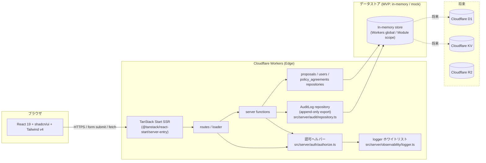

# アーキテクチャ

本ドキュメントは Phase 3 の中核である技術選定とランタイム前提を定義する。
GOAL-05（TanStack Start + Cloudflare Workers + shadcn/ui + Tailwind v4 のフルスタック構成の学習）と GOAL-06（loader / server function / mutation の責務分離、認可集中化、AuditLog 記録パターンの再利用可能化）に直接対応する。

## 構成図



## ランタイム前提

| 項目 | 値 |
| --- | --- |
| OS / ランタイム | Cloudflare Workers (V8 isolate, Edge SSR) |
| 言語 / バージョン | TypeScript 5.x（`strict: true` / `noUncheckedIndexedAccess: true` 推奨） |
| フレームワーク | TanStack Start (React 19) |
| ビルドツール | Vite + `@cloudflare/vite-plugin` |
| UI / スタイル | shadcn/ui + Tailwind CSS v4 |
| データストア (MVP) | In-memory / モック実装。`Repository` インターフェイス経由で抽象化（Q-005 確定後に D1 等に切替） |
| パッケージマネージャ | pnpm（推定。確定は Phase 5 入口で再確認） |
| 認証方式 | モック認証: cookie + 環境変数の許可リスト (REQ-015) |
| ホスティング | Cloudflare Workers (`wrangler deploy`) |

## 技術選定

| 領域 | 採用 | 代替案 | 採用理由 |
| --- | --- | --- | --- |
| Web フレームワーク | TanStack Start (React 19) | Remix / Next.js (App Router) | プロンプトおよび GOAL-05 が「TanStack Start の loader / server function / mutation を学ぶ」ことを直接の学習目標としているため。Edge ランタイム（Cloudflare Workers）公式サポートが近年強化されている |
| ランタイム | Cloudflare Workers (Edge) | Node.js (Vercel / Fly.io) | GOAL-05 / IDEA-007 の指定。低コスト・低レイテンシ・KV / D1 / R2 と直結可能 |
| ビルドツール | Vite + `@cloudflare/vite-plugin` | esbuild 単独 / Webpack | TanStack Start 公式サポート + Cloudflare 公式 plugin で SSR エントリと bindings を統合 |
| UI ライブラリ | shadcn/ui (Radix + class-variance-authority) | Material UI / Chakra UI | プロンプトおよび GOAL-05 の指定。コピー&貼付式でカスタマイズ容易、未使用コンポーネントの bundle 増を避けられる |
| スタイル | Tailwind CSS v4 | CSS Modules / Emotion | プロンプトおよび GOAL-05 の指定。v4 で PostCSS 不要 + 新しい `@theme` API |
| データストア (MVP) | In-memory + Repository インターフェイス | D1 を最初から / KV を最初から | Q-005 (open) で D1 採用是非が未確定。MVP は Repository を抽象化し、確定後に実装差し替え |
| 認可ヘルパー | `src/server/auth/authorize.ts` 単一モジュール | 各 server function に分散実装 | NFR-003 / BR-AUTHZ-03 / GOAL-03 の中核。CI grep でヘルパー外のロール判定を 0 件に強制 |
| ロガー | `src/server/observability/logger.ts` 単一ラッパ + ホワイトリスト | console.log 直書き | NFR-005 / NFR-007。許可フィールドのみを構造化 JSON で出力、PII を構造的に出さない |
| AuditLog 永続化 | `src/server/audit/repository.ts`（append + read のみ export） | 各 server function から DB を直接書く | NFR-004 / GOAL-02。アプリ層強制（update/delete を export しない）+ 将来データ層強制 |
| バリデーション | Zod 等のスキーマライブラリ（候補、後述「検討中の選択肢」を参照） | 自作型ガード | server function 入口での宣言的検証、TanStack Start mutation との親和性 |

## 検討中の選択肢

未確定事項。各論点について決定者と期限を明記する。

| 論点 | 候補 | 決定者 | 期限 | 関連 Q / NFR |
| --- | --- | --- | --- | --- |
| データストア (MVP / 永続) | A: in-memory のみ → 後で D1 移行 / B: 最初から D1 / C: KV + D1 ハイブリッド | プロダクトオーナー | Phase 3 確定 | Q-005, NFR-002 |
| ~~`nodejs_compat` 有効化~~ (確定 2026-05-05) | **C: 既定で有効化** に決定。理由: `@tanstack/router-core` が `node:stream` を直接 import、依存置換不可。詳細は本ドキュメント §"`nodejs_compat` の使用判断" 参照 | — | — | NFR-002 |
| バリデーションライブラリ | A: Zod / B: Valibot / C: 自作型ガード | 開発リード（Claude） | Phase 4 入口 | NFR-002（Workers 互換性） |
| CSRF 実装 | A: `SameSite=Lax` + Origin / Sec-Fetch-Site 検証のみ / B: CSRF トークン併用 | プロダクトオーナー | Phase 3 確定 | NFR-006 |
| CSP の最終ヘッダ値 | A: `default-src 'self'; script-src 'self'; object-src 'none'` 最小 / B: nonce ベース | 開発リード | Phase 3 確定 | NFR-006 |
| ログ集約先 | A: `wrangler tail` のみ (MVP) / B: Logpush + R2 / C: 外部 SaaS | プロダクトオーナー | Phase 3 以降 | Q-006, NFR-007 |
| 同時担当化の競合解決 | A: 楽観ロック (status 列の version) / B: 悲観ロック (Workers KV / D1 トランザクション) | 開発リード | Phase 3 / 4 | REQ-003 |
| AuditLog データ層強制 | A: D1 トリガ / B: 別アカウント分離 / C: アプリ層 + コードレビュー強制のみ | プロダクトオーナー | Phase 3 (データストア確定後) | NFR-004 |
| 許可リスト外 cookie の挙動 | A: 401 を返す / B: `guest` として扱う | プロダクトオーナー | Phase 3 確定 | REQ-015 |

## Cloudflare Vite plugin の順序（学習テーマ）

`@cloudflare/vite-plugin` を Vite plugin 配列の **最初** に配置する必要がある。これは Cloudflare plugin が SSR エントリと環境変数（`env.bindings`）を Workers ランタイムに合わせて変換するため、他の plugin（特に React / TanStack Start のトランスフォーム）より **前** に動かないと、後段の plugin が「素の Vite SSR エントリ」を見てしまい、ビルド成果物が Workers 上で動かなくなるため。

公式推奨順序：

1. `@cloudflare/vite-plugin` — Workers ランタイム互換変換、bindings 注入、`server-entry` 解決
2. `@tanstack/react-start/plugin/vite` — TanStack Start のルート / loader / server function コード生成
3. `@vitejs/plugin-react` — React JSX 変換、Fast Refresh
4. `vite-tsconfig-paths` — `tsconfig.json` の `paths` を Vite resolver に橋渡し（最後でよい）

補助 plugin（4 の後ろに置く）：

5. `@tailwindcss/vite` — Tailwind v4 用。zero-config なので `tailwind.config.ts` は不要
6. `@tanstack/devtools-vite` — TanStack Devtools の DevServer 連携（dev のみ）

これらは「ランタイム / フレームワーク変換に関与しない補助系」のため最後尾。`@tailwindcss/vite` と `@tanstack/devtools-vite` の相対順序は本プロジェクトでは未確定だが、現行 scaffold 既定（tailwindcss → devtools）に合わせる。

### `vite.config.ts` スケルトン

```ts
// vite.config.ts
import { defineConfig } from "vite";
import { cloudflare } from "@cloudflare/vite-plugin";
import { tanstackStart } from "@tanstack/react-start/plugin/vite";
import react from "@vitejs/plugin-react";
import tsconfigPaths from "vite-tsconfig-paths";
import tailwindcss from "@tailwindcss/vite";
import { devtools } from "@tanstack/devtools-vite";

export default defineConfig({
  plugins: [
    cloudflare({ viteEnvironment: { name: "ssr" } }),  // 1. Workers ランタイム互換変換は最初
    tanstackStart(),    // 2. TanStack Start のコード生成
    react(),            // 3. React の JSX / Fast Refresh
    tsconfigPaths(),    // 4. paths 解決
    tailwindcss(),      // 5. Tailwind v4（補助）
    devtools(),         // 6. TanStack Devtools（dev 用、補助）
  ],
});
```

> 注意: 上記の plugin 関数名は実際のパッケージ仕様に合わせて調整する。順序の原則（1〜4 の優先順位、補助 plugin は末尾）のみが本ドキュメントの決定事項。

## `wrangler.jsonc` の設計

Cloudflare Workers のデプロイ設定。本プロジェクトでは以下の項目を定義する：

```jsonc
{
  // Workers アプリ名（環境ごとに分けるなら env でオーバーライド）
  "name": "viaduction",

  // Workers ランタイムの互換日付。新機能の有効化境界。
  // 本プロジェクトでは MVP 着手時点の最新安定日付を採用。
  "compatibility_date": "2026-05-04",

  // 互換性フラグ。`@tanstack/router-core` が `node:stream` を直接 import するため
  // `nodejs_compat` を常時有効（NFR-002 / Q-014 確定 2026-05-05）。
  "compatibility_flags": [
    "nodejs_compat"
  ],

  // SSR エントリポイント。TanStack Start のサーバ実装を Workers の handler として登録する。
  "main": "@tanstack/react-start/server-entry",

  // 公開設定（非機密）。クライアントには露出しない、Workers 内で env として参照可能
  "vars": {
    "APP_ENV": "development"
    // "AUTH_ALLOWLIST" は秘匿。secrets で管理
  },

  // Workers の bindings（KV / D1 / R2 / Durable Objects 等）。MVP では未使用、Phase 3 確定後に追記
  // "kv_namespaces": [],
  // "d1_databases": [],
  // "r2_buckets": [],

  // 環境ごとのオーバーライド（development / staging / production）
  "env": {
    "staging": {
      "name": "viaduction-staging",
      "vars": { "APP_ENV": "staging" }
    },
    "production": {
      "name": "viaduction-production",
      "vars": { "APP_ENV": "production" }
    }
  }
}
```

### 各項目の意味と使い分け

- **`name`**: Workers アプリの名前（ダッシュボード上の識別子、`<name>.<account>.workers.dev` のサブドメイン）。env ごとに別アプリ扱いにすると分離が明確。
- **`compatibility_date`**: Workers ランタイムの互換境界。新しい Web 標準の有効化日付。古いまま放置するとセキュリティ更新を取り逃す。プロジェクトに対して **計画的に** 引き上げる。
- **`compatibility_flags`**: 個別の互換性切替。代表は `nodejs_compat`（Node 互換性レイヤ）。本プロジェクトでは TanStack Start v1 + `@cloudflare/vite-plugin` 採用に伴い `nodejs_compat` を **常時有効**（NFR-002 / Q-014 確定）。アプリケーションコードからの Node 専用 API 直接利用は引き続き禁止。
- **`main`**: Workers の handler エントリ。TanStack Start を採用するため `@tanstack/react-start/server-entry` を指定し、TanStack Start の SSR ハンドラを Workers の `fetch` イベントの入口として登録する（これにより Vite ビルド成果物が直接 Workers 上で SSR を走らせる）。
  - **公式パターンの参照と ADR 起票要（M-16）**: TanStack Start v1 + `@cloudflare/vite-plugin` の組み合わせで Workers 上に SSR をデプロイする際の `main` の指定方法は、両プロジェクトの公式ドキュメントと GitHub Issues の最新の合意で確定する。本ドキュメントの値（`@tanstack/react-start/server-entry`）は **暫定** であり、実装担当者は Phase 4 / Phase 5 で公式手順（TanStack Start v1 リリースノート + `@cloudflare/vite-plugin` README + Cloudflare Workers の Vite SSR ガイド）と整合することを **ADR で確認** すべき。`main` の実値が公式手順と異なる場合は ADR にその経緯を記載し、本ドキュメントを更新する。
- **`vars`**: 公開設定（環境名、フラグなど）。クライアント JS には露出しないが、ソースコードから env として参照可能。**機密は置かない**。
- **`secrets`** (`wrangler secret put` で投入): 機密設定（`AUTH_ALLOWLIST`、外部 API キーなど）。`wrangler.jsonc` には書かない。
- **`bindings`**: KV / D1 / R2 / Durable Objects などのリソース参照。env 経由でハンドラ内部から呼ぶ。MVP の in-memory 実装では未使用、Phase 3 で Q-005 確定後に追記。

### `nodejs_compat` の使用判断（確定: 2026-05-05）

- **方針**: `compatibility_flags: ["nodejs_compat"]` を **常時有効**。Q-014 を「C: 既定で有効化」で確定。
- **確定理由**:
  - `@tanstack/router-core` が `node:stream` および `node:stream/web` を直接 import している（公式パッケージ内部のため依存置換不可）
  - `@cloudflare/vite-plugin` v1.35 の dev サーバが `nodejs_compat` 無しで起動拒否し、`pnpm dev` / `wrangler deploy --dry-run` の双方が失敗する
  - したがって、TanStack Start v1 + `@cloudflare/vite-plugin` を採用する限りこのフラグは技術的前提
- **アプリケーション層の制約は維持**:
  - `src/` 配下のアプリ実装からは Node 専用 API（`Buffer` / `node:fs` / `node:crypto` の Node 版 等）を **直接 import しない**
  - 例: UUID 生成は `crypto.randomUUID()`（Web Crypto, Workers ネイティブ対応）、ハッシュは `crypto.subtle`、JSON は標準
  - フラグは「フレームワーク内部の Node API 利用を許容するための互換層」であり、アプリ層の実装スタイルには影響しない
- **将来 TanStack Start / `@cloudflare/vite-plugin` が `nodejs_compat` 不要になった場合**: ADR を起票して再判断する

## ランタイム境界とディレクトリ構成

```
src/
├── routes/                  # TanStack Start routes (loader / server function 宣言)
│   ├── _layout.tsx          # 共通レイアウト
│   ├── index.tsx            # SCR-002 公開投稿一覧
│   ├── proposals/
│   │   ├── $id.tsx          # SCR-003 公開投稿詳細
│   │   └── new.tsx          # SCR-004 投稿フォーム
│   ├── me/
│   │   ├── proposals.tsx    # SCR-005 自分の投稿一覧
│   │   └── proposals.$id.tsx# SCR-006 自分の投稿詳細
│   ├── review/
│   │   ├── inbox.tsx        # SCR-008 レビュー待ち一覧
│   │   └── $id.tsx          # SCR-009 レビュー詳細
│   ├── admin/
│   │   └── proposals.$id.tsx# SCR-013 公開操作画面
│   ├── audit/
│   │   ├── index.tsx        # SCR-010 監査ログ一覧
│   │   └── $id.tsx          # SCR-011 監査ログ詳細
│   ├── policies/
│   │   ├── posting.tsx      # SCR-012 投稿ポリシー
│   │   └── privacy.tsx      # SCR-012 プライバシーポリシー
│   └── login.tsx            # SCR-007 ログイン
├── components/              # UI コンポーネント (shadcn/ui ベース)
│   └── ui/                  # shadcn/ui コピー貼付分
├── lib/                     # クライアント／サーバ共通の型・ユーティリティ
│   ├── domain/              # 型定義（Proposal, AuditLogEntry 等）
│   └── validation/          # Zod スキーマ等
└── server/                  # サーバ専用（Workers ランタイムでのみ動く）
    ├── auth/
    │   ├── authorize.ts     # ★ 認可ヘルパー単一エントリポイント (NFR-003 / BR-AUTHZ-03)
    │   └── session.ts       # cookie + 許可リストの解決
    ├── observability/
    │   └── logger.ts        # ★ logger ホワイトリスト (NFR-005 / NFR-007)
    ├── audit/
    │   └── repository.ts    # ★ AuditLog repository (append + read のみ export, NFR-004)
    ├── repositories/
    │   ├── proposals.ts     # DB-003
    │   ├── policy-agreements.ts # DB-005
    │   └── users.ts         # DB-006
    └── functions/           # mutation 系 server function 群
        ├── submit.ts        # API-002
        ├── start-review.ts  # API-003
        ├── approve.ts       # API-004
        ├── return.ts        # API-005
        ├── reject.ts        # API-006
        ├── publish.ts       # API-007
        ├── withdraw.ts      # API-008
        ├── resubmit.ts      # API-009
        └── login.ts         # API-019
```

### 単一エントリポイントの強制

| ファイル | 強制内容 | 検証方法 |
| --- | --- | --- |
| `src/server/auth/authorize.ts` | 上記モジュール **以外** で `(role === '...')` / `hasRole` / `canAccess` / `isAdmin` 等のロール判定を直接書かない | CI grep が 0 件であること（NFR-003 AC） |
| `src/server/observability/logger.ts` | `src/server/` 配下で `console.log` / `console.info` / `console.error` 等の生 console API 利用が 0 件 | CI grep（NFR-005 AC） |
| `src/server/audit/repository.ts` | export 関数は `append` / `find` / `list` / `get` のみ。`update*` / `delete*` 命名は禁止（NFR-004 / BR-AUDIT-02） | CI grep + コードレビュー（NFR-004 AC） |

### 公開バイパス対象 API 一覧（B-3 / M-5）

UC-013（認可境界）の対象外として、認可ヘルパーをバイパスして良い API を Phase 3 で確定する。各 API の本体定義と詳細挙動は `04-api-list.md` 側に置く（重複定義回避のため、本ドキュメントは参照用一覧）：

- **API-018（ポリシー文書取得 loader）**: REQ-014。全ロール 200。公開ページ性質
- **API-019（モック login server function）**: REQ-015。認証ミドルウェアがその場で role を確立する境界そのもの。**UC-013 の関連 API リストから除外**
- **API-010 の guest 経路（公開投稿一覧 loader）**: REQ-008。同一 API-010 で viewer 判定（API 分割しない、暫定）。loader 内の単純分岐で扱う

> **API 分割しない理由**（暫定確定、M-10）: routing シンプル、公開バイパスは authenticate ミドルウェアの行為で、loader 内で `if (viewer === 'guest') filter = visibility=public else filter = visibility in [public, internal]` のような単純分岐で対応可。

## TanStack Start の loader / server function / mutation 責務分離（学習テーマ）

GOAL-06 の中核。3 つの仕組みの境界を明確にする。

| 仕組み | 役割 | 認可 | AuditLog | 例 |
| --- | --- | --- | --- | --- |
| **loader** | 画面表示に必要な **読み取り専用** 処理（GET 相当）。route の事前 fetch として SSR / クライアント遷移時に呼ばれる | 機微取得系 loader（`private` / `internal` 投稿、AuditLog 取得）は認可ヘルパー必須。`public` 投稿のみ返す loader と公開ページ loader は公開バイパス可 | 行わない（観測のみは BR-PROPOSAL-01「結果を変える操作」に含まれない） | 公開投稿一覧 loader (API-010) / 自分の投稿一覧 loader (API-012) / AuditLog 一覧 loader (API-016) |
| **server function** | サーバ側で実行する任意のロジック。**副作用を伴う mutation の本体** に使う | mutation 系 server function は **すべて** 認可ヘルパーを入口で必ず通過 | 結果を変える **5 種・8 操作**（visibility 変更は RC-005 needs-clarification のため MVP 対象外）の成功時に必ず append（UC-014） | submit (API-002) / start_review (API-003) / approve (API-004) / return (API-005) / reject (API-006) / publish (API-007) / withdraw (API-008) / resubmit (API-009) |
| **mutation** | クライアント側で server function を呼ぶ宣言的な仕組み。フォーム送信や承認ボタンに使う。useMutation 相当 | mutation 自体は認可しない（通信レイヤ）。認可は呼ばれる server function 側 | 同上（server function 側で append） | SCR-004 の「提出」ボタン / SCR-009 の「承認」ボタン |

### 設計原則

1. **「結果を変える 5 種・8 操作」（visibility 変更は RC-005 needs-clarification のため MVP 対象外）は必ず server function として実装し、mutation で呼ぶ**。loader 内に副作用を書かない（loader は冪等であるべき）
2. **認可は server function / loader の **入口** で 1 回だけ行う**。途中で再判定しない（多重判定は規約からのドリフトを生む）
3. **AuditLog 書き込みは server function の **末尾** で行う**。先頭で書くと、後段の DB 書き込み失敗時に「実体は遷移していないのにログだけ残る」状態になる
4. **loader / server function の引数・戻り値は型で固定**（Zod 等）。クライアント側の TanStack Start mutation から呼ばれる際の型整合を保つ

## 外部システム連携

MVP では外部システム連携なし。

| 連携先 | 方式 | 認証 | 障害時の振る舞い | MVP / 将来 |
| --- | --- | --- | --- | --- |
| メール通知 | — | — | — | 非ゴール (06-goals.md) |
| Cloudflare Turnstile（スパム対策） | — | — | — | 将来（Q-013） |
| Cloudflare R2（添付画像） | — | — | — | 将来（IDEA-008） |
| 通報システム | — | — | — | 将来 |
| 既存自治体システム | — | — | — | 非ゴール |

## デプロイ・運用

### 環境

| 環境 | 用途 | デプロイ方法 | 認証 cookie 属性 |
| --- | --- | --- | --- |
| development | ローカル開発 (`wrangler dev` または Vite dev server) | `pnpm dev` | `Secure` 不要、`HttpOnly` / `SameSite=Lax` |
| staging | 統合テスト・ステークホルダーレビュー | `wrangler deploy --env staging` | `Secure` / `HttpOnly` / `SameSite=Lax` |
| production | 本番 | `wrangler deploy --env production` | `Secure` / `HttpOnly` / `SameSite=Lax` 以上 |

### リリース手順（暫定）

1. `pnpm typecheck` / `pnpm lint` / `pnpm test` が緑
2. `npx tsx scripts/validate-traceability.ts` が `errors=0`
3. `wrangler deploy --dry-run --env staging` で互換性検証
4. `wrangler deploy --env staging` でステージング反映
5. ステークホルダー確認後、`wrangler deploy --env production`

### ロールバック手順（暫定）

- `wrangler rollback`（直前デプロイへ即時切替）または前回コミットへ revert + 再デプロイ
- AuditLog のデータ層へのロールバックは **行わない**（NFR-004 の append-only と整合）。誤エントリは「補正エントリ」を append して打ち消す運用とする

### 監視

- メトリクス: Cloudflare Workers ダッシュボード（リクエスト数 / エラー率 / CPU 時間）— Cloudflare 標準提供を採用、自前 SLO は設定しない（横断 NFR の MVP 非ゴール）
- ログ: `wrangler tail`（MVP）。長期保存先は Phase 3 以降で評価（Q-006）
- アラート: MVP は未設定。将来 Slack / メール通知を追加検討

### `/healthz` ヘルスチェック

公開エンドポイント `/healthz`（GET、認可不要、`{"status":"ok"}` を返す）の実装を **設計推奨**。可用性 NFR の数値合格基準には含めないが、`wrangler deploy` 後の疎通確認に利用する。

## 参照

- 上流: `docs/02-requirements/02-functional-requirements.md` の REQ-010 / REQ-011 / REQ-015、`docs/02-requirements/03-non-functional-requirements.md` の NFR-002〜NFR-007、`docs/00-discovery/06-goals.md` の GOAL-05 / GOAL-06、`docs/00-discovery/07-open-questions.md` の Q-005 / Q-006 / Q-014
- 下流: `docs/10-basic-design/03-screen-list.md`、`docs/10-basic-design/04-api-list.md`、`docs/10-basic-design/05-data-model.md`、`docs/10-basic-design/06-non-functional.md`、`docs/20-detail-design/`（Phase 4）
