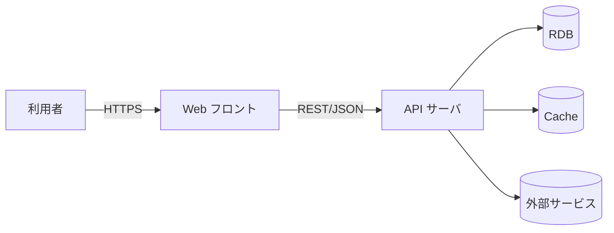

# アーキテクチャ

## 構成図

> 上図はテンプレート。実際の構成に合わせて差し替えること。

## ランタイム前提

| 項目 | 値 |
| --- | --- |
| OS / ランタイム |  |
| 言語 / バージョン |  |
| フレームワーク |  |
| データベース |  |
| キャッシュ |  |
| メッセージング |  |
| ホスティング |  |

## 技術選定

| 領域 | 採用 | 代替案 | 採用理由 |
| --- | --- | --- | --- |
| Web フレームワーク |  |  |  |
| ORM |  |  |  |
| 認証 |  |  |  |
| ロギング |  |  |  |

## 検討中の選択肢

未決定の事項は以下に書く。決定者と期限を必ず明記する。

| 論点 | 候補 | 決定者 | 期限 |
| --- | --- | --- | --- |
| (例) 認可方式 | RBAC / ABAC | @owner | 2026-05-15 |

## 外部システム連携

| 連携先 | 方式 | 認証 | 障害時の振る舞い |
| --- | --- | --- | --- |
|  |  |  |  |

## デプロイ・運用

- 環境: dev / staging / prod
- リリース手順:
- ロールバック手順:
- 監視: メトリクス / ログ / トレース

## 参照

- 上流: REQ-XXX (技術制約に関わるもの)、NFR-XXX
- 下流: 詳細設計の API / DB
