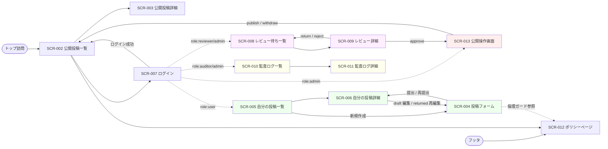

# 画面一覧

> 注記: Phase 3 は SCR-XXX の **一覧** と **遷移** を定義する。画面項目（フィールド名・型・バリデーション・初期値）の詳細は Phase 4（`docs/20-detail-design/screens/SCR-XXX.md`）に委ねる。
> 既存サンプル SCR-001（ログイン）は AMB-001 で人間判断待ちのため温存し、本プロジェクト固有の画面は SCR-002 から採番する。

## 画面一覧 (SCR-XXX)

| ID | 画面名 | 概要 | アクセス権限 | 関連 UC |
| --- | --- | --- | --- | --- |
| SCR-001 | ログイン (既存サンプル) | メール + パスワードでログイン（本ドメインでは非適用、AMB-001 待ち） | ゲスト | UC-001 |
| SCR-002 | 公開投稿一覧（トップ） | published 投稿のうち visibility と viewer ロールに合致するものを一覧表示 | ゲスト / 全ロール | UC-011 |
| SCR-003 | 公開投稿詳細 | 個別の published 投稿の本文を表示 | visibility × viewer マトリクスに準拠 | UC-011 |
| SCR-004 | 投稿フォーム（draft 編集 / 提出） | draft の作成・編集と提出操作。倫理ガード 3 種 + PolicyAgreement 同意 + visibility 選択を含む | 投稿者本人 (`user`) | UC-002, UC-016 |
| SCR-005 | 自分の投稿一覧 | ログインユーザ自身が起票した全 8 ステータスの投稿を一覧表示 | ログイン済 (`user` 以上) | UC-010 |
| SCR-006 | 自分の投稿詳細 | 自分の投稿の詳細（status / 直近の判定 reason / 再提出導線） | 投稿者本人 (`user`) | UC-009, UC-010 |
| SCR-007 | ログイン（モック認証） | cookie + 許可リスト方式のモックログイン UI と、ログアウト導線 | ゲスト / ログイン済 | UC-018 |
| SCR-008 | レビュー待ち一覧 | submitted / in_review の投稿を一覧。reviewer は `private` を除外（Q-016 暫定） | レビュアー / 管理者 | UC-012 |
| SCR-009 | レビュー詳細（判定アクション） | 担当開始・承認・差し戻し・却下の各操作を判断理由必須で実行 | レビュアー / 管理者 | UC-003, UC-004, UC-005, UC-006, UC-012 |
| SCR-010 | 監査ログ一覧 | AuditLog の全件一覧とフィルタ（actor / action / 期間） | 監査担当 / 管理者 | UC-015 |
| SCR-011 | 監査ログ詳細 | 個別エントリのメタ情報を表示。`private` 投稿本文には到達しない（Q-016 暫定） | 監査担当 / 管理者 | UC-015 |
| SCR-012 | ポリシーページ | 投稿ポリシー / プライバシーポリシーをログイン不要で閲覧 | 全アクター（公開） | UC-017 |
| SCR-013 | 公開操作画面（公開・取り下げ） | admin 向け：approved 投稿の公開、published 投稿の取り下げ（reason 必須） | 管理者 | UC-007, UC-008 |

> 設計指針:
> - SCR-013 は admin 専用の操作面。SCR-006 を流用せず分離した理由は、admin は「投稿者本人」ではないためアクセス文脈と UI 警告（取り下げ後は本文非表示）が異なるため。
> - SCR-006（投稿者本人の詳細）と SCR-009（レビュアー視点の詳細）も同じ proposal を別 viewer 視点で扱うため画面分離。

## 画面遷移図

## 画面共通の方針

### レイアウト

- **ヘッダ**: ロゴ / ナビゲーション（公開投稿一覧 / 自分の投稿 / レビュー待ち / 監査ログ / ポリシー）/ ユーザ識別子表示 / ログイン・ログアウト導線。ナビゲーション項目は role に応じて出し分けるが、**認可の本体は server function 側**（NFR-003）。UI 出し分けはあくまで UX 補助
- **フッタ**: ポリシーページ (SCR-012) へのリンク / バージョン情報
- **レスポンシブ対応**: shadcn/ui + Tailwind v4 のデフォルトでモバイル / デスクトップ両対応。アクセシビリティ NFR は MVP 非ゴールだが、shadcn/ui のデフォルト ARIA 属性 / キーボード操作を **積極的に外さない**（06-goals.md の方針）

### 認可と動線

- **未認証で認証必須画面に来た場合**: SCR-007（ログイン）にリダイレクト。loader が `401` を返したらリダイレクトを行う
- **権限不足の場合の表示**: ログイン済かつ権限不足は loader が `404` を返し、画面側は「該当ページが見つかりません」を表示する（暫定統一: `404`、Phase 3 / 4 で `403` を選ぶ場合は同期更新、REQ-008 / REQ-009 / REQ-012 と整合）
- **公開ページ (SCR-002, SCR-012, SCR-007)**: 認可ヘルパーをバイパスして全員アクセス可。SCR-002 は `public` のみを返す loader を経由するため公開バイパス対象

### エラー表示の共通方針

- **フィールド単位のバリデーションエラー** (`400 VALIDATION_ERROR`): 該当入力欄の直下に赤字で表示。Phase 4 で項目別の具体メッセージを定義
- **グローバルエラー（サーバ起因 5xx）**: 画面上部に bunner 表示 + リトライ導線。SSR で 500 を受けた場合はエラー境界 (`ErrorBoundary`) でフォールバック UI を表示
- **空状態 (empty state)**: 一覧が 0 件の場合は専用メッセージ（「まだ投稿がありません」「レビュー待ちはありません」など）を表示
- **読み込み中状態 (loading)**: TanStack Start の `pending` UI を活用
- **楽観ロック競合 (`409 CONFLICT`)** (M-13): 同時担当化（UC-003）で楽観ロック失敗側に「他のレビュアーが先に担当開始しました。一覧を更新してください。」のような表示を SCR-009 で出す。一覧 (SCR-008) への戻りボタンを併置。詳細メッセージと UI コンポーネントは Phase 4（`docs/20-detail-design/screens/SCR-009.md`）で詳細化
- **ビジネスルール違反 (`422 BUSINESS_RULE_VIOLATION`)**: 状態遷移違反（例: in_review でない投稿を approve）は「この操作は現在の状態では実行できません」を表示し、最新状態の再取得導線を出す

## ロール × 画面アクセスマトリクス

> REQ-008 / REQ-009 / REQ-012 のアクセスマトリクスを画面側に再投影。viewer 視点で「画面に到達できるか」（loader が成功するか）を示す。

| 画面 \ ロール | guest | user(他人) | user(本人) | reviewer | admin | auditor |
| --- | --- | --- | --- | --- | --- | --- |
| SCR-002 公開投稿一覧 | 可（public のみ） | 可 | 可 | 可 | 可 | 可 |
| SCR-003 公開投稿詳細 | visibility に依存 | visibility に依存 | 投稿者本人なら可 | visibility に依存 | 全 visibility 可 | visibility に依存 |
| SCR-004 投稿フォーム | 401 → SCR-007 へ | 404（他人の draft、暫定統一） | 可 | **自身が起票した draft のみ可（他人の draft を編集・提出することは BR-PROPOSAL-02 / REQ-002 AC により 404）** | **自身が起票した draft のみ可（同上、admin 権限でも他人の draft の編集・提出は不可）** | 401 / 404 |
| SCR-005 自分の投稿一覧 | 401 → SCR-007 へ | 可（自身分のみ） | 可 | 可（自身分のみ、兼任時のみ。reviewer 単独の運用では空一覧） | 可（自身分のみ、兼任時のみ） | 可（自身分のみ、兼任時のみ。auditor 単独ロールでは到達しない／空一覧） |
| SCR-006 自分の投稿詳細 | 401 | 404（他人の投稿、暫定統一） | 可 | 自身分のみ（兼任時） | 自身分のみ（兼任時） | 自身分のみ（兼任時） |
| SCR-007 ログイン | 可 | — | — | — | — | — |
| SCR-008 レビュー待ち一覧 | 401 | 404 | 404 | 可（private 除外） | 可（全件） | 404 |
| SCR-009 レビュー詳細 | 401 | 404 | 404 | 可 | 可 | 404 |
| SCR-010 監査ログ一覧 | 401 | 404 | 404 | 404 | 可 | 可 |
| SCR-011 監査ログ詳細 | 401 | 404 | 404 | 404 | 可 | 可（メタのみ、本文不到達） |
| SCR-012 ポリシーページ | 可 | 可 | 可 | 可 | 可 | 可 |
| SCR-013 公開操作画面 | 401 | 404 | 404 | 404 | 可 | 404 |

> 上表の `401` / `404` は loader が返すステータスコード（**暫定統一: 未ログイン 401 / 認可違反 404**）。画面側はこれを受けてリダイレクトまたは「見つかりません」表示を出す。Phase 3 / 4 で `403` 選択を行う場合は REQ-008 / REQ-009 / REQ-012 とともに同時更新。
>
> **SCR-004 への到達条件**（B-5 補足）: 自身が author の draft proposal を持っていることが必要。reviewer / admin であっても他人の draft の編集・提出は BR-PROPOSAL-02（投稿者本人のみ編集可）により 404 となる。「新規作成」経路は SCR-005「新規作成」ボタンから空 draft を生成して自身を author として確立する。
>
> **SCR-005 / SCR-006 の auditor / reviewer / admin 列**（B-5 補足）: 「自身分のみ可（兼任時のみ）」とは、同一ユーザに `user` ロールが OR 合成されている場合のみ自分が起票した投稿が表示される、という意味。auditor / reviewer / admin 単独ロールのユーザは `user` 経路の投稿を持たないため一覧は空になる。

## SCR ごとの主要要素（概要のみ、詳細は Phase 4）

### SCR-002 公開投稿一覧
- ヘッダ + ページネーション付きのカード/テーブル一覧。フィルタ・検索は MVP 非対象（Phase 3 末で確認）
- データソース: API-010

### SCR-003 公開投稿詳細
- タイトル / 本文 / visibility ラベル / 投稿者名 / published_at / 関連リンク
- データソース: API-011

### SCR-004 投稿フォーム
- 入力: タイトル / 本文 / visibility (`private` / `internal` / `public`) のラジオ / 倫理ガード 3 種チェック / PolicyAgreement 同意チェック
- 送信:
  - 「下書き保存」（status 遷移なし）: 新規作成は **API-022 `createDraft`**、既存 draft の編集は **API-023 `updateDraft`** を mutation 経由で呼ぶ（B-4 採番）
  - 「提出」: API-002 `submit` を mutation 経由で呼ぶ（draft 段階で本文保存済を前提とする）
- 注意表示: 公開可能性、PII 入力禁止、ポリシーページ (SCR-012) リンク

### SCR-005 自分の投稿一覧
- 全 8 ステータス一覧。各行に最新 status バッジと最終更新日時
- データソース: API-012
- 「新規作成」ボタン: クリックで **API-022 `createDraft`** を mutation 経由で呼び、空 draft を生成して SCR-004 に遷移（自身を author として確立、B-4）

### SCR-006 自分の投稿詳細
- 自身の投稿の詳細 + 直近の判定 reason（returned / rejected の場合）+ 再提出導線（returned のときのみ表示、API-009 を mutation 経由で呼ぶ）
- データソース: API-013
- draft 状態のとき: 「draft 編集」ボタンで SCR-004 に遷移し、SCR-004 が **API-023 `updateDraft`** を mutation 経由で呼ぶ（B-4）

### SCR-007 ログイン
- 入力: ユーザ識別子（許可リストから選択 or 入力）
- 送信: API-019（モック認証）。成功で role に応じたデフォルト画面へ遷移（user → SCR-005、reviewer → SCR-008、admin → SCR-013、auditor → SCR-010）
- ログアウトボタン: API-020 を呼んで cookie 破棄

### SCR-008 レビュー待ち一覧
- submitted / in_review の一覧。担当者列、提出日時、経過時間。フィルタは Phase 3 で確定（Q-012 と並行）
- データソース: API-014

### SCR-009 レビュー詳細
- 投稿の本文 + 判定アクション 4 種ボタン（担当開始 / 承認 / 差し戻し / 却下）+ reason 入力欄（必須）
- 送信: API-003 / API-004 / API-005 / API-006

### SCR-010 監査ログ一覧
- AuditLog の Table 表示（actor / role / action / target / before / after / timestamp の列）
- フィルタ: actor / action / 期間（Q-012 で必要性確定後に詳細化）
- データソース: API-016

### SCR-011 監査ログ詳細
- エントリの全フィールド表示。reason 全文表示（PII 注意表示付き）。target proposal へのリンクは admin のみ表示（auditor は本文不到達 = リンクを非表示 or 404 を返す）
- データソース: API-017

### SCR-012 ポリシーページ
- `/policies/posting` および `/policies/privacy` の 2 経路
- ポリシー文書の本文 + `policy_version` 表示
- データソース: API-018

### SCR-013 公開操作画面
- admin が approved 投稿を選んで「公開」、published 投稿を選んで「取り下げ」を実行
- 取り下げは reason 入力欄（必須）
- 取得（loader）: **API-021 `getProposalForAdmin`** を呼び、admin が任意の proposal を全 visibility・全 status で取得する（B-1 採番、API-013 の「投稿者本人のみ」制約を回避するための専用 loader）
- 送信: 公開は API-007 `publish` / 取り下げは API-008 `withdraw`
- 表示項目: タイトル / 本文 / visibility / status / `submitted_at` / `approved_at`（MAJOR-3 で追加されたカラム）/ `published_at` / `withdrawn_at` / 直近 AuditLog 履歴抜粋

## 参照

- 上流: `docs/10-basic-design/01-system-overview.md` の UC-002〜UC-018
- 下流: `docs/20-detail-design/screens/SCR-XXX.md`（Phase 4）
