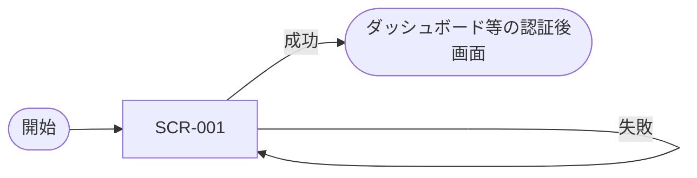

# 画面一覧

## 画面一覧 (SCR-XXX)

| ID | 画面名 | 概要 | アクセス権限 | 関連 UC |
| --- | --- | --- | --- | --- |
| SCR-001 | ログイン | メール + パスワードでログインする | 未認証 | UC-001 |

## 画面遷移図

## 画面共通の方針

### レイアウト
- ヘッダ:
- フッタ:
- レスポンシブ対応:

### 認可と動線
- 未認証で認証必須画面に来たら `SCR-001` にリダイレクト
- 権限不足の場合の表示:

### エラー表示の共通方針
- フィールド単位のバリデーションエラー:
- グローバルエラー（サーバ起因）:

## 参照

- 上流: UC-001
- 下流: `docs/20-detail-design/screens/SCR-XXX.md`
