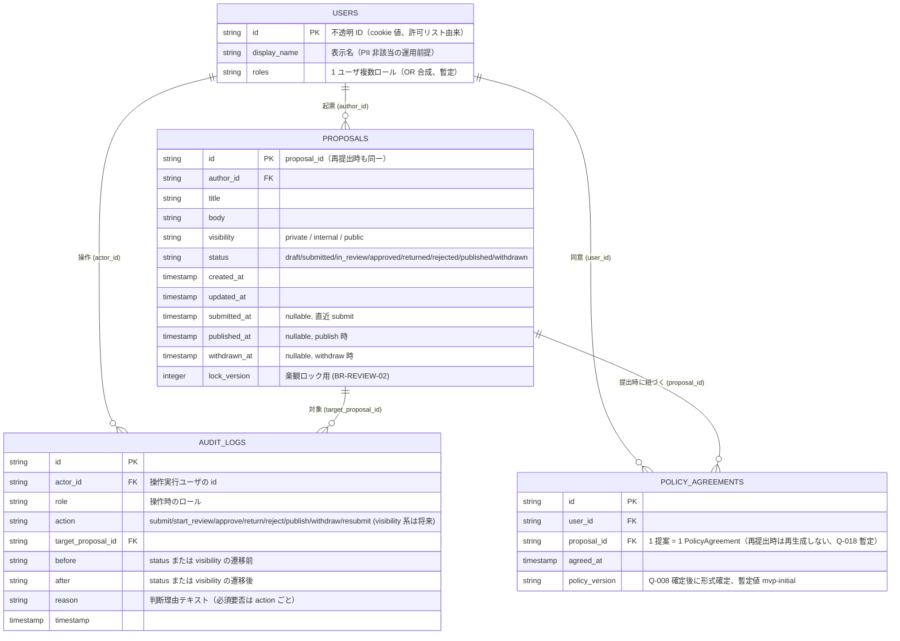
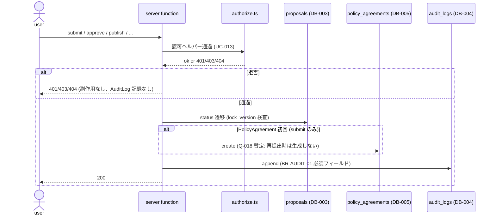

# データモデル

> 注記: Phase 3 はエンティティ一覧と関連、責務、append-only 等の不変条件を定義する。
> カラム型・null 制約・インデックス・外部キー詳細は Phase 4（`docs/20-detail-design/db/DB-XXX.md`）に委ねる。
> 既存サンプル DB-001 (users) / DB-002 (sessions) は AMB-001 で人間判断待ちのため温存し、本プロジェクト固有のエンティティは DB-003 から採番する。
> MVP は in-memory / モック実装。`Repository` インターフェイス経由で抽象化し、Q-005 確定後に D1 等へ差し替え。

## エンティティ一覧 (DB-XXX)

| ID | 名称 | 概要 | 想定書き込み API | 想定読み取り API |
| --- | --- | --- | --- | --- |
| DB-001 | users (既存サンプル) | ユーザ情報（本ドメインでは DB-006 を採用） | (登録系 API は別途設計) | API-001 |
| DB-002 | sessions (既存サンプル) | セッション/トークン（本ドメインでは Cookie + 許可リストで代替） | API-001 | (取得系 API は別途設計) |
| DB-003 | proposals | 提案本体（タイトル / 本文 / visibility / status / タイムスタンプ群） | API-002, API-003, API-004, API-005, API-006, API-007, API-008, API-009 | API-010, API-011, API-012, API-013, API-014, API-015, API-017 |
| DB-004 | audit_logs | 監査ログエントリ（append-only） | API-002, API-003, API-004, API-005, API-006, API-007, API-008, API-009 | API-015, API-016, API-017 |
| DB-005 | policy_agreements | プライバシーポリシー同意ログ | API-002 | (Phase 4 で詳細化) |
| DB-006 | users | モック認証のユーザ識別子 + ロール（環境変数の許可リスト由来） | API-019 (read のみ、書き込みは環境変数管理) | API-002, API-019, 認可ヘルパー |

## ER 図

> 注記:
> - 上記 ER 図はカラムの **存在** を示すものであり、型・null 制約・index 詳細は Phase 4 に委ねる。
> - 既存サンプル DB-001 / DB-002 は本図には含めない（本ドメインでは DB-006 で代替）。

## エンティティの責務

### DB-003 proposals

- **責務**: 提案本体のライフサイクル（status / visibility / 本文）を保持
- **不変条件**:
  - `proposal_id` は再提出時も不変（BR-RESUBMIT-01）
  - `status` は 8 値のいずれか（`draft` / `submitted` / `in_review` / `approved` / `returned` / `rejected` / `published` / `withdrawn`）
  - `visibility` は 3 値のいずれか（`private` / `internal` / `public`）
  - `submitted` 後は本文編集禁止（REQ-002）。再編集は `returned` 状態でのみ許可（REQ-006）
  - `withdrawn` 後は一般閲覧経路から本文非表示（REQ-005）。物理削除はしない
  - 楽観ロック: 同時担当化の競合解決のため `lock_version`（または equivalent）を持つ（BR-REVIEW-02、暫定）
- **タイムスタンプ群**: `created_at` / `updated_at` / `submitted_at` / `published_at` / `withdrawn_at`。AuditLog から `(published_at, withdrawn_at)` のペアが抽出可能であること（REQ-005）

### DB-004 audit_logs

- **責務**: 結果を変える **5 種・8 操作**（visibility 変更は RC-005 needs-clarification のため MVP 対象外、確定後に 6 種・10 操作へ拡張）の append-only 記録
- **必須フィールド** (BR-AUDIT-01): `actor / role / action / target / before / after / reason / timestamp`
- **不変条件** (NFR-004 / BR-AUDIT-02):
  - **append-only**。アプリ層およびデータ層の両方で update / delete を禁止
  - アプリ層強制: AuditLog repository (`src/server/audit/repository.ts`) の export は `append` / `find` / `list` / `get` のみ。`update` / `delete` を export しない
  - データ層強制: 採用ストア確定後（Q-005）に D1 トリガ / 別アカウント分離 等で実装（Phase 3 末に追補）
- **action の取りうる値** (BR-PROPOSAL-01):
  - `submit` / `start_review` / `approve` / `return` / `reject` / `publish` / `withdraw` / `resubmit`
  - 将来: `visibility_shrink` / `visibility_expand`（RC-005 確定後）
- **記録条件** (BR-AUDIT-03): 認可エラー (`401` / `403` / `404`) で失敗した呼び出しでは生成しない

### DB-005 policy_agreements

- **責務**: 投稿提出時のプライバシーポリシー同意ログ
- **必須フィールド** (REQ-013 / BR-GUARD-02): `user_id / proposal_id / agreed_at / policy_version`
- **不変条件**:
  - 1 proposal = 1 PolicyAgreement（再提出 (UC-009) 時は再生成しない、Q-018 暫定）
  - `policy_version` は ポリシー文書 (REQ-014 / API-018) の同名フィールドと整合する形式（Q-008 確定後）

### DB-006 users

- **責務**: モック認証のユーザ識別子 + ロール保持。実体は環境変数の **許可リスト**
- **不変条件**:
  - `id` は不透明 ID（任意文字列）。AMB-008 暫定: 不透明 ID は PII 非該当
  - `roles` は 1 ユーザ複数ロール可（OR 合成、暫定方針、REQ-010）
  - 書き込みは環境変数管理（API 経由の登録 UI は MVP 非対象）
- **将来**:
  - 実プロバイダ統合（OIDC / Cloudflare Access）時に DB に正規化

## 設計方針

### 主キー
- 既定で UUID v7 を使う（時系列整列性のため）。本 MVP は in-memory のため `crypto.randomUUID()`（Workers Web Crypto, NFR-002 と整合）でも代替可
- 外部公開する識別子は ULID または UUID v7。連番は使わない

### タイムスタンプ
- すべてのエンティティに `created_at`（必須）。可変なものは `updated_at`
- DB-003 は state-specific timestamp（`submitted_at` / `published_at` / `withdrawn_at`）を nullable で持つ
- DB-004 は `timestamp` のみ（append-only のため `updated_at` は持たない）
- 型: D1 採用なら `INTEGER`（Unix epoch ms）または `TEXT` (ISO8601)。確定は Phase 4

### 文字コード
- UTF-8。本文 / reason / title はテキスト型を使用（長さ上限はビジネスルール側で確定、Phase 4）

### 物理削除と論理削除
- DB-003: 物理削除しない。`withdrawn` 状態への遷移で「公開停止」を表現（REQ-005、Q-003 暫定）
- DB-004: 物理削除しない（append-only、NFR-004）
- DB-005: 物理削除しない（同意の事実は保持）
- DB-006: 環境変数管理のため、DB 上の論理削除概念は持たない

### マイグレーション
- 全変更はマイグレーションファイル経由（D1 採用後）。手動 DDL は禁止
- 後方互換のあるマイグレーションを優先（カラム追加は nullable で開始）
- in-memory 期間は型定義の変更で代替

### Repository インターフェイス（NFR-002 / NFR-004 と整合）

各エンティティは `src/server/repositories/<entity>.ts` で interface を定義し、以下の **責務範囲と禁止項目** を Phase 3 で確定する。具体シグネチャ（`findByActor` / `findByAction` / `findByPeriod` 等の引数列・戻り値型）は Phase 4（`docs/20-detail-design/db/DB-XXX.md`）で確定する。

| エンティティ | export 関数（責務範囲） | export 禁止 |
| --- | --- | --- |
| `proposals` | 取得系: `findById` / `findByAuthor` / `listPublishedByVisibility` / `listForReview`、書き込み系: `create` / `updateStatus`（具体シグネチャは Phase 4） | — |
| `audit_logs` | **append + read のみ**: `append` / `findById` / `list` (filter 対応、`findByActor` / `findByAction` / `findByPeriod` の具体シグネチャは Phase 4 で確定) | **`update*` / `delete*` 命名は禁止**（NFR-004 / BR-AUDIT-02、CI grep `update*AuditLog` / `delete*AuditLog` パターンが 0 件であることを観測） |
| `policy_agreements` | `create` / `findByProposalId` | `update`, `delete` |
| `users` | `findById`（許可リスト参照） | `create` / `update` / `delete`（環境変数管理） |

> 注意（M-11）:
> - `audit_logs` の **`find` / `list` / `get` の具体シグネチャは Phase 4 詳細設計で確定**（`findByActor`, `findByAction`, `findByPeriod`, `listWithFilter` 等の引数列・戻り値型）。本 Phase 3 では責務範囲（append + read）と禁止命名のみを確定する。
> - **`update*AuditLog` / `delete*AuditLog` 命名は禁止**（NFR-004 で CI grep により観測）。新規メソッド追加時は命名がこの禁止パターンに該当しないことをレビューで必ず確認する。
> - CI grep で AuditLog repository の `update` / `delete` export が 0 件であることを検証する（NFR-004 AC）。

## ライフサイクルとデータ更新タイミング

## 参照

- 上流: `docs/02-requirements/02-functional-requirements.md` の REQ-002〜REQ-015、`docs/02-requirements/03-non-functional-requirements.md` の NFR-002 / NFR-004 / NFR-007、`docs/02-requirements/04-business-rules.md` の BR-PROPOSAL-01〜03 / BR-AUDIT-01〜03 / BR-RESUBMIT-01 / BR-GUARD-02
- 下流: `docs/20-detail-design/db/DB-XXX.md`（Phase 4）、`docs/10-basic-design/04-api-list.md`
