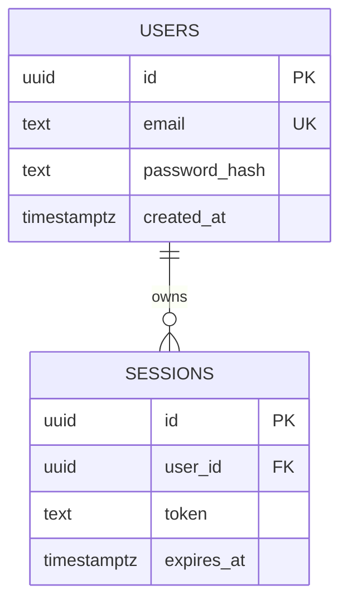

# データモデル

## エンティティ一覧 (DB-XXX)

| ID | 名称 | 概要 | 想定書き込み API | 想定読み取り API |
| --- | --- | --- | --- | --- |
| DB-001 | users | ユーザ情報 | (登録系 API は別途設計) | API-001 |
| DB-002 | sessions | セッション/トークン | API-001 | (取得系 API は別途設計) |

## ER 図

## 設計方針

### 主キー
- 既定で UUID v7 を使う（時系列整列性のため）。
- 外部公開する識別子は ULID または UUID v7。連番は使わない。

### タイムスタンプ
- すべてのテーブルに `created_at`, `updated_at` を持つ（型: `timestamptz`）。
- 削除は論理削除を基本とし、`deleted_at timestamptz null` を持たせる（要件で物理削除が必要な場合は別途）。

### 文字コード・コラレーション
- UTF-8。
- `text` 型を基本（長さ制約はビジネスルールで決まる場合のみ）。

### マイグレーション
- 全変更はマイグレーションファイル経由。手動 DDL は禁止。
- 後方互換のあるマイグレーションを優先（カラム追加は nullable で開始）。

## 参照

- 上流: REQ-XXX, UC-XXX, API-XXX
- 下流: `docs/20-detail-design/db/DB-XXX.md`
