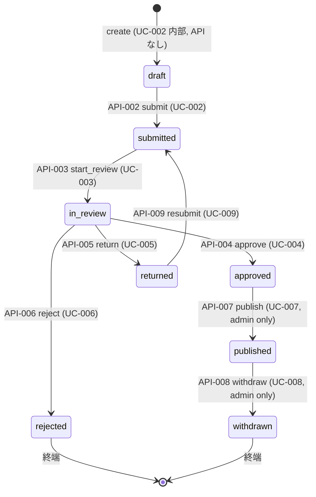

# DB-003 — proposals（提案本体）

## 概要

一般市民の提案・報告・申請の本体を保持する中核エンティティ。タイトル / 本文 / 公開範囲 (`visibility`) / ステータス (`status`) のライフサイクル全体（draft → submitted → in_review → approved/returned/rejected → published → withdrawn の 8 状態）を 1 行で表現する。再提出時も同一 `id` を維持し（`BR-RESUBMIT-01`）、AuditLog (DB-004) からステータス遷移履歴と差し戻し回数が観測可能。

## カラム

| カラム名 | 型 | null | デフォルト | PK/FK/UK | 説明 |
| --- | --- | --- | --- | --- | --- |
| `id` | text | no | — | PK | 提案 ID。`crypto.randomUUID()` で生成（UUID v7 相当、Workers 互換）。再提出時も同一 id を維持（`BR-RESUBMIT-01`）。最大長 36 文字。 |
| `author_id` | text | no | — | FK → `users(id)` | 起票者（投稿者本人）の `users.id`。authorize 層の `assertOwner` で参照される。`draft` 作成時に決定し、以後不変。 |
| `title` | text | no | — | — | 提案タイトル。最大長 **200 文字**（暫定、Phase 5 で UX レビュー時に再評価）。空文字は `submitted` 以降では不可（`BR-PROPOSAL-02`、アプリ層検証）。 |
| `body` | text | no | — | — | 提案本文。最大長 **10,000 文字**（暫定、Phase 5 で UX レビュー時に再評価）。空文字は `submitted` 以降では不可。 |
| `visibility` | text | no | — | — | 公開範囲。`private` / `internal` / `public` のいずれか（CHECK 制約）。提出時に投稿者が選択（REQ-002 / REQ-013）。 |
| `status` | text | no | `draft` | — | ステータス。`draft` / `submitted` / `in_review` / `approved` / `returned` / `rejected` / `published` / `withdrawn` の 8 値（CHECK 制約）。 |
| `assignee_id` | text | yes | NULL | FK → `users(id)` | `in_review` 化時にアサインされた reviewer / admin の `users.id`。`in_review` 以外の状態では NULL（アプリ層で正規化）。`BR-REVIEW-02` の楽観ロックで「同時担当化の競合解決」に使用。 |
| `current_policy_agreement_id` | text | yes | NULL | FK → `policy_agreements(id)` | 最新の同意レコードへの参照。`draft` では NULL、`submitted` 以降は NOT NULL（アプリ層で正規化、DDL では NULLABLE）。Q-018 暫定により **再提出 (API-009) 時も差し替えない**（初回 submit 時に固定）。 |
| `created_at` | integer | no | — | — | 作成時刻（Unix epoch millis）。`draft` 作成時に記録、以後不変。 |
| `updated_at` | integer | no | — | — | 最終更新時刻（Unix epoch millis）。**status 遷移と本文編集の両方で更新**。 |
| `submitted_at` | integer | yes | NULL | — | 直近の提出時刻。`draft → submitted` および `returned → submitted` の両遷移で **上書き更新**。`draft` / `rejected`（draft からの直接遷移は無いが将来用） では NULL のまま。 |
| `approved_at` | integer | yes | NULL | — | 承認時刻 (**MAJOR-3 で追加**)。`in_review → approved` 遷移時 (API-004) に `Date.now()` で設定。`returned` / `rejected` 経路では NULL のまま。SCR-013 で表示、API-021 のレスポンスに含む。 |
| `published_at` | integer | yes | NULL | — | 公開時刻。`approved → published` 時に記録。`withdrawn` 後も保持（REQ-005: AuditLog から `(published_at, withdrawn_at)` ペアが抽出可能）。 |
| `withdrawn_at` | integer | yes | NULL | — | 取り下げ時刻。`published → withdrawn` 時に記録。 |
| `version` | integer | no | `0` | — | 楽観ロック用バージョン番号。**status 遷移ごとに +1**（`BR-REVIEW-02`、in_review 化の同時実行検出が主目的だが、全 7 遷移で一律に +1 する）。本文編集（draft 内）でも +1 する（CAS 更新）。 |

> **型の方針（NFR-002 と整合）**: SQLite 互換の `text` / `integer` のみ。`visibility` / `status` の enum は `text` + CHECK 制約で表現（`text CHECK (visibility IN ('private','internal','public'))` 等）。タイムスタンプは Unix epoch millis（`integer`）。
>
> **Workers / D1 移行時の整数 53bit 制限注意（m-01 整理）**: Unix epoch millis は **2^53 ≈ 9,007,199,254,740,992（西暦 285,427 年頃まで）** までは JavaScript の `number`（IEEE 754 倍精度浮動小数点）で安全に表現可能。MVP 想定範囲（〜数十年）では問題ないが、D1 採用時は SQLite の `INTEGER` が最大 64bit で扱える一方、JS 側で受け取った時点で `number` 化されるため、**マイクロ秒精度や 1970 年以前の負の epoch 等を扱う場合は `bigint` または `text` への変更を検討**。MVP では `number` で十分。

## インデックス

| 名前 | カラム | 種別 | 用途 |
| --- | --- | --- | --- |
| `pk_proposals` | `(id)` | primary | 主キー検索（API-011 / API-013 / API-015 の詳細取得、各 mutation の対象特定） |
| `ix_proposals_author_id` | `(author_id, updated_at DESC)` | non-unique | API-012 自分の投稿一覧（REQ-007）。`author_id` フィルタ + 最終更新日時降順。 |
| `ix_proposals_status_visibility` | `(status, visibility)` | non-unique | API-010 公開投稿一覧（REQ-008、`status='published'` + visibility フィルタ）、API-014 レビュー待ち一覧（REQ-009、`status IN ('submitted','in_review')`）。 |
| `ix_proposals_status_updated_at` | `(status, updated_at DESC)` | non-unique | API-014 のレビュー待ち一覧の並び順（暫定: `updated_at` 降順）。`submitted` の古いものを優先する場合は将来 `(status, submitted_at ASC)` も追加検討。 |
| `ix_proposals_status_published_at` | `(status, published_at DESC)` | non-unique | API-010 公開投稿一覧の `published_at` 降順並び（最新公開が先頭）。 |

> 注記: REQ-008 / REQ-009 のページネーション規約は Phase 3 / 4 で確定（cursor-based を想定）。本 index は cursor 列として `updated_at` / `published_at` を使う前提。

## 不変条件

### 1. status 遷移の整合（`BR-PROPOSAL-01` / 各 REQ）

許可される遷移は次の 9 経路のみ。これ以外の遷移を試みた `UPDATE` はアプリ層で `422 BUSINESS_RULE_VIOLATION` を返す。

| # | from | to | 操作 (action) | API | 強制レベル |
| --- | --- | --- | --- | --- | --- |
| 1 | `(初期)` | `draft` | create | (UC-002 内部、API なし) | アプリ層 |
| 2 | `draft` | `submitted` | submit | API-002 | アプリ層 |
| 3 | `submitted` | `in_review` | start_review | API-003 | アプリ層 |
| 4 | `in_review` | `approved` | approve | API-004 | アプリ層 |
| 5 | `in_review` | `returned` | return | API-005 | アプリ層 |
| 6 | `in_review` | `rejected` | reject | API-006 | アプリ層 |
| 7 | `returned` | `submitted` | resubmit | API-009 | アプリ層 |
| 8 | `approved` | `published` | publish | API-007 | アプリ層 |
| 9 | `published` | `withdrawn` | withdraw | API-008 | アプリ層 |

- **強制レベル**: status × API の対応はアプリ層（`src/server/proposals/repository.ts` の `updateStatus(id, expectedFrom, to, version)` 等の関数シグネチャ）で強制する。DB 層 CHECK 制約では「status 値の集合」のみ強制（個別の遷移ペアは表現困難）。
- **`approved → withdrawn` は不可**: `withdrawn` は **必ず `published` 経由**（REQ-005 / `BR-PUBLISH-03`）。`approved` の状態で API-008 を呼ぶと `422 BUSINESS_RULE_VIOLATION`。
- **`rejected` / `withdrawn` は終端**: 以後の遷移は不可。
- **publish は admin 専権**: 遷移 #8 は admin のみが API-007 経由で実行可（`BR-PUBLISH-01`）。コード上は authorize 層で `requireRole('admin')` を強制。

### 2. 楽観ロック（`BR-REVIEW-02`）

- すべての status 遷移は CAS（Compare-And-Set）で実行: `WHERE id = ? AND version = ?` の条件付き `UPDATE` で、`version` を +1 する。
- 同時 in_review 化（API-003 を 2 名が同時呼び出し）の場合、後勝ち側は更新行数 0 を返し、アプリ層で `409 CONFLICT` を返す。
- 本文編集（draft 内、SCR-004 経由の draft 保存）でも `version` を +1（同一画面の複数タブ編集の競合検出のため）。

### 3. submitted 以降の本文編集禁止（REQ-002）

- `status IN ('submitted', 'in_review', 'approved', 'returned', 'rejected', 'published', 'withdrawn')` の状態では `title` / `body` / `visibility` の `UPDATE` を **アプリ層で禁止**。例外は `returned → submitted` の **再提出フロー**（REQ-006、API-009）でのみ `title` / `body` を変更可（`visibility` は変更不可）。
- DB 層では強制せず（多列条件付き CHECK は記述可能だが可読性が低い）、Repository 層の関数シグネチャで強制（`updateDraftContent` は `status='draft'` のみ、`resubmit` は `status='returned'` のみ等）。

### 4. assignee_id の整合

- `status='in_review'` の場合のみ `assignee_id IS NOT NULL`。それ以外の status では `assignee_id IS NULL`。
- `start_review` (API-003) 成功時に `assignee_id = caller.user_id` を記録、`approve` / `return` / `reject` 成功時に `NULL` に戻す。アプリ層で正規化。

### 5. current_policy_agreement_id の整合（Q-018 暫定）

- `status='draft'` の場合のみ NULL を許容。`status` が `submitted` 以降に遷移したら NOT NULL を維持。
- 初回 submit (API-002) で `policy_agreements` レコードを INSERT し、その `id` を本カラムに設定。**resubmit (API-009) 時は変更しない**（Q-018 暫定）。
- 不変条件 1 と組み合わせ、`returned → submitted` 遷移時の `current_policy_agreement_id` は **据え置き**。

### 6. timestamps の整合

- `created_at <= updated_at`（DB 層 CHECK で表現可能だが MVP では省略、テストで担保）。
- `submitted_at IS NOT NULL` であれば `submitted_at >= created_at`。
- `published_at IS NOT NULL` であれば `published_at >= submitted_at`（直近の submit 以降に publish される）。
- `withdrawn_at IS NOT NULL` であれば `withdrawn_at >= published_at`（publish 後に withdraw）。
- いずれも DB 層では強制せず、アプリ層 + テストで担保。

### 7. visibility の整合

- 取りうる値は `private` / `internal` / `public` の 3 種（CHECK 制約）。
- visibility 変更（`private ↔ internal ↔ public`）は **MVP 対象外**（RC-005 が `needs-clarification`）。`status` 遷移とは独立した遷移として将来実装予定（`BR-PROPOSAL-01` の 6 種・10 操作への拡張時）。
- 本 MVP では visibility は **提出 (UC-002 / API-002) で確定し、以後不変**。

## 状態遷移



### 遷移条件・副作用サマリ

| 遷移 | 認可（NFR-003） | reason | 楽観ロック | カラム更新 | AuditLog (DB-004) |
| --- | --- | --- | --- | --- | --- |
| `draft → submitted` | 投稿者本人 (`user`) | 任意 (Q-019 暫定) | version +1 | `status`, `submitted_at`, `current_policy_agreement_id`, `updated_at`, `version` | `action=submit` append |
| `submitted → in_review` | reviewer / admin | 必須 | version +1（CAS、競合は 409） | `status`, `assignee_id`, `updated_at`, `version` | `action=start_review` append |
| `in_review → approved` | reviewer / admin | 必須 | version +1 | `status`, `assignee_id=NULL`, `updated_at`, `version` | `action=approve` append |
| `in_review → returned` | reviewer / admin | 必須 | version +1 | 同上 | `action=return` append |
| `in_review → rejected` | reviewer / admin | 必須 | version +1 | 同上 | `action=reject` append |
| `returned → submitted` | 投稿者本人 (`user`) | 任意 (Q-019 暫定) | version +1 | `status`, `submitted_at`（上書き）, `title`, `body`, `updated_at`, `version` | `action=resubmit` append |
| `approved → published` | admin | 任意 (Q-019 暫定) | version +1 | `status`, `published_at`, `updated_at`, `version` | `action=publish` append |
| `published → withdrawn` | admin | 必須 | version +1 | `status`, `withdrawn_at`, `updated_at`, `version` | `action=withdraw` append |

## 関連 API

| API | 操作 | 備考 |
| --- | --- | --- |
| API-002 (`submit`) | write (UPDATE) | `draft → submitted`。`current_policy_agreement_id` を初回設定。 |
| API-003 (`startReview`) | write (UPDATE, CAS) | `submitted → in_review`。`assignee_id` を caller の id に設定。同時実行時 `409 CONFLICT`（`BR-REVIEW-02`）。 |
| API-004 (`approve`) | write (UPDATE) | `in_review → approved`。`assignee_id` を NULL に戻す。 |
| API-005 (`returnProposal`) | write (UPDATE) | `in_review → returned`。`assignee_id` を NULL に戻す。 |
| API-006 (`reject`) | write (UPDATE) | `in_review → rejected`。`assignee_id` を NULL に戻す。終端状態。 |
| API-007 (`publish`) | write (UPDATE) | `approved → published`。`published_at` を記録。admin 専権（`BR-PUBLISH-01`）。 |
| API-008 (`withdraw`) | write (UPDATE) | `published → withdrawn`。`withdrawn_at` を記録。admin 専権（`BR-PUBLISH-03`）。 |
| API-009 (`resubmit`) | write (UPDATE) | `returned → submitted`。`title` / `body` 更新可、`current_policy_agreement_id` は据え置き（Q-018 暫定）。 |
| API-010 (`list publishedProposals`) | read | `status='published'` + `visibility` フィルタ。`ix_proposals_status_visibility` / `ix_proposals_status_published_at` を使用。 |
| API-011 (`get publishedProposal`) | read | 主キー検索 + visibility × viewer マトリクス検証。`withdrawn` は loader 側で 404 にフィルタ（REQ-005）。 |
| API-012 (`list myProposals`) | read | `author_id` フィルタ。`ix_proposals_author_id` を使用。全 8 ステータスを含む。 |
| API-013 (`get myProposal`) | read | 主キー検索 + `assertOwner`。`withdrawn` 自身分も 404（REQ-005）。 |
| API-014 (`list reviewInbox`) | read | `status IN ('submitted','in_review')` + visibility フィルタ（reviewer は `private` 除外、Q-016 暫定）。 |
| API-015 (`get reviewProposal`) | read | 主キー検索 + reviewer / admin 認可。AuditLog (DB-004) と JOIN 表示（アプリ層で 2 クエリ実行）。 |
| API-017 (`get auditLog`) | read | DB-004 詳細から target proposal_id 経由で本文 loader 呼び出し（admin のみ可、auditor は 404、Q-016 暫定）。 |

> **draft 作成 / 編集 (B-4 採番済)**: SCR-004 / SCR-005 / SCR-006 経由で **API-022 (createDraft, POST /v1/proposals)** が `INSERT`、**API-023 (updateDraft, PATCH /v1/proposals/{id})** が `UPDATE`（`title` / `body` / `visibility`、`status='draft'` 限定）を行う。これらは独立 API として採番済（B-4 解消）。AuditLog 書き込みなし（BR-PROPOSAL-01 の「結果を変える 5 種・8 操作」に含めない）。

## マイグレーション方針

### 追加（カラム追加）
- 後方互換: **`null` 許容で追加 → バックフィル → `not null` 化** の 3 ステップ。
- 例: 将来 `category`（カテゴリ分類）を追加する場合、既存全行を `null` で先に追加 → バックフィル（既存は `その他`）→ `not null` 化。

### visibility 変更フロー（RC-005 確定後）
- RC-005 が `refined → REQ` 化された時点で:
  - 新規 API（`changeVisibility`）を採番
  - 本テーブルの `version` カラムを引き続き楽観ロックに使用（追加カラム不要）
  - AuditLog (DB-004) の `action` enum を `visibility_shrink` / `visibility_expand` に拡張
  - 不変条件 7 を緩和し、特定状態（`approved` / `published`）から visibility 変更を許可

### MVP DDL（D1 移行時、SQLite 互換）

```sql
CREATE TABLE proposals (
  id                            TEXT NOT NULL PRIMARY KEY,
  author_id                     TEXT NOT NULL REFERENCES users(id),
  title                         TEXT NOT NULL,
  body                          TEXT NOT NULL,
  visibility                    TEXT NOT NULL
                                  CHECK (visibility IN ('private','internal','public')),
  status                        TEXT NOT NULL DEFAULT 'draft'
                                  CHECK (status IN (
                                    'draft','submitted','in_review','approved',
                                    'returned','rejected','published','withdrawn'
                                  )),
  assignee_id                   TEXT REFERENCES users(id),
  current_policy_agreement_id   TEXT REFERENCES policy_agreements(id),
  created_at                    INTEGER NOT NULL,
  updated_at                    INTEGER NOT NULL,
  submitted_at                  INTEGER,
  published_at                  INTEGER,
  withdrawn_at                  INTEGER,
  version                       INTEGER NOT NULL DEFAULT 0
);

CREATE INDEX ix_proposals_author_id
  ON proposals(author_id, updated_at DESC);
CREATE INDEX ix_proposals_status_visibility
  ON proposals(status, visibility);
CREATE INDEX ix_proposals_status_updated_at
  ON proposals(status, updated_at DESC);
CREATE INDEX ix_proposals_status_published_at
  ON proposals(status, published_at DESC);
```

> 注記: `policy_agreements(id)` への FK は **proposal が先に作成されるため、循環 FK** を生む（proposals.current_policy_agreement_id → policy_agreements.id, policy_agreements.proposal_id → proposals.id）。MVP では DB 層 FK ではなくアプリ層整合で担保し、D1 移行時に `DEFERRABLE` 制約（D1 が対応する場合）または「初回 submit を 2 段 INSERT トランザクション」で解決する。詳細は Phase 5 で実装方針を確定。
>
> **Repository メソッドの呼び出し順（m-12 整理）**: 初回 submit 時の正規呼び出し順は **(1) proposals INSERT（draft 段階で `current_policy_agreement_id=NULL` で先に作成、SCR-005「新規作成」/ API-022 が該当）→ (2) policy_agreements INSERT（API-002 submit で実行、`proposal_id` に既存 proposal の id を入れる）→ (3) proposals UPDATE で `current_policy_agreement_id` を seed**（API-002 の DB-003 CAS UPDATE と同一トランザクション内）。この順序により循環 FK の片方は常に NULL → 値設定の単方向書き込みで完結する。MVP の in-memory ではトランザクション境界は概念のみだが、D1 移行時には 1 トランザクション内に閉じる。

## 参照

- 上流: `docs/10-basic-design/05-data-model.md` (`BD-DATA` の `### DB-003 proposals`)、`docs/02-requirements/02-functional-requirements.md` の REQ-002 / REQ-004 / REQ-005 / REQ-006 / REQ-007 / REQ-008、`docs/02-requirements/03-non-functional-requirements.md` の NFR-002、`docs/02-requirements/04-business-rules.md` の `BR-PROPOSAL-01` / `BR-PROPOSAL-02` / `BR-PROPOSAL-03` / `BR-REVIEW-01` / `BR-REVIEW-02` / `BR-PUBLISH-01` / `BR-PUBLISH-03` / `BR-RESUBMIT-01`、`docs/00-discovery/07-open-questions.md` の Q-018 / Q-019
- 下流: `docs/20-detail-design/apis/API-002.md` 〜 `API-009.md` / `API-010.md` 〜 `API-015.md` / `API-017.md`（Phase 4）、`docs/30-implementation-plan/01-task-breakdown.md` の TASK-XXX（Phase 5、後刻採番）
