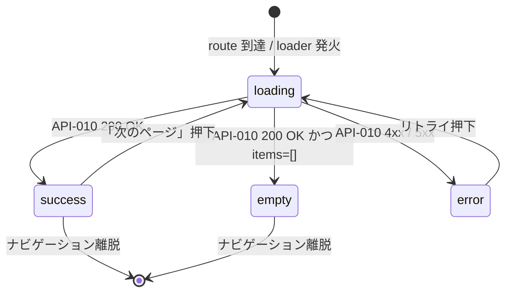

# SCR-002 — 公開投稿一覧（トップ）

## 目的

`status='published'` の提案を viewer ロール × `visibility` のマトリクスでフィルタして一覧表示するトップ画面（UC-011）。`guest` 含め全アクターが到達可能で、`guest` は `public` のみ、ログイン済は `public` + `internal` を表示する（API-010 の filter と整合、REQ-008）。

## アクター

- 主アクター: ゲスト（未ログイン）/ ログイン済の全ロール（`user` / `reviewer` / `admin` / `auditor`）
- 想定権限: 不要（公開バイパス対象、API-010 が viewer に応じて自動フィルタ）
- 想定デバイス: PC / モバイル両対応（shadcn/ui + Tailwind v4 のレスポンシブデフォルト）

## 画面項目

| 項目名 | 型 | 必須 | 初期値 | バリデーション | 参照 API |
| --- | --- | --- | --- | --- | --- |
| ヘッダ：ログイン / ログアウト導線 | リンク（`Button` variant=ghost） | yes | viewer 状態に応じる | guest なら「ログイン」（`SCR-007` へ）、ログイン済なら表示名 + 「ログアウト」 | API-020（ログアウト時） |
| 提案カード：タイトル | text（読み取り専用） | yes | API-010 から取得 | 表示のみ。`title` は最大 200 文字（DB-003 と整合、超過は 1 行省略表示） | API-010 |
| 提案カード：visibility バッジ | enum（`Badge`） | yes | API-010 から取得 | `public` / `internal` のいずれか（guest には `public` のみ表示される） | API-010 |
| 提案カード：投稿者表示名 | text（読み取り専用） | no | `author_id` を表示用に解決（暫定: `author_id` を短縮形で表示、display_name 解決は Phase 5 で確定） | 表示のみ | API-010 |
| 提案カード：published_at | datetime（読み取り専用） | yes | API-010 から取得 | Unix epoch millis を `YYYY-MM-DD HH:mm` 形式に整形 | API-010 |
| 提案カード：詳細遷移 | リンク（`Card` クリック） | yes | — | クリックで `SCR-003` へ遷移（`/proposals/{id}`） | — |
| ページネーション：「次のページ」 | button（`Button` + `Pagination`） | no | `has_more=false` のとき非表示 | `next_cursor` を URL クエリに付与して再 loader | API-010 |
| 空状態メッセージ | static text | yes（0 件時） | 「公開された提案はまだありません」 | — | — |
| ポリシーリンク（フッタ） | リンク | yes | — | `/policies/posting` / `/policies/privacy` への内部遷移 | API-018 |

> shadcn/ui コンポーネント候補: `Card` / `Badge` / `Button` / `Pagination` / `Skeleton`（loading 表示）。
> **server-side 検証の徹底（NFR-003 / PROB-005）**: `cursor` / `limit` のクエリ検証は本画面の URL 解析時に UI 側でも一次チェックするが、本物の検証は API-010 側で実施する。UI 側のチェックは UX 補助。

## 操作フロー (UC 単位)

### 公開投稿の閲覧（UC-011）

1. 利用者がこの画面に到達する条件: ルート URL `/` にアクセス（cookie の有無は問わない、公開バイパス）。
2. 主シナリオ:
   1. loader が API-010 を呼び出し、viewer × visibility マトリクスに基づく一覧を 200 OK で受領（最大 20 件、`published_at DESC` 順）。
   2. 提案カードをグリッド表示（モバイルは 1 列、PC は 2〜3 列）。
   3. 利用者がカードをクリック → `SCR-003` へ遷移（パス `/proposals/{id}`）。
   4. `has_more=true` の場合「次のページ」ボタンを押下 → `next_cursor` を付与して再 loader、追加件数を末尾に append または置き換え（暫定: ページ単位の置き換え）。
3. 例外シナリオ:
   - `limit` / `cursor` 改竄で 400 → エラーバナー表示「リクエストが正しくありません。再読み込みしてください」+ `cursor` をクリアした再 loader 導線。
   - 5xx → エラー境界で「一時的に取得できませんでした。時間をおいて再度お試しください」+ リトライボタン。

## 状態遷移

> 本画面は GET のみで mutation を発生させない。CSRF 検証は API-010 側で不要（NFR-006）。ただしログアウト導線（ヘッダ）は mutation のため、押下時に `SameSite=Lax` cookie + Origin 検証で CSRF 対策（API-020）。

## エラー・空状態

| 状況 | 表示 | 動線 |
| --- | --- | --- |
| 検索結果 0 件（ログイン済 / guest 共通） | カード表示エリアに「公開された提案はまだありません」を中央寄せで表示。`Alert` 風ボックス | guest なら「ログイン後に自分の投稿を作成」のサブテキスト + `SCR-007` への CTA、ログイン済（user）なら「投稿を作成する」ボタン → `SCR-005`（一覧） |
| ネットワーク不通 | ヘッダ直下に Toast / Alert「ネットワークに接続できませんでした」 | 「再読み込み」ボタン |
| バリデーションエラー（`limit` 範囲外、`cursor` 改竄） | バナー「リクエストが正しくありません」 | 「先頭に戻る」ボタン（`cursor` クエリ削除） |
| 5xx サーバエラー | エラー境界フォールバック「サーバの一時的な問題です」 | 「リトライ」ボタン |
| 認証切れ | guest として再 loader（公開バイパスのため自動的に `public` のみに絞られる） | バナー「セッションが切れました。再ログインで internal も表示されます」+ `SCR-007` リンク |

## アクセシビリティ

- フォーカス順序: ヘッダ（ログイン / ログアウト）→ 検索エリア（MVP 非実装、スキップ）→ 提案カード（先頭から順）→ ページネーション → フッタリンク
- ラベル付け: 各カードは `<article>` でラップ、タイトルを `<h2>`、visibility バッジを `aria-label="公開範囲: ..."`
- キーボード操作: Tab で順次フォーカス、Enter / Space でカード遷移
- shadcn/ui のデフォルト ARIA 属性（`Card` / `Button` / `Badge`）を外さない

## 権限による表示分岐

| ロール | ヘッダ | 表示される items の visibility | 「自分の投稿」ナビ | 「レビュー待ち」ナビ | 「監査ログ」ナビ |
| --- | --- | --- | --- | --- | --- |
| guest | 「ログイン」リンク | `public` のみ | 非表示 | 非表示 | 非表示 |
| user | 表示名 + ログアウト | `public` + `internal` | 表示（`SCR-005`） | 非表示 | 非表示 |
| reviewer | 同上 | 同上 | 表示 | 表示（`SCR-008`） | 非表示 |
| admin | 同上 | 同上 | 表示 | 表示 | 表示（`SCR-010`） |
| auditor | 同上 | 同上 | 表示（兼任時のみ実質的なエントリ有り） | 非表示 | 表示（`SCR-010`） |

> ナビゲーションの出し分けは UX 補助。本物の認可は server function 側（API-010 / API-014 / API-016 等）で実施（NFR-003）。

## 参照

- 上流: `docs/02-requirements/02-functional-requirements.md` の REQ-008 / REQ-010 / REQ-015、`docs/02-requirements/03-non-functional-requirements.md` の NFR-002〜007、`docs/10-basic-design/01-system-overview.md` の UC-011、`docs/10-basic-design/03-screen-list.md`
- 下流: `docs/20-detail-design/apis/API-010.md`、TASK-XXX（Phase 5、後刻採番）
