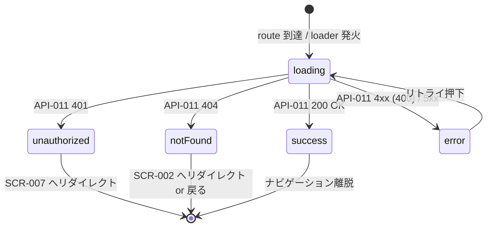

# SCR-003 — 公開投稿詳細

## 目的

`status='published'` の提案 1 件の本文・メタ情報を viewer × visibility マトリクス（REQ-008）に従って表示する詳細画面（UC-011）。`withdrawn` および非該当 visibility は 404 で隠蔽（REQ-005、API-011 の暫定統一方針と整合）。

## アクター

- 主アクター: ゲスト / 全ロールのログイン済ユーザ
- 想定権限: visibility に依存（API-011 の viewer × visibility マトリクスを再投影）
- 想定デバイス: PC / モバイル両対応

## 画面項目

| 項目名 | 型 | 必須 | 初期値 | バリデーション | 参照 API |
| --- | --- | --- | --- | --- | --- |
| タイトル | text（読み取り専用） | yes | API-011 から取得 | 表示のみ。`title` は最大 200 文字（DB-003 準拠） | API-011 |
| visibility バッジ | enum（`Badge`） | yes | API-011 から取得 | `public` / `internal` / `private`（admin のみ）| API-011 |
| 投稿者表示名 | text（読み取り専用） | yes | `author_id` を表示用に解決 | 表示のみ（PII 注意：display_name 解決は Phase 5 で） | API-011 |
| published_at | datetime（読み取り専用） | yes | API-011 から取得 | Unix epoch millis を `YYYY-MM-DD HH:mm` 形式に整形 | API-011 |
| 本文 | text（読み取り専用、`Card` content） | yes | API-011 から取得 | 表示のみ。`body` は最大 10,000 文字。改行を保持しつつ markdown レンダリングは MVP 非対象（プレーンテキスト改行のみ）。**ポリシー文書 (SCR-012) は markdown レンダリング対象、公開投稿は plain text — 表示挙動が異なる点に注意（m-05 整理）**。XSS 対策として本文は escape 必須。 | API-011 |
| 戻るリンク | リンク | yes | — | クリックで `SCR-002` または `SCR-005` に戻る（前画面 referrer に応じる） | — |
| ポリシーリンク（フッタ） | リンク | yes | — | `/policies/posting` / `/policies/privacy` への内部遷移 | API-018 |

> shadcn/ui コンポーネント候補: `Card` / `Badge` / `Button` / `Skeleton`。
> 本画面は GET のみ。送信フォームを持たないため CSRF 検証は不要（NFR-006、API-011 側でも不要）。

## 操作フロー (UC 単位)

### 公開投稿の閲覧 詳細（UC-011）

1. 利用者がこの画面に到達する条件: `SCR-002` のカード or 直 URL 経由で `/proposals/{id}` にアクセス。
2. 主シナリオ:
   1. loader が API-011 を呼び出す。
   2. 200 OK を受領 → タイトル / visibility / 投稿者 / published_at / 本文を表示。
   3. visibility = `private` の場合（admin または投稿者本人）は `Badge` を「private」表示。
3. 例外シナリオ:
   - `id` 形式不正 (400 VALIDATION_ERROR) → エラー画面「URL が正しくありません」+ `SCR-002` へのリンク。
   - 401 UNAUTHENTICATED（guest が `internal` / `private` を要求）→ ログインリダイレクト（`SCR-007` へ、戻り先パスを query で保持）。
   - 404 NOT_FOUND（不存在 / `withdrawn` / 認可違反） → 404 ページ「該当の提案は見つかりませんでした」+ `SCR-002` へのリンク。
     - withdrawn だった場合も 404 で統一（REQ-005、本文非表示）。
   - 5xx → エラー境界 + リトライ。

## 状態遷移

## エラー・空状態

| 状況 | 表示 | 動線 |
| --- | --- | --- |
| 不存在 / 認可違反 / withdrawn（404 統一） | 「該当の提案は見つかりませんでした」全画面 fallback | `SCR-002` へ戻るリンク |
| guest が internal / private を要求（401） | ログインリダイレクトの直前に Toast「閲覧にはログインが必要です」 | `SCR-007` へ自動遷移（戻り先 URL を query 保持） |
| `id` 形式不正（400） | バナー「URL が正しくありません」 | `SCR-002` リンク |
| ネットワーク不通 | エラー境界「ネットワークに接続できませんでした」 | リトライ |
| サーバエラー（5xx） | 「サーバの一時的な問題です」 | リトライ |

## アクセシビリティ

- フォーカス順序: ヘッダナビ → 戻るリンク → タイトル（`<h1>`）→ メタ情報 → 本文 → フッタ
- ラベル付け: visibility バッジに `aria-label="公開範囲: public"` 等、本文は `<article>` でラップ
- キーボード操作: 戻るリンクは Tab + Enter で発火、Esc は無効（モーダルなし）

## 権限による表示分岐

| ロール / 投稿の visibility | `public` | `internal` | `private` |
| --- | --- | --- | --- |
| guest | 200 表示 | 401 → SCR-007 | 401 → SCR-007 |
| user（他人の投稿） | 200 表示 | 200 表示 | 404 |
| user（投稿者本人） | 200 表示 | 200 表示 | 200 表示 |
| reviewer | 200 表示 | 200 表示 | 404（Q-016 暫定） |
| admin | 200 表示 | 200 表示 | 200 表示（visibility バッジ「private」を強調） |
| auditor | 200 表示 | 200 表示 | 404（Q-016 暫定） |

> visibility バッジの「private」を見た admin は、本文が機微情報を含む可能性に留意する（NFR-005）。auditor の本文不到達は Q-016 暫定（API-011 側で 404）。

## 参照

- 上流: `docs/02-requirements/02-functional-requirements.md` の REQ-005 / REQ-008 / REQ-010 / REQ-015、`docs/02-requirements/03-non-functional-requirements.md` の NFR-002〜007、`docs/10-basic-design/01-system-overview.md` の UC-011、`docs/10-basic-design/03-screen-list.md`
- 下流: `docs/20-detail-design/apis/API-011.md`、TASK-XXX（Phase 5、後刻採番）
