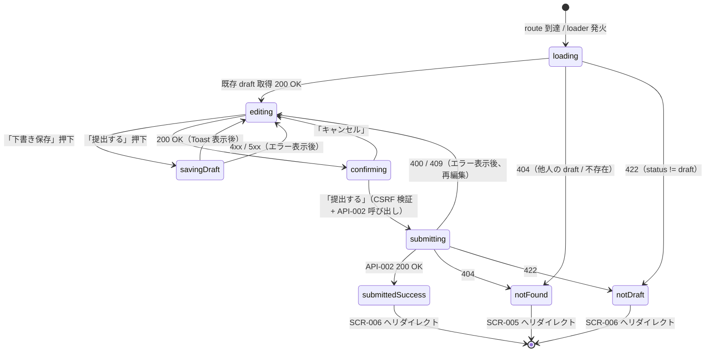

# SCR-004 — 投稿フォーム（draft 編集 / 提出）

## 目的

投稿者本人が自分の `draft` 提案を編集し、倫理ガード 3 種 + PolicyAgreement 同意 + visibility 選択を経て提出する画面（UC-002 / UC-016）。本画面で「下書き保存」（status 遷移なし）と「提出」（draft → submitted、API-002）の 2 操作を提供する。

## アクター

- 主アクター: 投稿者本人（`user` ロール、または `user` を含む兼任ロール）
- 想定権限: `proposals.author_id == viewer.user_id` 必須。reviewer / admin / auditor が他人の draft を開いた場合は 404（API 側および loader で検出 → `SCR-005` へリダイレクト、暫定統一）
- 想定デバイス: PC / モバイル両対応（モバイルでは textarea を縦長表示）

## 画面項目

| 項目名 | 型 | 必須 | 初期値 | バリデーション | 参照 API |
| --- | --- | --- | --- | --- | --- |
| タイトル | text（`Input`） | yes（提出時） | 既存 draft の `title` または 空 | trim 後 1〜200 文字（DB-003 と整合）。**送信時は server-side で再検証** | API-022 (createDraft) / API-023 (updateDraft) / API-002 (submit) |
| 本文 | textarea（`Textarea`） | yes（提出時） | 既存 draft の `body` または 空 | trim 後 1〜10,000 文字（DB-003 と整合）。**送信時は server-side で再検証** | 同上 / API-002 |
| visibility | radio（`RadioGroup`、3 択） | yes（提出時） | 既存 draft の `visibility` または `internal`（既定値）| `private` / `internal` / `public` のいずれか。**送信時は server-side で再検証** | API-002 |
| 倫理ガード 1：個人情報注意 | checkbox（`Checkbox`） | yes（提出時） | false | `true` であること。`false` のままでは提出ボタン disabled（UX 補助）。**送信時は server-side で再検証**（API-002 の `ethics_check_personal_info`、`BR-GUARD-01`） | API-002 |
| 倫理ガード 2：第三者誹謗中傷注意 | checkbox | yes（提出時） | false | 同上（`ethics_check_no_libel`） | API-002 |
| 倫理ガード 3：公開可能性明示 | checkbox | yes（提出時） | false | 同上（`ethics_check_publicity_acknowledged`） | API-002 |
| PolicyAgreement 同意 | checkbox | yes（提出時） | false | `true` であること。`false` では提出ボタン disabled。**送信時は server-side で再検証**（`policy_agreement_consent`、`BR-GUARD-02`） | API-002 |
| `policy_version` 表示 | text（読み取り専用） | yes | loader が API-018 を呼んで取得した最新版（MVP では `mvp-initial`） | 表示のみ。同意ボタン直近に表示し、リンクで `SCR-012` の該当ポリシーへ遷移可能。**API-002 への送信値としては使わない（M-4 / M-13 確定）**: server-side が同一ソースから再取得して PolicyAgreement に保存する。 | API-018（loader として参照） |
| ポリシーリンク（投稿ポリシー / プライバシー） | リンク（新規タブ） | yes | — | `/policies/posting` / `/policies/privacy` を新規タブで開く | API-018 |
| 「下書き保存」ボタン | button（`Button` variant=outline） | no | — | 任意のタイミングで押下可。バリデーションは緩い（タイトル・本文の空も許可、空でも保存）。送信時は server-side で再検証 | API-022 (createDraft, 新規時) / API-023 (updateDraft, 既存編集時) |
| 「提出する」ボタン | button（`Button` variant=default） | yes（フォーム submit） | disabled（必須項目未充足時） | UI 側 disabled は UX 補助。**実際の判定は server-side で再検証**（API-002 が倫理 3 種 + 同意 + visibility + title/body 必須を再検証） | API-002 |
| 提出確認ダイアログ | `AlertDialog` | yes（提出ボタン押下後） | hidden | 「提出すると編集できなくなります。よろしいですか？」+ 「提出する」「キャンセル」 | — |
| `expected_version` | hidden（数値） | yes（提出時） | API から取得した現 `version` | server-side で CAS 検証 → 不一致時 409 | API-002 |
| エラー表示エリア | `Alert` | no | hidden | 各フィールド直下の `field_errors` + 全体エラーバナー | — |

> shadcn/ui コンポーネント候補: `Form` / `Input` / `Textarea` / `RadioGroup` / `Checkbox` / `Button` / `AlertDialog` / `Alert` / `Card`。
> **server-side 検証の徹底（NFR-003 / PROB-005）**: UI のチェックボックス制御や disabled は **すべて UX 補助**。本物の検証は API-002 側（倫理ガード 3 種 / `policy_agreement_consent` / `visibility` enum / `title` / `body` 必須・文字数）で再実施。CSRF 対策として送信時 cookie は `SameSite=Lax`、Origin / Sec-Fetch-Site=same-origin を API 側で検証（NFR-006）。
> **policy_version の解決（M-4 / M-13 確定）**: 表示用には loader 段階で API-018 を呼んで最新版を取得し、画面 context として保持（hidden input 化はしない）。「提出する」押下時、API-002 リクエスト body に `policy_version` を含めない。server-side が API-018 と同一ソース（MVP では in-memory 定数）から再取得して PolicyAgreement に保存する。クライアント送信値の改竄リスクを排除する設計（NFR-003）。

## 操作フロー (UC 単位)

### UC-002 — 提案の起票・提出

1. 利用者がこの画面に到達する条件: `SCR-005` の「新規作成」または既存 draft の「編集」リンクから `/me/proposals/new`（新規）または `/me/proposals/{id}/edit`（既存）に到達。新規時は client-side で空の編集状態を持ち、初回保存で API-022 (createDraft) を呼び proposal_id を取得。既存編集時は API-013 で draft を取得（`status='draft'` のみ可、それ以外は 404 → `SCR-005` へ）し、編集中は API-023 (updateDraft) を呼ぶ。
2. 主シナリオ（提出）:
   1. 利用者がタイトル / 本文 / visibility を入力。
   2. 倫理ガード 3 種 + PolicyAgreement 同意 のチェックボックスをすべて確認。
   3. 「提出する」ボタンを押下 → `AlertDialog` が表示。
   4. 「提出する」を選択 → API-002 を `expected_version` 付きで呼び出し。
   5. 200 OK → `submitted` 遷移成功。`SCR-006`（自分の投稿詳細、`/me/proposals/{id}`）へリダイレクト。Toast「提出しました」。
3. 主シナリオ（下書き保存）:
   1. 利用者がタイトル / 本文 / visibility のいずれかを編集。
   2. 「下書き保存」ボタンを押下 → 新規時は API-022 (createDraft) を呼んで `proposal_id` を取得、既存編集時は API-023 (updateDraft) を呼ぶ（楽観ロック `expected_version` 付き）。
   3. 200 OK → 同じ画面に留まり、Toast「下書きを保存しました」+ `version` を更新。
4. 例外シナリオ:
   - 400 VALIDATION_ERROR（倫理ガード未確認 / 同意なし / title or body 空 / visibility 不正）→ 該当フィールド直下に赤字エラー、未確認チェックボックスをハイライト。
   - 401 UNAUTHENTICATED → `SCR-007` へリダイレクト。
   - 404 NOT_FOUND（他人の draft をパス指定で開いた）→ `SCR-005` へリダイレクト、Toast「該当の下書きが見つかりません」。
   - 409 CONFLICT（`expected_version` 不一致、別タブで編集された）→ 「他のタブで編集されました。最新を取得してください」+ 「最新を読み込む」ボタン（loader 再実行）。
   - 422 BUSINESS_RULE_VIOLATION（status が draft でない、再提出は SCR-006 経由）→ 「この提案はすでに提出済みです」+ `SCR-006` へのリンク。
   - 5xx → エラー境界 + 「再試行」。

### UC-016 — 倫理ガード（チェックボックス強制）

1. 利用者がこの画面に到達する条件: UC-002 と同じ。
2. 主シナリオ:
   1. 倫理ガード 3 種チェックボックスを画面中央に配置（無視できない位置）。
   2. 各チェックボックスのラベル: 「個人情報を含めないことを確認しました」「第三者の誹謗中傷でないことを確認しました」「公開される可能性を理解し同意しました」。
   3. 1 つでも未確認の場合、「提出する」ボタンは disabled（UX 補助）。
   4. 提出後、API-002 が server-side でも再検証（`BR-GUARD-01`）。
3. 例外シナリオ:
   - 開発者ツールで disabled を解除して送信した場合 → API-002 が 400 を返し、UI で該当チェックボックスをハイライト。

## 状態遷移

> **CSRF 検証**: 「下書き保存」「提出する」のいずれも mutation。送信時は `SameSite=Lax` cookie + `Origin` / `Sec-Fetch-Site=same-origin` を API 側で検証（NFR-006）。

## エラー・空状態

| 状況 | 表示 | 動線 |
| --- | --- | --- |
| 倫理ガード未確認 / 同意なし | 該当チェックボックス枠を赤色 + 直下「未確認の項目があります」+ 全体バナー「提出するには倫理ガードと同意が必要です」 | チェックボックスにフォーカス移動、バナーに「閉じる」ボタン |
| title 空 / 200 文字超過 | `Input` 直下「タイトルは 1〜200 文字で入力してください」 | フォーカスを title に移動 |
| body 空 / 10,000 文字超過 | `Textarea` 直下「本文は 1〜10,000 文字で入力してください」 + 文字数カウンタ表示 | フォーカスを body に移動 |
| visibility 不正値 | `RadioGroup` 直下「公開範囲を選択してください」 | フォーカスを visibility に移動 |
| 認証切れ（401） | 「セッションが切れました。再ログインしてください」 | `SCR-007` へリダイレクト（戻り先 URL を保持） |
| 他人の draft / 不存在（404） | 「該当の下書きが見つかりません」（一瞬表示） | `SCR-005` へ自動リダイレクト |
| 楽観ロック競合（409） | バナー「他のタブで編集されました。最新を取得してください」 | 「最新を読み込む」ボタン → loader 再実行 |
| 422（status != draft） | 「この提案はすでに提出済みです」 | `SCR-006` へのリンク |
| ネットワーク / 5xx | エラー境界フォールバック | 「再試行」 |

## アクセシビリティ

- フォーカス順序: タイトル → 本文 → visibility → 倫理ガード 1 → 倫理ガード 2 → 倫理ガード 3 → PolicyAgreement 同意 → 「下書き保存」→「提出する」
- ラベル付け: 各 `Input` / `Textarea` / `Checkbox` / `RadioGroup` に `<label>` または `aria-label` 必須。エラーメッセージは `aria-describedby` で関連付け
- キーボード操作: Tab で順次、Enter は submit、Escape は AlertDialog のキャンセル
- AlertDialog は focus trap（shadcn/ui のデフォルト）

## 権限による表示分岐

| ロール | 自分の draft | 他人の draft | 提出済み（status != draft） |
| --- | --- | --- | --- |
| guest | 401 → SCR-007 | 401 | 401 |
| user（投稿者本人） | 編集可 / 提出可 | — | 422 → SCR-006 へ誘導 |
| user（他人） | — | 404 → SCR-005 | 404 |
| reviewer | 自身が author の draft のみ可（兼任時） | 404（admin 権限でも他人の draft 編集・提出は不可、`BR-PROPOSAL-02`） | 404 / 422 |
| admin | 同上 | 404（同上） | 同上 |
| auditor | 同上 | 404 | 同上 |

> reviewer / admin であっても他人の draft の編集・提出は `BR-PROPOSAL-02`（投稿者本人のみ編集可）により 404（API-002 / draft 保存系で強制）。本画面は server-side authorize で守られる（NFR-003）。

## 参照

- 上流: `docs/02-requirements/02-functional-requirements.md` の REQ-002 / REQ-010 / REQ-013 / REQ-014 / REQ-015、`docs/02-requirements/03-non-functional-requirements.md` の NFR-002〜007、`docs/02-requirements/04-business-rules.md` の `BR-GUARD-01` / `BR-GUARD-02` / `BR-PROPOSAL-02`、`docs/10-basic-design/01-system-overview.md` の UC-002 / UC-016、`docs/10-basic-design/03-screen-list.md`、`docs/00-discovery/07-open-questions.md` の Q-008
- 下流: `docs/20-detail-design/apis/API-002.md`（submit）、`API-018.md`（policy_version 表示用）、`API-022.md`（createDraft、B-4 採番済）、`API-023.md`（updateDraft、B-4 採番済）、TASK-XXX（Phase 5）
