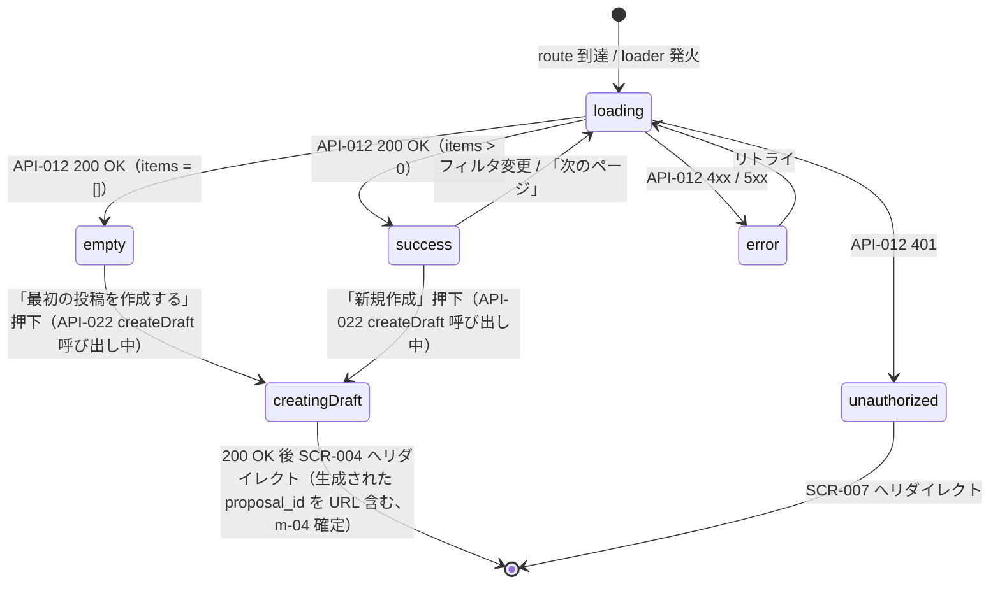

# SCR-005 — 自分の投稿一覧

## 目的

ログインユーザが自身が起票した提案を全 8 ステータス横断で閲覧する一覧画面（UC-010）。各エントリのステータスバッジで進捗を視覚化し、詳細遷移（`SCR-006`）と新規 draft 作成の入口を提供する（REQ-007）。

## アクター

- 主アクター: 投稿者本人（`user` ロール、または `user` を含む兼任ロール）
- 想定権限: ログイン必須。`author_id == viewer.user_id` で server-side フィルタ（API-012）。reviewer / admin / auditor も自身が起票した投稿があれば閲覧可、無ければ空リスト
- 想定デバイス: PC / モバイル両対応

## 画面項目

| 項目名 | 型 | 必須 | 初期値 | バリデーション | 参照 API |
| --- | --- | --- | --- | --- | --- |
| ステータスフィルタ | select（`Select`、9 値: 全件 + 8 ステータス） | no | 「全件」 | enum 検証。**送信時は server-side で再検証**（API-012 の `status` クエリ） | API-012 |
| 「新規作成」ボタン | button（`Button`） | yes | — | クリックで API-022 (createDraft) を呼び draft 新規作成 → 生成された `proposal_id` を URL に含めて `SCR-004` へ遷移 | API-022 (createDraft、B-4 採番済) |
| 投稿カード：タイトル | text（読み取り専用） | yes | API-012 から取得 | 表示のみ。最大 200 文字、超過は省略表示 | API-012 |
| 投稿カード：ステータスバッジ | enum（`Badge`、8 値） | yes | API-012 から取得 | 表示のみ。色分け（draft=gray / submitted=blue / in_review=cyan / approved=green / returned=orange / rejected=red / published=teal / withdrawn=purple、暫定） | API-012 |
| 投稿カード：visibility バッジ | enum（`Badge`） | yes | API-012 から取得 | 表示のみ | API-012 |
| 投稿カード：投稿者表示名 | text（読み取り専用、自身の投稿のため通常は viewer 自身の display_name） | no | `author_id` から解決 | 表示のみ。**表示専用扱い**（logger には出さない、DB-006 不変条件 3 / M-2 確定） | API-012 |
| 投稿カード：updated_at | datetime（読み取り専用） | yes | API-012 から取得 | Unix epoch millis を `YYYY-MM-DD HH:mm` 形式に整形 | API-012 |
| 投稿カード：詳細遷移 | リンク | yes | — | クリックで `SCR-006`（`/me/proposals/{id}`） | — |
| ページネーション「次のページ」 | button（`Button`） | no | `has_more=false` のとき非表示 | `next_cursor` を URL クエリに付与 | API-012 |
| 空状態メッセージ | static text | yes（0 件時） | 「まだ投稿がありません」 | — | — |
| 空状態の CTA | button | yes（0 件時） | 「最初の投稿を作成する」 | クリックで `SCR-004` へ | — |

> shadcn/ui コンポーネント候補: `Card` / `Badge` / `Button` / `Select` / `Pagination` / `Skeleton`。
> 本画面は GET のみ。新規作成ボタン押下時のみ API-022 (createDraft) を呼ぶ（mutation、CSRF 検証 → 違反時 **403 CSRF_DENIED**、B-2）。

## 操作フロー (UC 単位)

### 自分の投稿一覧の閲覧（UC-010）

1. 利用者がこの画面に到達する条件: ヘッダの「自分の投稿」リンクから `/me/proposals` にアクセス。loader が API-012 を呼ぶ前に cookie を確認、未ログインなら 401 → `SCR-007`。
2. 主シナリオ:
   1. loader が API-012 を呼び出す（必要に応じて `status` クエリ）。
   2. 200 OK → 投稿カードを `updated_at DESC` 順で一覧表示。
   3. ステータスフィルタを変更 → URL に `?status=...` を付与して再 loader、画面を再描画。
   4. カードクリック → `SCR-006` へ遷移。
   5. 「新規作成」ボタン押下 → API-022 (createDraft) で空 draft を作成（title/body/visibility は最小値で初期化）→ 生成された `proposal_id` を URL に含めて `SCR-004` へ遷移。
3. 例外シナリオ:
   - 401 UNAUTHENTICATED → `SCR-007` へリダイレクト。
   - 400 VALIDATION_ERROR（`status` の値不正）→ フィルタを「全件」にリセット + バナー「フィルタが正しくありませんでした」。
   - 5xx → エラー境界 + リトライ。

## 状態遷移

> **CSRF 検証**: 「新規作成」押下時の API-022 呼び出しは mutation のため、`SameSite=Lax` cookie + Origin / Sec-Fetch-Site=same-origin で CSRF 対策（NFR-006）。違反時は **403 CSRF_DENIED**（B-2 確定）。

## エラー・空状態

| 状況 | 表示 | 動線 |
| --- | --- | --- |
| 0 件（空状態） | 中央寄せの illustration + 「まだ投稿がありません」 | 「最初の投稿を作成する」CTA → SCR-004 |
| フィルタ後の 0 件 | 「該当する投稿がありません（フィルタ：returned）」 | 「フィルタを解除する」リンク |
| 認証切れ（401） | Toast「セッションが切れました」 | SCR-007 へリダイレクト |
| バリデーションエラー（400、`status` 不正） | バナー「フィルタが正しくありません」 | フィルタを「全件」にリセット |
| ネットワーク不通 / 5xx | エラー境界 | リトライ |

## アクセシビリティ

- フォーカス順序: ヘッダ → ステータスフィルタ →「新規作成」→ 投稿カード（先頭から）→ ページネーション
- ラベル付け: ステータスバッジに `aria-label="ステータス: ..."`、visibility バッジに `aria-label="公開範囲: ..."`、ステータスフィルタは `<label>`「ステータスで絞り込む」を関連付け
- キーボード操作: Tab で順次、Enter でカード遷移
- ステータス色分けは色のみに依存しない（バッジテキストでも識別可能）

## 権限による表示分岐

| ロール | 表示される items |
| --- | --- |
| guest | 401 → SCR-007 |
| user | 自身の全 8 ステータス |
| reviewer | 自身が起票した投稿のみ（兼任時。reviewer 単独では空） |
| admin | 同上 |
| auditor | 同上（auditor 単独では空、兼任時のみ自身分が表示） |

> 「自分の投稿一覧」は author 軸のフィルタであり、role による出し分けは行わない（API-012 が `author_id == viewer.user_id` で強制）。reviewer / admin / auditor 単独ロールのユーザは `user` 経路の投稿を持たないため一覧は空となる。

## 参照

- 上流: `docs/02-requirements/02-functional-requirements.md` の REQ-007 / REQ-010 / REQ-015、`docs/02-requirements/03-non-functional-requirements.md` の NFR-002〜007、`docs/10-basic-design/01-system-overview.md` の UC-010、`docs/10-basic-design/03-screen-list.md`
- 下流: `docs/20-detail-design/apis/API-012.md`、draft 保存系 server function（Phase 5 で採番）、TASK-XXX（Phase 5）
