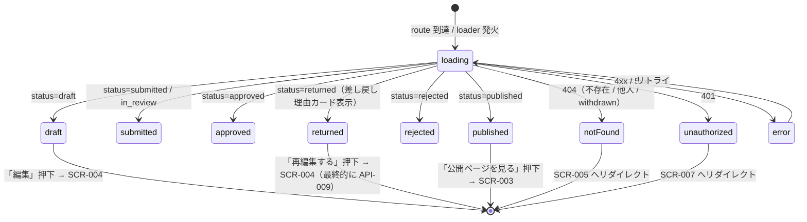

# SCR-006 — 自分の投稿詳細

## 目的

投稿者本人が自身の提案 1 件を全 8 ステータス横断で確認する詳細画面（UC-010）。`returned` のときは直近の差し戻し reason を強調表示し、再編集経路（`SCR-004`）への動線を提供する（UC-009）。`withdrawn` 自身分は 404 で本文非表示（REQ-005、API-013 と整合）。

## アクター

- 主アクター: 投稿者本人（`user` ロール、または `user` を含む兼任ロール）
- 想定権限: `proposals.author_id == viewer.user_id` 必須（API-013 が強制）。他人の投稿は 404
- 想定デバイス: PC / モバイル両対応

## 画面項目

| 項目名 | 型 | 必須 | 初期値 | バリデーション | 参照 API |
| --- | --- | --- | --- | --- | --- |
| タイトル | text（読み取り専用） | yes | API-013 から取得 | 表示のみ | API-013 |
| ステータスバッジ | enum（`Badge`） | yes | API-013 から取得 | 表示のみ。8 値の色分け（SCR-005 と同色規約） | API-013 |
| visibility バッジ | enum（`Badge`） | yes | API-013 から取得 | 表示のみ | API-013 |
| 本文 | text（読み取り専用、`Card` content） | yes | API-013 から取得 | 表示のみ。最大 10,000 文字、改行保持 | API-013 |
| ~~`current_policy_agreement_id` 表示~~ **削除 (MAJOR-5)**: ユーザに ID を見せる用途が不明確 | — | — | — | — | — |
| メタ情報：created_at / updated_at / submitted_at / published_at / withdrawn_at | datetime（読み取り専用） | yes | API-013 から取得 | Unix epoch millis を `YYYY-MM-DD HH:mm` 形式に整形。NULL は「—」表示 | API-013 |
| 差し戻し理由カード（status=returned のみ） | `Alert` variant=warning | yes（returned 時） | `last_return_reason.reason` | 表示のみ。`last_return_reason` が NULL の場合は表示しない | API-013 |
| 「再編集する」ボタン（status=returned のみ） | button（`Button`） | yes（returned 時） | — | クリックで `SCR-004` へ遷移（`/me/proposals/{id}/edit?mode=resubmit`）。再編集後の提出は API-009（resubmit）を呼ぶ | API-009（最終的に呼ぶ） |
| 「編集」ボタン（status=draft のみ） | button | yes（draft 時） | — | クリックで `SCR-004` へ遷移、編集後の保存は API-023 (updateDraft) | API-023 (updateDraft、B-4 採番済) |
| 「削除」ボタン（status=draft のみ、MVP 非実装） | button（disabled） | no | disabled | MVP 対象外。tooltip 「現在のバージョンでは削除はサポートされていません」 | — |
| 「公開ページを見る」リンク（status=published のみ） | リンク | yes（published 時） | — | クリックで `SCR-003`（`/proposals/{id}`） | API-011（遷移先） |
| エラー表示エリア | `Alert` | no | hidden | API エラー時に表示 | — |

> shadcn/ui コンポーネント候補: `Card` / `Badge` / `Alert` / `Button` / `Skeleton`。
> 本画面自体は GET。「再編集する」ボタンは画面遷移のみで mutation を起こさない（再提出時の API-009 呼び出しは `SCR-004` 内で発生）。

## 操作フロー (UC 単位)

### 自分の投稿詳細の閲覧（UC-010）

1. 利用者がこの画面に到達する条件: `SCR-005` のカード or 直 URL `/me/proposals/{id}` から到達。loader が API-013 を呼び出し、cookie + author 一致を検証。
2. 主シナリオ:
   1. 200 OK を受領 → タイトル / ステータス / visibility / 本文 / メタ情報を表示。
   2. status に応じた追加 UI を出し分け:
      - `draft` → 「編集」「削除」（disabled）
      - `submitted` / `in_review` / `approved` / `rejected` → 操作ボタンなし（閲覧のみ）
      - `returned` → 差し戻し理由カード + 「再編集する」ボタン
      - `published` → 「公開ページを見る」リンク
3. 例外シナリオ:
   - 401 UNAUTHENTICATED → `SCR-007` へリダイレクト。
   - 404 NOT_FOUND（不存在 / 他人の投稿 / `withdrawn`） → `/me/proposals` へリダイレクト + Toast「該当の投稿が見つかりません」。
   - 5xx → エラー境界 + リトライ。

### 再提出 returned からの編集（UC-009）

1. 利用者がこの画面に到達する条件: status=`returned` の自身の投稿に到達。
2. 主シナリオ:
   1. 差し戻し理由カードに `last_return_reason.reason` / `returned_at` が表示される。
   2. 「再編集する」ボタン押下 → `SCR-004` へ遷移（同一 proposal_id を保持、`BR-RESUBMIT-01`）。
   3. `SCR-004` で title / body を編集（visibility は変更不可、DB-003 不変条件 7）→「提出する」押下 → API-009（resubmit）が呼ばれる。
   4. 200 OK → `submitted` 遷移成功、本画面に戻り Toast「再提出しました」。
3. 例外シナリオ:
   - 「再編集する」を押した時点で別タブで status が変わっていた場合（例: 既に admin が rejected に変更）→ `SCR-004` の loader 側で 422 → 「この提案はすでに別の状態です」+ 本画面へ戻る。

## 状態遷移

> 本画面のボタン操作は画面遷移のみで mutation を起こさない。再提出時の CSRF 検証は `SCR-004` + API-009 側で実施（NFR-006）。

## エラー・空状態

| 状況 | 表示 | 動線 |
| --- | --- | --- |
| 不存在 / 他人の投稿 / withdrawn（404） | 「該当の投稿が見つかりません」（一瞬） | `/me/proposals` へ自動リダイレクト |
| 認証切れ（401） | Toast「セッションが切れました」 | SCR-007 へリダイレクト |
| バリデーションエラー（400、`id` 形式不正） | バナー「URL が正しくありません」 | `/me/proposals` へのリンク |
| ネットワーク不通 / 5xx | エラー境界 | リトライ |
| `last_return_reason` が NULL なのに status=returned（不整合） | 差し戻し理由カードに「理由情報が取得できませんでした」を表示し、再編集ボタンは表示する（再編集自体は可能） | 通常通り「再編集する」 |

## アクセシビリティ

- フォーカス順序: ヘッダ → 戻るリンク → タイトル（`<h1>`）→ ステータス / visibility バッジ → メタ情報 → 差し戻し理由カード（returned 時）→ 本文 → アクションボタン群
- ラベル付け: ステータス / visibility バッジに `aria-label`、差し戻し理由カードは `<aside aria-labelledby="return-reason-heading">`
- キーボード操作: Tab で順次、Enter でボタン発火

## 権限による表示分岐

| ロール / 投稿の author | 自身の投稿（status=draft） | 自身の投稿（returned） | 自身の投稿（withdrawn） | 他人の投稿 |
| --- | --- | --- | --- | --- |
| guest | 401 → SCR-007 | 401 | 401 | 401 |
| user | 編集 + 削除（disabled） | 差し戻し理由 + 「再編集する」 | 404 → SCR-005 | 404 → SCR-005 |
| reviewer / admin / auditor（兼任時） | 同上 | 同上 | 同上 | 同上 |

> reviewer / admin / auditor 単独ロールのユーザは `user` 経路の投稿を持たないため、本画面に到達するパスは存在しない（SCR-005 から空リスト経由）。reviewer / admin として他人の投稿を見る経路は `SCR-009` を使用（本画面ではない）。

## 参照

- 上流: `docs/02-requirements/02-functional-requirements.md` の REQ-005 / REQ-006 / REQ-007 / REQ-010 / REQ-015、`docs/02-requirements/03-non-functional-requirements.md` の NFR-002〜007、`docs/02-requirements/04-business-rules.md` の `BR-RESUBMIT-01`、`docs/10-basic-design/01-system-overview.md` の UC-009 / UC-010、`docs/10-basic-design/03-screen-list.md`
- 下流: `docs/20-detail-design/apis/API-013.md`、`API-009.md`（再提出時に最終的に呼ばれる）、TASK-XXX（Phase 5）
