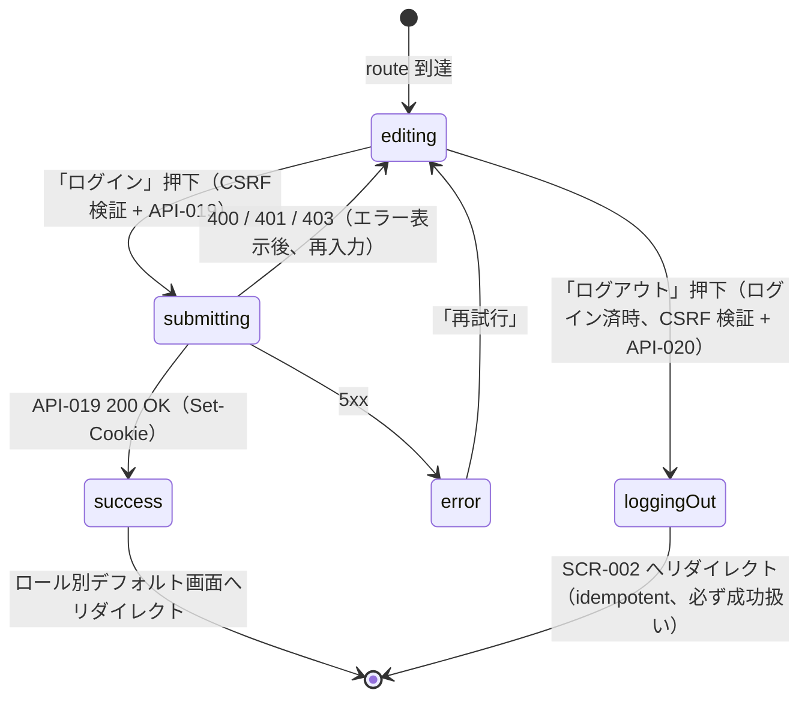

# SCR-007 — ログイン（モック認証）

## 目的

cookie + 環境変数許可リストに基づくモック認証 UI を提供し、許可リストにあるユーザがセッションを確立する画面（UC-018）。学習目的（GOAL-05 / GOAL-06）の MVP では実プロバイダ統合は対象外。ログアウト導線も本画面または header メニューから提供する。

## アクター

- 主アクター: ゲスト（未ログイン）が主だが、ログイン済が再ログインのため到達することも許容
- 想定権限: 不要（公開バイパス対象、API-019 が公開バイパス）。CSRF 検証は API-019 / API-020 側で実施
- 想定デバイス: PC / モバイル両対応（モバイルではフォームを縦長に）

## 画面項目

| 項目名 | 型 | 必須 | 初期値 | バリデーション | 参照 API |
| --- | --- | --- | --- | --- | --- |
| ユーザ識別子 (`user_identifier`) | text（`Input`） | yes | （空）または cookie 復元時の前回値 | trim 後 1〜128 文字。**送信時は server-side で許可リスト照合**（API-019） | API-019 |
| ロール選択 (`role_request`) | select（`Select`、5 値: 自動 / user / reviewer / admin / auditor、CSV 入力は MVP 非対応） | no | 「自動」（許可リストの全 roles を採用） | enum 検証。「自動」選択時は API-019 にフィールド送らず、それ以外は当該 role を送信。**送信時は server-side で許可リスト部分集合を再検証** | API-019 |
| 「ログイン」ボタン | button（`Button` variant=default） | yes | enabled（user_identifier 入力時のみ） | UI 側 disabled は UX 補助。実際の判定は API-019 側で許可リスト照合 | API-019 |
| 「ゲストとして閲覧する」リンク | リンク | yes | — | クリックで `SCR-002` へ遷移（API 呼び出しなし） | — |
| 「ログアウト」ボタン（ログイン済時のみ表示） | button（`Button` variant=outline） | no | hidden（guest 時） | クリックで API-020 を呼び出し、cookie を破棄して `SCR-002` へ | API-020 |
| エラー表示エリア | `Alert` | no | hidden | 401 / 400 / 403 のメッセージ表示 | — |
| ポリシーリンク（フッタ） | リンク | yes | — | `/policies/posting` / `/policies/privacy` への内部遷移 | API-018 |

> shadcn/ui コンポーネント候補: `Form` / `Input` / `Select` / `Button` / `Alert` / `Card`。
> **server-side 検証の徹底（NFR-003 / PROB-005）**: `user_identifier` の許可リスト照合は API-019 側で実施。UI 側の disabled は UX 補助。**CSRF 対策**: 送信時に `Origin` / `Sec-Fetch-Site=same-origin` を API-019 / API-020 側で検証（NFR-006）。違反時 403 CSRF_DENIED。

## 操作フロー (UC 単位)

### UC-018 — ログイン / ログアウト

1. 利用者がこの画面に到達する条件: ヘッダの「ログイン」リンク or 認証必須画面の loader が 401 を返した際の自動リダイレクトで `/login` に到達。
2. 主シナリオ（ログイン）:
   1. 利用者が `user_identifier` を入力。
   2. 必要に応じて `role_request` を選択（兼任時の表示切替テスト用、本番運用では「自動」）。
   3. 「ログイン」ボタン押下 → API-019 を呼び出し（CSRF 対策 cookie + Origin 検証）。
   4. 200 OK + `Set-Cookie: session=...; HttpOnly; SameSite=Lax` を受領。
   5. レスポンス body の `roles` に応じてデフォルト遷移先を決定:
      - `user` のみ → `SCR-005`（自分の投稿一覧）
      - `reviewer` を含む → `SCR-008`（レビュー待ち一覧）
      - `admin` を含む → `SCR-008`（admin の運用上の自然な入口、レビュー待ち一覧）
      - `auditor` のみ → `SCR-010`（監査ログ一覧）
      - 上記が複合する場合の優先度: admin > reviewer > auditor > user の順で最初に該当した遷移先（暫定）
3. 主シナリオ（ログアウト）:
   1. ログイン済の状態で「ログアウト」ボタン押下（本画面または header メニューから）。
   2. API-020 を呼び出し（CSRF 対策）。
   3. 200 OK + `Set-Cookie: session=; Max-Age=0` で cookie 失効。
   4. `SCR-002` へリダイレクト + Toast「ログアウトしました」。
4. 例外シナリオ:
   - 400 VALIDATION_ERROR（`user_identifier` 形式不正、長さ 0 や 128 超） → フィールド直下「ユーザ識別子を入力してください（128 文字以内）」。
   - 401 UNAUTHENTICATED（許可リスト外、または `role_request` が許可リストの roles の部分集合でない）→ バナー「ログインに失敗しました」（タイミング攻撃対策のため理由を漏らさない統一文言、API-019 規約と整合）。
   - 403 CSRF_DENIED → バナー「セキュリティ検証に失敗しました。ページを再読み込みしてください」+ 「再読み込み」ボタン。
   - 5xx → エラー境界 + 「再試行」。

## 状態遷移

> **CSRF 検証**: 「ログイン」「ログアウト」のいずれも mutation。送信時は `Origin` / `Sec-Fetch-Site=same-origin` を API-019 / API-020 側で検証（NFR-006）。違反時 403 CSRF_DENIED。

## エラー・空状態

| 状況 | 表示 | 動線 |
| --- | --- | --- |
| 許可リスト外（401） | バナー「ログインに失敗しました」（統一文言、原因を漏らさない） | フィールドにフォーカス、再入力 |
| `user_identifier` 空 / 128 文字超（400） | フィールド直下「ユーザ識別子を入力してください（1〜128 文字）」 | フィールドにフォーカス |
| `role_request` enum 不正（400） | フィールド直下「ロール選択が正しくありません」 | リセット |
| CSRF 違反（403） | バナー「セキュリティ検証に失敗しました。ページを再読み込みしてください」 | 「再読み込み」ボタン |
| ネットワーク不通 | バナー「ネットワークに接続できませんでした」 | 「再試行」 |
| サーバエラー（5xx） | エラー境界 | 「再試行」 |
| ログアウト失敗（CSRF 違反のみ。idempotent のため通常 200） | バナー「ログアウト処理でエラーが発生しました」 | 「再試行」 |

## アクセシビリティ

- フォーカス順序: ユーザ識別子 → ロール選択 → 「ログイン」→ 「ゲストとして閲覧する」→（ログイン済時）「ログアウト」
- ラベル付け: 各 `Input` / `Select` に `<label>`。エラーメッセージは `aria-describedby` で関連付け、`aria-live="polite"` で動的通知
- キーボード操作: Enter で submit、Tab で順次

## 権限による表示分岐

| 状態 | 表示要素 |
| --- | --- |
| guest（未ログイン） | ユーザ識別子入力 + ロール選択 + 「ログイン」+ 「ゲストとして閲覧する」 |
| ログイン済（再ログイン目的） | 上記 + 「現在のセッション: <user_id>」+ 「ログアウト」ボタン |

> 本画面は公開バイパス対象（API-019 / API-020 の認可レベル: public / mixed）。loader 側で 401/404 を返すことはない。

## 参照

- 上流: `docs/02-requirements/02-functional-requirements.md` の REQ-010 / REQ-015、`docs/02-requirements/03-non-functional-requirements.md` の NFR-002〜007、`docs/10-basic-design/01-system-overview.md` の UC-018、`docs/10-basic-design/03-screen-list.md`
- 下流: `docs/20-detail-design/apis/API-019.md`、`API-020.md`、TASK-XXX（Phase 5）
