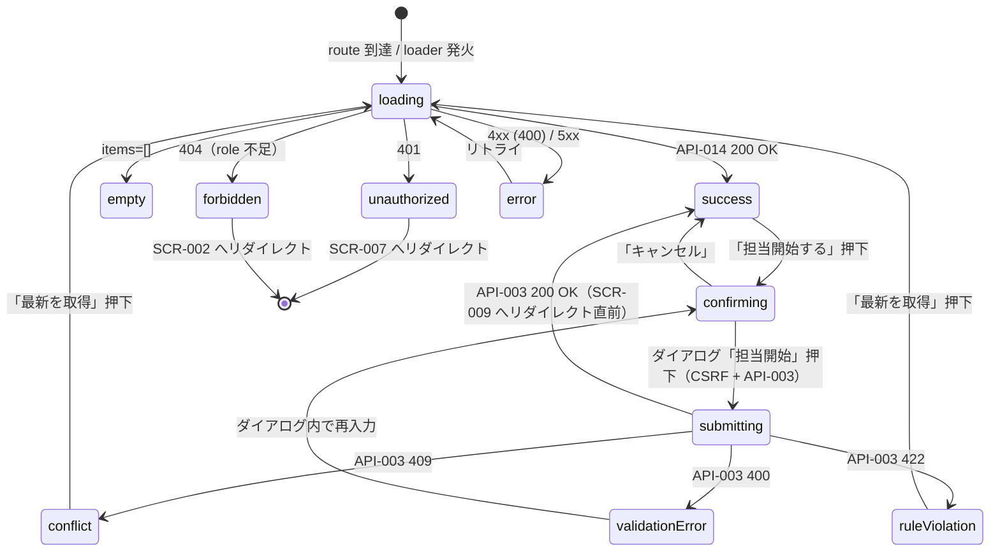

# SCR-008 — レビュー待ち一覧

## 目的

`reviewer` または `admin` が `submitted` / `in_review` の提案を横断して一覧する画面（UC-012）。提出時刻が古いものから優先処理する想定で `submitted_at ASC` の並び（API-014 と整合）。担当開始（API-003）の入口を提供する（REQ-009）。

## アクター

- 主アクター: `reviewer` / `admin`
- 想定権限: `reviewer` または `admin` 必須。`user` / `auditor` は 404、guest は 401（API-014 が強制、NFR-003）
- 想定デバイス: PC 主、モバイル副（テーブル表示はモバイルではカード表示にフォールバック）

## 画面項目

| 項目名 | 型 | 必須 | 初期値 | バリデーション | 参照 API |
| --- | --- | --- | --- | --- | --- |
| ステータスフィルタ | select（`Select`、3 値: 全件 / submitted / in_review） | no | 「全件」（submitted + in_review） | enum 検証。**送信時は server-side で再検証**（API-014 の `status` クエリ） | API-014 |
| 投稿テーブル：タイトル抜粋 | text（読み取り専用） | yes | API-014 から取得 | 表示のみ。50 文字超は省略 | API-014 |
| 投稿テーブル：visibility バッジ | enum（`Badge`） | yes | API-014 から取得 | reviewer は `public` / `internal`、admin は `private` も含む | API-014 |
| 投稿テーブル：ステータスバッジ | enum（`Badge`、submitted / in_review） | yes | API-014 から取得 | 表示のみ | API-014 |
| 投稿テーブル：投稿者表示名 | text | yes | `author_id` を表示用に解決 | 表示のみ。**表示専用扱い**（logger には出さない、DB-006 不変条件 3 / M-2 確定） | API-014 |
| 投稿テーブル：submitted_at | datetime | yes | API-014 から取得 | `YYYY-MM-DD HH:mm` 形式 | API-014 |
| 投稿テーブル：経過時間 | computed text | yes | `now() - submitted_at` | 「N 時間 M 分前」「N 日前」形式 | （計算のみ） |
| 投稿テーブル：担当 reviewer 表示 | text（`assignee_id` 解決、in_review のみ） | no | API-014 から取得 | submitted では「未担当」、in_review では担当者表示名 | API-014 |
| 「担当開始する」ボタン（行ごと、submitted のみ） | button（`Button` variant=default） | yes（submitted 行のみ） | enabled | クリックで `AlertDialog` 表示 → reason 入力 → API-003 を `expected_version` 付きで呼び出し | API-003 |
| 担当開始確認ダイアログ：reason | textarea（`Textarea`） | yes（提出時） | （空） | trim 後 1〜4000 文字（API-003 の `BR-REVIEW-01`）。**送信時は server-side で再検証** | API-003 |
| 「詳細を見る」リンク（行ごと、in_review） | リンク | yes（in_review 行のみ） | — | クリックで `SCR-009` へ遷移（`/review/proposals/{id}`） | API-015（遷移先） |
| 「最新を取得」ボタン | button（`Button` variant=outline） | no | — | クリックで loader 再実行 | API-014 |
| ページネーション「次のページ」 | button | no | `has_more=false` のとき非表示 | `next_cursor` を URL クエリに付与 | API-014 |
| 空状態メッセージ | static text | yes（0 件時） | 「レビュー待ちはありません」 | — | — |

> shadcn/ui コンポーネント候補: `Table`（PC）/ `Card`（モバイル）/ `Badge` / `Button` / `AlertDialog` / `Textarea` / `Select` / `Pagination` / `Toast` / `Skeleton`。
> **server-side 検証の徹底（NFR-003 / PROB-005）**: reason の必須・文字数チェックは API-003 側で再実施。UI 側のチェックは UX 補助。
> **CSRF 対策（NFR-006）**: 「担当開始する」は mutation のため、送信時 `SameSite=Lax` cookie + `Origin` / `Sec-Fetch-Site=same-origin` を API-003 側で検証。

## 操作フロー (UC 単位)

### UC-012 — レビュー待ち一覧の閲覧と担当開始

1. 利用者がこの画面に到達する条件: ヘッダの「レビュー待ち」リンクから `/review/queue` にアクセス。loader が cookie + role 検証（reviewer / admin のみ）。
2. 主シナリオ（一覧閲覧）:
   1. loader が API-014 を呼び出し、200 OK で `submitted` + `in_review` 一覧を `submitted_at ASC` 順で受領。
   2. テーブル / カード形式で表示。経過時間が長い投稿はバッジ強調（暫定: 7 日以上を warning カラー）。
3. 主シナリオ（担当開始）:
   1. submitted 行の「担当開始する」ボタン押下。
   2. `AlertDialog` で reason 入力欄を表示「担当を開始する理由を入力してください（必須）」。
   3. reason 入力後「担当開始」ボタン押下 → API-003 を `expected_version` 付きで呼び出し（CSRF 対策）。
   4. 200 OK → `in_review` 遷移成功。`SCR-009`（`/review/proposals/{id}`）へリダイレクト + Toast「担当を開始しました」。
4. 例外シナリオ:
   - 401 UNAUTHENTICATED → `SCR-007` へリダイレクト。
   - 404 NOT_FOUND（user / auditor が到達した場合）→ 「このページにはアクセスできません」+ `SCR-002` へのリンク。
   - 400 VALIDATION_ERROR（reason 空 / 4000 文字超）→ ダイアログ内エラー表示「理由は 1〜4000 文字で入力してください」。
   - 409 CONFLICT（楽観ロック失敗、別 reviewer が先に担当開始）→ ダイアログを閉じ、バナー「他のレビュアーが先に担当開始しました。一覧を更新してください。」+ 「最新を取得」ボタンで loader 再実行。
   - 422 BUSINESS_RULE_VIOLATION（status が submitted でない、別経路で承認済み等） → 「この投稿はすでに別の状態です」+ loader 再実行。
   - 5xx → エラー境界 + リトライ。

## 状態遷移

## エラー・空状態

| 状況 | 表示 | 動線 |
| --- | --- | --- |
| 0 件 | 中央寄せ「レビュー待ちはありません」 | 「最新を取得」ボタン |
| 認証切れ（401） | Toast「セッションが切れました」 | SCR-007 へリダイレクト |
| role 不足（404、user / auditor） | 「このページにはアクセスできません」全画面 fallback | SCR-002 へのリンク |
| reason 空 / 4000 文字超（400） | ダイアログ内 textarea 直下「理由は 1〜4000 文字で入力してください」 | textarea にフォーカス |
| 楽観ロック競合（409） | バナー「他のレビュアーが先に担当開始しました。一覧を更新してください。」 | 「最新を取得」ボタン → loader 再実行 |
| status 遷移違反（422） | バナー「この投稿はすでに別の状態です」 | 「最新を取得」ボタン |
| CSRF 違反（403、API 側で発生時は 404 として隠蔽） | バナー「セキュリティ検証に失敗しました」 | 「再読み込み」 |
| ネットワーク / 5xx | エラー境界 | リトライ |

## アクセシビリティ

- フォーカス順序: ヘッダ → ステータスフィルタ → 「最新を取得」 → テーブル各行（タイトル → 担当開始 / 詳細を見る）→ ページネーション
- ラベル付け: テーブルヘッダ `<th scope="col">`、各バッジに `aria-label`、AlertDialog は focus trap（shadcn/ui デフォルト）
- キーボード操作: Tab で順次、Enter でボタン発火、Escape で AlertDialog をキャンセル

## 権限による表示分岐

| ロール | 表示される items |
| --- | --- |
| guest | 401 → SCR-007 |
| user | 404 → SCR-002 |
| reviewer | submitted + in_review、`private` を除外（Q-016 暫定、API-014 が強制） |
| admin | submitted + in_review、全 visibility |
| auditor | 404 → SCR-002 |

> 本画面のロール判定は API-014 / API-003 側で実施（NFR-003）。UI のナビゲーション出し分けは UX 補助。

## 参照

- 上流: `docs/02-requirements/02-functional-requirements.md` の REQ-009 / REQ-010 / REQ-011 / REQ-015、`docs/02-requirements/03-non-functional-requirements.md` の NFR-002〜007、`docs/02-requirements/04-business-rules.md` の `BR-REVIEW-01` / `BR-REVIEW-02`、`docs/10-basic-design/01-system-overview.md` の UC-012、`docs/10-basic-design/03-screen-list.md`、`docs/00-discovery/07-open-questions.md` の Q-016
- 下流: `docs/20-detail-design/apis/API-014.md`、`API-003.md`、TASK-XXX（Phase 5）
