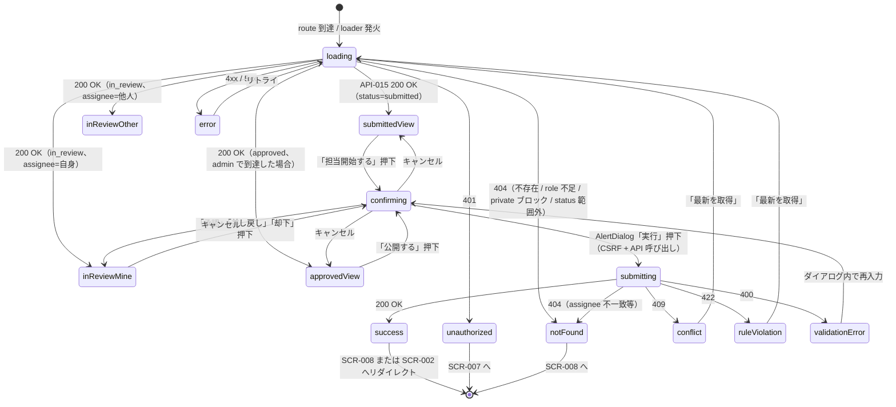

# SCR-009 — レビュー詳細（判定アクション）

## 目的

`reviewer` または `admin` が `submitted` / `in_review` の提案詳細を確認し、判定操作（担当開始 / 承認 / 差し戻し / 却下）を実行する画面（UC-003〜UC-006）。`approved` 状態のときは admin が公開（API-007）を実行できる入口（UC-007）も提供する。AuditLog 履歴抜粋を表示してレビュアーの判断補助とする（API-015 と整合）。

## アクター

- 主アクター: `reviewer` / `admin`
- 想定権限: `reviewer` または `admin` 必須。reviewer は `private` 投稿に到達不可（Q-016 暫定、API-015 が 404）。`assignee_id != viewer.user_id` での判定（approve / return / reject）は API 側で 404
- 想定デバイス: PC 主、モバイル副

## 画面項目

| 項目名 | 型 | 必須 | 初期値 | バリデーション | 参照 API |
| --- | --- | --- | --- | --- | --- |
| タイトル | text（読み取り専用） | yes | API-015 から取得 | 表示のみ | API-015 |
| ステータスバッジ | enum（`Badge`、submitted / in_review / approved（公開待ち）） | yes | API-015 から取得 | 表示のみ | API-015 |
| visibility バッジ | enum（`Badge`） | yes | API-015 から取得 | reviewer は `public` / `internal`、admin は `private` も | API-015 |
| 投稿者表示名 | text | yes | API-015 から取得 | 表示のみ（PII 配慮） | API-015 |
| submitted_at / updated_at | datetime | yes | API-015 から取得 | `YYYY-MM-DD HH:mm` | API-015 |
| 担当 reviewer 表示（`assignee_id`） | text | no（in_review 時のみ） | API-015 から取得 | 表示のみ | API-015 |
| `policy_version` 表示 | text（読み取り専用） | yes | API-015 から取得 | 表示のみ。`current_policy_agreement_id` も補助情報として表示 | API-015 |
| 本文 | text（読み取り専用、`Card` content） | yes | API-015 から取得 | 表示のみ。最大 10,000 文字、改行保持 | API-015 |
| AuditLog 履歴抜粋 | list（`Card` 内、`submit` / `return` / `resubmit` のみ） | yes | API-015 から取得 | 表示のみ。各エントリ: action / actor / actor_role / before→after / reason / created_at | API-015 |
| 判定 reason 入力欄 | textarea（`Textarea`、判定アクション 4 種で共通） | yes（判定実行時） | （空） | trim 後 1〜4000 文字（API-003〜006 の `BR-REVIEW-01`）。**送信時は server-side で再検証** | API-003 / API-004 / API-005 / API-006 |
| 「担当開始する」ボタン（status=submitted のみ） | button（`Button`） | yes（submitted 時） | enabled | 押下で AlertDialog → reason 確認 → API-003 | API-003 |
| 「承認する」ボタン（status=in_review、`assignee_id == viewer.user_id` のみ） | button（`Button` variant=default） | yes（条件成立時） | enabled | 押下で AlertDialog → API-004 | API-004 |
| 「差し戻す」ボタン（status=in_review、自身が担当のみ） | button（`Button` variant=secondary） | yes（条件成立時） | enabled | 押下で AlertDialog → API-005 | API-005 |
| 「却下する」ボタン（status=in_review、自身が担当のみ） | button（`Button` variant=destructive） | yes（条件成立時） | enabled | 押下で確認の強い AlertDialog → API-006 | API-006 |
| 「公開する」ボタン（status=approved、admin のみ表示） | button（`Button` variant=default） | yes（admin × approved 時） | enabled | 押下で AlertDialog → API-007 | API-007 |
| 確認 AlertDialog（4 アクション + 公開で共通テンプレート） | `AlertDialog` | yes（判定実行時） | hidden | reason textarea + 「実行」「キャンセル」 | — |
| `expected_version` | hidden（数値） | yes（mutation 時） | API-015 から取得 | server-side で CAS 検証 → 不一致時 409 | API-003〜007 |
| 「最新を取得」ボタン | button | no | — | クリックで loader 再実行 | API-015 |
| エラー表示エリア | `Alert` | no | hidden | API エラー時の表示 | — |

> shadcn/ui コンポーネント候補: `Card` / `Badge` / `Button` / `AlertDialog` / `Textarea` / `Skeleton` / `Toast` / `Separator`。
> **server-side 検証の徹底（NFR-003 / PROB-005）**: reason の必須・文字数チェックは API-003〜007 側で再実施。UI 側のチェックは UX 補助。`assignee_id == viewer.user_id` の判定も API 側で強制。
> **CSRF 対策（NFR-006）**: 全判定アクションは mutation。送信時 `SameSite=Lax` cookie + `Origin` / `Sec-Fetch-Site=same-origin` を API 側で検証。

## 操作フロー (UC 単位)

### 担当開始 status=submitted（UC-003）

1. 利用者がこの画面に到達する条件: `SCR-008` の「担当開始する」を経由しないが、直 URL `/review/proposals/{id}` で submitted 投稿に到達した場合。
2. 主シナリオ:
   1. loader が API-015 を呼び出し、200 OK で詳細 + AuditLog 履歴を取得。
   2. status=submitted のため「担当開始する」ボタンが表示。
   3. 押下 → AlertDialog で reason 入力 → API-003 を `expected_version` 付きで呼び出し。
   4. 200 OK → status=in_review に更新、画面 reload + Toast「担当を開始しました」。
3. 例外シナリオ:
   - 409 → 「他のレビュアーが先に担当開始しました。一覧を更新してください。」+ 「最新を取得」。
   - 422 → 「この投稿はすでに別の状態です」+ 「最新を取得」。

### 承認 status=in_review、自身が担当（UC-004）

1. 利用者がこの画面に到達する条件: 担当開始後または `SCR-008` の「詳細を見る」から到達。
2. 主シナリオ:
   1. status=in_review、`assignee_id == viewer.user_id` を確認。
   2. 「承認する」ボタン押下 → AlertDialog「承認しますか？理由を入力してください（必須）」。
   3. reason 入力 + 「承認」押下 → API-004。
   4. 200 OK → status=approved に更新、Toast「承認しました」。SCR-008 へ戻る。
3. 例外シナリオ:
   - 404（assignee 不一致）→ 「自身が担当でない投稿は承認できません」+ SCR-008 へ戻る。
   - 409 → 「投稿が更新されました。最新を取得してください」+ 「最新を取得」。
   - 422 → 「この投稿はすでに別の状態です」+ 「最新を取得」。

### 差し戻し status=in_review、自身が担当（UC-005）

1. UC-004 と同条件。
2. 主シナリオ:
   1. 「差し戻す」ボタン押下 → AlertDialog「差し戻しますか？投稿者向けの理由を入力してください（必須）」。
   2. reason 入力 + 「差し戻し」押下 → API-005。
   3. 200 OK → status=returned に更新、Toast「差し戻しました」。SCR-008 へ戻る。
3. 例外シナリオ: UC-004 と同じ。

### 却下 status=in_review、自身が担当（UC-006）

1. UC-004 と同条件。
2. 主シナリオ:
   1. 「却下する」ボタン押下 → AlertDialog（destructive variant、強めの確認文言）「却下すると以後再提出できません。理由を入力してください（必須）」。
   2. reason 入力 + 「却下」押下 → API-006。
   3. 200 OK → status=rejected（終端状態）に更新、Toast「却下しました」。SCR-008 へ戻る。
3. 例外シナリオ: UC-004 と同じ。

### 公開 status=approved、admin のみ（UC-007）

1. 利用者がこの画面に到達する条件: status=approved の投稿に admin で到達（ヘッダや別画面のリンクから）。
2. 主シナリオ:
   1. status=approved + admin role 確認。
   2. 「公開する」ボタン押下 → AlertDialog「公開しますか？（理由は任意）」。
   3. reason 入力（任意）+ 「公開」押下 → API-007。
   4. 200 OK → status=published に更新、Toast「公開しました」。`SCR-002` または `SCR-008` へ戻る（暫定: SCR-002）。
3. 例外シナリオ:
   - 404（admin でない、または approved でない）→ 「このページの操作は実行できません」+ SCR-008 へ戻る。
   - 409 / 422 → 通常通り「最新を取得」。

> 取り下げ（withdraw、UC-008、API-008）の入口は本画面では提供しない（status=published を本画面の loader 範囲外とするため、API-015 の対象外）。withdraw は別画面（基本設計の `SCR-013` 公開操作画面）から実行。

## 状態遷移

## エラー・空状態

| 状況 | 表示 | 動線 |
| --- | --- | --- |
| 不存在 / role 不足 / private ブロック / status 範囲外（404） | 「このページにはアクセスできません」 | SCR-008 / SCR-002 へリダイレクト |
| 認証切れ（401） | Toast「セッションが切れました」 | SCR-007 へリダイレクト |
| reason 空 / 4000 文字超（400） | AlertDialog 内「理由は 1〜4000 文字で入力してください」 | textarea にフォーカス |
| 楽観ロック競合（409） | バナー「投稿が更新されました。最新を取得してください」 | 「最新を取得」ボタン → loader 再実行 |
| 状態遷移違反（422） | バナー「この投稿はすでに別の状態です」 | 「最新を取得」 |
| assignee 不一致（404、approve/return/reject 時） | バナー「自身が担当でない投稿は判定できません」 | SCR-008 へ戻る |
| CSRF 違反（403、API 側で 404 として隠蔽） | バナー「セキュリティ検証に失敗しました」 | 「再読み込み」 |
| ネットワーク / 5xx | エラー境界 | リトライ |

## アクセシビリティ

- フォーカス順序: ヘッダ → 戻るリンク → タイトル（`<h1>`） → ステータス / visibility バッジ → メタ情報 → 本文 → AuditLog 履歴抜粋 → 判定アクションボタン群（左から：担当開始 / 承認 / 差し戻し / 却下 / 公開）
- ラベル付け: 各バッジに `aria-label`、AlertDialog の reason textarea に `<label>`、AuditLog 履歴は `<ol>` で時系列順
- キーボード操作: Tab で順次、Enter でボタン発火、Escape で AlertDialog のキャンセル
- 「却下」「公開」など影響大の操作は AlertDialog の destructive / default variant でデザイン上区別

## 権限による表示分岐

| ロール / status | submitted | in_review (assignee=自身) | in_review (assignee=他人) | approved | rejected / returned / withdrawn / published |
| --- | --- | --- | --- | --- | --- |
| guest | 401 | 401 | 401 | 401 | 401 |
| user | 404 | 404 | 404 | 404 | 404 |
| reviewer | 「担当開始」表示 | 「承認」「差し戻し」「却下」表示 | 閲覧のみ（自身が担当でない旨表示） | 404（API-015 が 404、approved は対象外） | 404 |
| admin | 「担当開始」表示 | 「承認」「差し戻し」「却下」表示（admin が assignee 時） | 閲覧のみ | 「公開する」表示 | 404 |
| auditor | 404 | 404 | 404 | 404 | 404 |

> 本画面の loader (API-015) は status が `submitted` / `in_review` 以外の場合 404 で隠蔽する。例外として、admin が approved 投稿の公開操作を行う場合は本画面の loader 設計上 404 となるため、approved 投稿への到達経路は別画面（基本設計の `SCR-013`）または admin 専用ナビゲーションを経由（Phase 5 で詳細）。

## 参照

- 上流: `docs/02-requirements/02-functional-requirements.md` の REQ-003 / REQ-004 / REQ-009 / REQ-010 / REQ-011 / REQ-015、`docs/02-requirements/03-non-functional-requirements.md` の NFR-002〜007、`docs/02-requirements/04-business-rules.md` の `BR-REVIEW-01` / `BR-REVIEW-02` / `BR-PUBLISH-01`、`docs/10-basic-design/01-system-overview.md` の UC-003〜UC-007、`docs/10-basic-design/03-screen-list.md`、`docs/00-discovery/07-open-questions.md` の Q-016
- 下流: `docs/20-detail-design/apis/API-015.md`、`API-003.md`、`API-004.md`、`API-005.md`、`API-006.md`、`API-007.md`、TASK-XXX（Phase 5）
