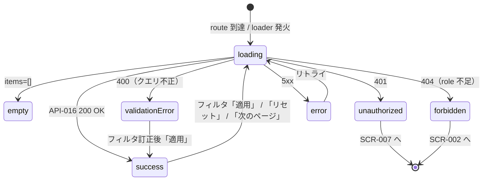

# SCR-010 — 監査ログ一覧

## 目的

`auditor` または `admin` が AuditLog エントリ全件をフィルタ付きで一覧する画面（UC-015）。一覧では PII 配慮（NFR-005）として `reason_present: boolean` のみ表示し、reason 本体は詳細画面（`SCR-011`）でのみ確認可能（API-016 と整合、REQ-012）。

## アクター

- 主アクター: `auditor` / `admin`
- 想定権限: `auditor` または `admin` 必須。`user` / `reviewer` は 404、guest は 401（API-016 が強制、NFR-003）
- 想定デバイス: PC 主、モバイル副

## 画面項目

| 項目名 | 型 | 必須 | 初期値 | バリデーション | 参照 API |
| --- | --- | --- | --- | --- | --- |
| フィルタ：actor_id | text（`Input`） | no | （空） | UUID v7 形式（任意）。空ならフィルタなし。**送信時は server-side で再検証**（API-016 の `actor_id`） | API-016 |
| フィルタ：action | multi-select（`Select` 複数選択、8 値: submit / start_review / approve / return / reject / resubmit / publish / withdraw） | no | （全件） | enum 検証、CSV パース。**送信時は server-side で再検証** | API-016 |
| フィルタ：target_proposal_id | text（`Input`） | no | （空） | UUID v7 形式（任意）。**送信時は server-side で再検証** | API-016 |
| フィルタ：from（期間 from） | datetime-local（`DatePicker`） | no | （空） | datetime → Unix epoch millis 変換 | API-016 |
| フィルタ：to（期間 to） | datetime-local（`DatePicker`） | no | （空） | from < to を UI でも一次チェック。**送信時は server-side で再検証**（`from > to` で 400） | API-016 |
| 「適用」ボタン | button（`Button`） | yes（フィルタ適用時） | enabled | クリックで loader 再実行 | API-016 |
| 「リセット」ボタン | button（`Button` variant=outline） | no | enabled | クリックでフィルタを全クリア + loader 再実行 | API-016 |
| AuditLog テーブル：created_at | datetime（読み取り専用） | yes | API-016 から取得 | `YYYY-MM-DD HH:mm:ss` 形式 | API-016 |
| AuditLog テーブル：actor_id | text | yes | API-016 から取得 | 表示用に短縮（先頭 8 文字 + ...） | API-016 |
| AuditLog テーブル：actor_role バッジ | enum（`Badge`） | yes | API-016 から取得 | `user` / `reviewer` / `admin` / `auditor` のいずれかのスナップショット | API-016 |
| AuditLog テーブル：action バッジ | enum（`Badge`、8 値） | yes | API-016 から取得 | 色分け（暫定: submit=blue / start_review=cyan / approve=green / return=orange / reject=red / resubmit=blue / publish=teal / withdraw=purple） | API-016 |
| AuditLog テーブル：target_proposal_id | text（読み取り専用） | yes | API-016 から取得 | 表示のみ（**本文遷移リンクなし**、Q-016 暫定で auditor は本文不到達） | API-016 |
| AuditLog テーブル：before → after | text（`before_status → after_status`） | yes | API-016 から取得 | NULL は「—」表示 | API-016 |
| AuditLog テーブル：reason_present | boolean（`Checkbox` icon、disabled） | yes | API-016 から取得 | `true` は「あり」アイコン、`false` は「なし」。**reason 本体は表示しない**（NFR-005 PII 除外） | API-016 |
| AuditLog テーブル：詳細遷移 | リンク（行クリック） | yes | — | クリックで `SCR-011` へ遷移（`/audit/logs/{audit_log_id}`） | API-017（遷移先） |
| ページネーション「次のページ」 | button | no | `has_more=false` のとき非表示 | `next_cursor` を URL クエリに付与 | API-016 |
| 空状態メッセージ | static text | yes（0 件時） | 「該当する監査ログはありません」 | — | — |

> shadcn/ui コンポーネント候補: `Table`（PC）/ `Card`（モバイル）/ `Badge` / `Input` / `Select` / `DatePicker`（カスタム）/ `Button` / `Pagination` / `Skeleton`。
> 本画面は GET のみ。CSRF 検証は API-016 側で不要（読み取り）。
> **重要（NFR-005 PII 配慮）**: 一覧では reason 本体を **絶対に表示しない**。`reason_present: boolean` のみで存在を示す。reason 本体の取得は SCR-011 詳細画面のみ。

## 操作フロー (UC 単位)

### 監査ログ一覧の閲覧とフィルタ（UC-015）

1. 利用者がこの画面に到達する条件: ヘッダの「監査ログ」リンクから `/audit/logs` にアクセス。loader が cookie + role 検証（auditor / admin のみ）。
2. 主シナリオ:
   1. loader が API-016 を呼び出す（フィルタなし、デフォルト 50 件、`created_at DESC`）。
   2. 200 OK → テーブルで一覧表示。`reason_present=true` の行は「あり」アイコンを表示。
   3. フィルタを変更（actor_id / action / target_proposal_id / from / to）→「適用」押下 → URL に query を付与して再 loader。
   4. 行クリック → `SCR-011`（`/audit/logs/{audit_log_id}`）へ遷移。
3. 例外シナリオ:
   - 401 → SCR-007 へ。
   - 404（user / reviewer が到達した場合）→ 「このページにはアクセスできません」+ SCR-002 へ戻る。
   - 400 VALIDATION_ERROR（`from > to`、UUID 形式不正、`limit` 範囲外、`action` の値不正）→ フィルタフォーム上にエラーメッセージ。
   - 5xx → エラー境界 + リトライ。

## 状態遷移

## エラー・空状態

| 状況 | 表示 | 動線 |
| --- | --- | --- |
| 0 件（フィルタ無し） | 中央寄せ「該当する監査ログはありません」 | — |
| 0 件（フィルタ後） | 「該当するログがありません（フィルタ：action=approve）」 | 「フィルタを解除する」リンク |
| 認証切れ（401） | Toast「セッションが切れました」 | SCR-007 へリダイレクト |
| role 不足（404、user / reviewer） | 「このページにはアクセスできません」 | SCR-002 へのリンク |
| クエリ不正（400、`from > to`、UUID 不正、`action` enum 外） | フィルタフォーム上にエラー表示「期間 from は期間 to より前にしてください」等 | エラーフィールドにフォーカス |
| ネットワーク / 5xx | エラー境界 | リトライ |

## アクセシビリティ

- フォーカス順序: ヘッダ → フィルタ群（actor → action → target → from → to → 「適用」→「リセット」）→ テーブル各行 → ページネーション
- ラベル付け: 各 `Input` / `Select` / `DatePicker` に `<label>`、テーブルヘッダ `<th scope="col">`、`reason_present` アイコンに `aria-label="判断理由あり / なし"`、action / actor_role バッジに `aria-label`
- キーボード操作: Tab で順次、Enter で行クリック → SCR-011

## 権限による表示分岐

| ロール | 表示される items |
| --- | --- |
| guest | 401 → SCR-007 |
| user | 404 → SCR-002 |
| reviewer | 404 → SCR-002 |
| auditor | 全件（メタ情報のみ、reason 本体は SCR-011 で reason 全文表示可） |
| admin | 全件（メタ情報のみ、SCR-011 で reason 全文表示可） |

> auditor は `target_proposal_id` を表示するが、本文遷移リンクは表示しない（Q-016 暫定で本文不到達、API-011 / API-013 が 404 を返す）。admin の場合は target proposal の本文閲覧経路を別途 SCR-003 / SCR-006 / SCR-009 経由で持つが、本画面からの直リンクは MVP では提供しない（Phase 5 で詳細）。

## 参照

- 上流: `docs/02-requirements/02-functional-requirements.md` の REQ-010 / REQ-011 / REQ-012 / REQ-015、`docs/02-requirements/03-non-functional-requirements.md` の NFR-002〜007（特に NFR-004 append-only / NFR-005 PII 除外）、`docs/02-requirements/04-business-rules.md` の `BR-AUDIT-01` / `BR-AUDIT-02`、`docs/10-basic-design/01-system-overview.md` の UC-015、`docs/10-basic-design/03-screen-list.md`、`docs/00-discovery/07-open-questions.md` の Q-016
- 下流: `docs/20-detail-design/apis/API-016.md`、TASK-XXX（Phase 5）
