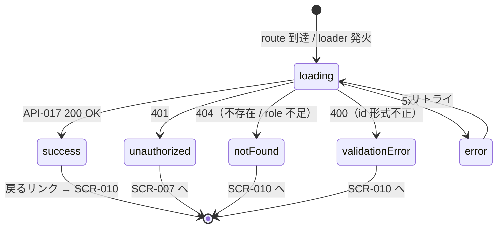

# SCR-011 — 監査ログ詳細

## 目的

`auditor` または `admin` が AuditLog エントリ 1 件のメタ情報（reason 本体含む）を表示する詳細画面（UC-015）。reason 全文を表示するが、target proposal の本文プレビューは表示しない（Q-016 暫定で本文不到達、API-017 と整合、REQ-012）。

## アクター

- 主アクター: `auditor` / `admin`
- 想定権限: `auditor` または `admin` 必須。`user` / `reviewer` は 404、guest は 401（API-017 が強制、NFR-003）
- 想定デバイス: PC 主、モバイル副

## 画面項目

| 項目名 | 型 | 必須 | 初期値 | バリデーション | 参照 API |
| --- | --- | --- | --- | --- | --- |
| 戻るリンク（SCR-010 へ） | リンク | yes | — | クリックで SCR-010 へ戻る（フィルタ状態を URL query で保持） | — |
| audit_log_id | text（読み取り専用） | yes | API-017 から取得 | 表示のみ（先頭 8 文字 + ... の形式 + コピーボタン） | API-017 |
| created_at | datetime（読み取り専用） | yes | API-017 から取得 | `YYYY-MM-DD HH:mm:ss` 形式 | API-017 |
| actor_id | text（読み取り専用） | yes | API-017 から取得 | 表示のみ（短縮 + コピーボタン） | API-017 |
| actor_role バッジ | enum（`Badge`） | yes | API-017 から取得 | スナップショット（記録時のロール、現在のロールではない） | API-017 |
| action バッジ | enum（`Badge`、8 値） | yes | API-017 から取得 | 色分け（SCR-010 と同色規約） | API-017 |
| target_proposal_id | text（読み取り専用） | yes | API-017 から取得 | 表示のみ。**本文プレビューへの遷移リンクなし**（Q-016 暫定で auditor は本文不到達） | API-017 |
| before_status / after_status | text（`before_status → after_status`） | yes | API-017 から取得 | NULL は「—」表示 | API-017 |
| before_visibility / after_visibility | text | no | API-017 から取得 | MVP では常に NULL → 表示しない or 「—」 | API-017 |
| reason 本体 | text（読み取り専用、`Card` content、`<pre>` で改行保持） | no | API-017 から取得 | 表示のみ。NULL の場合は「（理由なし）」表示 | API-017 |
| policy_agreement_id | text（読み取り専用、submit / resubmit のみ） | no | API-017 から取得 | 該当時のみ表示。短縮 + コピーボタン | API-017 |
| エラー表示エリア | `Alert` | no | hidden | API エラー時の表示 | — |

> shadcn/ui コンポーネント候補: `Card` / `Badge` / `Separator` / `Button`（コピーボタン）/ `Skeleton` / `Alert`。
> 本画面は GET のみ。CSRF 検証は API-017 側で不要（読み取り）。
> **重要（NFR-005 PII 配慮）**: reason 本体を表示するため、画面アクセスは auditor / admin に限定（API-017 が強制）。reason をクリップボードにコピーする UI は用意しない（PII 拡散防止、暫定方針）。
> **重要（NFR-004 append-only）**: 本画面は閲覧専用。AuditLog の編集 / 削除 UI は **絶対に提供しない**（API-017 も read のみ、NFR-004）。

## 操作フロー (UC 単位)

### 監査ログ詳細の閲覧（UC-015）

1. 利用者がこの画面に到達する条件: SCR-010 の行クリックから `/audit/logs/{audit_log_id}` に到達。loader が cookie + role 検証（auditor / admin のみ）。
2. 主シナリオ:
   1. loader が API-017 を呼び出す。
   2. 200 OK → audit_log_id / created_at / actor / actor_role / action / target_proposal_id / before→after / reason / policy_agreement_id を表示。
   3. reason 本体は `<pre>` ブロックで改行・空白を保持して表示。
   4. 戻るリンクで SCR-010 に戻る（フィルタ状態保持）。
3. 例外シナリオ:
   - 401 → SCR-007 へ。
   - 404（不存在 / user / reviewer がアクセス） → 「該当のログが見つかりません」+ SCR-010 へ戻る。
   - 400 VALIDATION_ERROR（`id` 形式不正） → 「URL が正しくありません」+ SCR-010 へ戻る。
   - 5xx → エラー境界 + リトライ。

## 状態遷移

> 本画面は閲覧専用で mutation を発生させない。CSRF 検証は不要（NFR-006、GET のみ）。

## エラー・空状態

| 状況 | 表示 | 動線 |
| --- | --- | --- |
| 不存在 / role 不足（404） | 「該当のログが見つかりません」 | SCR-010 へ戻る |
| 認証切れ（401） | Toast「セッションが切れました」 | SCR-007 へリダイレクト |
| `id` 形式不正（400） | 「URL が正しくありません」 | SCR-010 へ戻る |
| reason が NULL の場合 | reason エリアに「（理由なし）」と表示 | — |
| ネットワーク / 5xx | エラー境界 | リトライ |

## アクセシビリティ

- フォーカス順序: ヘッダ → 戻るリンク → エントリ ID 表示 → メタ情報（actor / action / target / before→after）→ reason 本体 → policy_agreement_id（該当時）
- ラベル付け: 各バッジに `aria-label`、reason 本体は `<section aria-labelledby="reason-heading">`、`<pre>` には `aria-label="判断理由本文"`
- キーボード操作: Tab で順次、Enter で戻るリンクとコピーボタンを発火

## 権限による表示分岐

| ロール | 表示される情報 |
| --- | --- |
| guest | 401 → SCR-007 |
| user | 404 → SCR-010（実質的にはアクセス自体不可） |
| reviewer | 404 → SCR-010 |
| auditor | 全フィールド（reason 本体含む）。target proposal への遷移リンクなし |
| admin | 全フィールド。target proposal への遷移リンクは MVP では未提供（Phase 5 で再評価） |

> auditor / admin の閲覧範囲は同等（reason 本体を含む）。本画面から target proposal の本文に遷移する経路は MVP では提供しない（Q-016 暫定）。

## 参照

- 上流: `docs/02-requirements/02-functional-requirements.md` の REQ-010 / REQ-011 / REQ-012 / REQ-015、`docs/02-requirements/03-non-functional-requirements.md` の NFR-002〜007（特に NFR-004 append-only / NFR-005 PII 配慮）、`docs/02-requirements/04-business-rules.md` の `BR-AUDIT-01` / `BR-AUDIT-02`、`docs/10-basic-design/01-system-overview.md` の UC-015、`docs/10-basic-design/03-screen-list.md`、`docs/00-discovery/07-open-questions.md` の Q-016
- 下流: `docs/20-detail-design/apis/API-017.md`、TASK-XXX（Phase 5）
