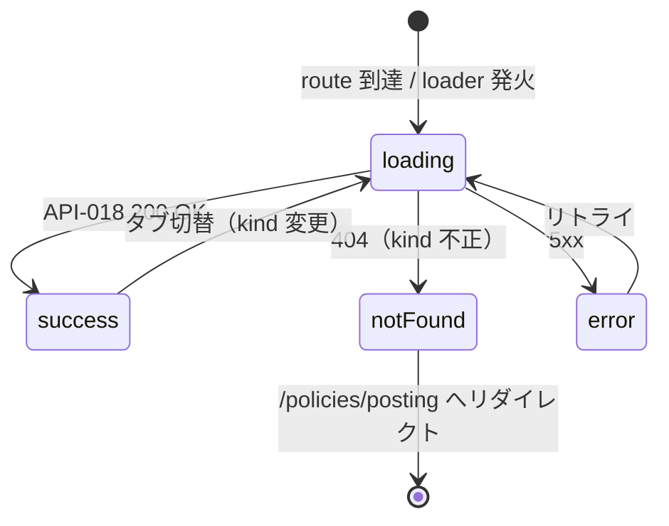

# SCR-012 — ポリシーページ（投稿ポリシー / プライバシー）

## 目的

投稿ポリシー（`posting`）またはプライバシーポリシー（`privacy`）の文書をログイン不要で閲覧する公開ページ（UC-017）。`SCR-004` の倫理ガード経由のリンクや、フッタからの遷移で利用される。`policy_version` を表示してバージョン明示を行う（REQ-013 / REQ-014、API-018 と整合）。

## アクター

- 主アクター: ゲスト / 全ロールのログイン済ユーザ
- 想定権限: 不要（公開バイパス対象、API-018 が公開バイパス）
- 想定デバイス: PC / モバイル両対応

## 画面項目

| 項目名 | 型 | 必須 | 初期値 | バリデーション | 参照 API |
| --- | --- | --- | --- | --- | --- |
| ポリシー切替タブ（投稿ポリシー / プライバシー） | tabs（`Tabs`） | yes | URL の `kind` パラメータに従う（`/policies/posting` or `/policies/privacy`） | enum 検証（`posting` / `privacy`）。**送信時は server-side で再検証**（API-018 の `kind` パスパラメータ） | API-018 |
| 文書タイトル | text（読み取り専用） | yes | API-018 から取得 | 表示のみ（`<h1>`） | API-018 |
| `policy_version` 表示 | text（読み取り専用、`Badge`） | yes | API-018 から取得 | 表示のみ。MVP では `mvp-initial` リテラル | API-018 |
| `last_modified_at` | datetime（読み取り専用） | yes | API-018 から取得 | `YYYY-MM-DD` 形式 | API-018 |
| ポリシー本文 | markdown（読み取り専用、レンダリング済み） | yes | API-018 から取得 | 表示のみ。**XSS 対策として markdown レンダラ経由でサニタイズ**（NFR-006: `dangerouslySetInnerHTML` 禁止、API-018 と整合） | API-018 |
| 戻るリンク（前画面 referrer） | リンク | yes | — | クリックで前画面に戻る（referrer がなければ SCR-002） | — |
| ポリシー切替リンク（フッタ） | リンク | yes | — | もう一方の kind ページへ遷移 | API-018 |

> shadcn/ui コンポーネント候補: `Tabs` / `Card` / `Badge` / `Skeleton` / markdown レンダラ（外部、Phase 5 で確定。例: `react-markdown` + `rehype-sanitize`）。
> 本画面は GET のみ。公開バイパス対象（API-018）。CSRF 検証は不要（NFR-006、GET）。
> **重要（NFR-006 XSS 対策）**: markdown 本文の HTML レンダリングは sanitize 済みのレンダラを必ず経由。生 HTML の `dangerouslySetInnerHTML` は禁止。

## 操作フロー (UC 単位)

### UC-017 — ポリシー文書の閲覧

1. 利用者がこの画面に到達する条件:
   - フッタの「投稿ポリシー」「プライバシーポリシー」リンクから `/policies/posting` または `/policies/privacy` にアクセス。
   - SCR-004 の倫理ガードチェックボックス近傍のリンクから新規タブで開く。
   - 直 URL アクセス。
2. 主シナリオ:
   1. loader が API-018 を呼び出す（`kind` パスパラメータ）。
   2. 200 OK → タイトル / `policy_version` / `last_modified_at` / 本文を表示。
   3. タブ切替で `posting` ↔ `privacy` を URL 変更 + loader 再実行（または client-side router で kind を変更）。
3. 例外シナリオ:
   - 404 NOT_FOUND（`kind` enum 外、URL タイプミス等） → 「該当のポリシー文書が見つかりません」+ `/policies/posting` へのリンク。
   - 5xx INTERNAL_ERROR（文書ファイル読み込み失敗等） → 「ポリシー文書を取得できませんでした」+ リトライ。
   - ネットワーク不通 → 「ネットワークに接続できませんでした」+ リトライ。

## 状態遷移

> 本画面は公開バイパス対象。401 / 404（認可違反）は発生しない（401 はそもそもログイン不要、404 は `kind` 不正のみ）。

## エラー・空状態

| 状況 | 表示 | 動線 |
| --- | --- | --- |
| `kind` enum 外（404） | 「該当のポリシー文書が見つかりません」全画面 fallback | `/policies/posting` へのリンク |
| 文書本文が空文字（運用ミス） | 本文エリアに「文書が用意されていません」を表示し、loader は成功扱い | フィードバック導線（運営に問い合わせ等、MVP では未実装） |
| ネットワーク不通 | エラー境界「ネットワークに接続できませんでした」 | リトライ |
| サーバエラー（5xx） | エラー境界「ポリシー文書を取得できませんでした」 | リトライ |

## アクセシビリティ

- フォーカス順序: ヘッダ → タブ（投稿ポリシー / プライバシー）→ 文書タイトル（`<h1>`）→ `policy_version` バッジ → 本文 → フッタ
- ラベル付け: `Tabs` は shadcn/ui のデフォルトで `role="tablist"` / `role="tab"` / `aria-selected` を持つ。文書本文は `<article>` でラップ
- キーボード操作: Tab で順次、矢印キーで Tabs 切替（shadcn/ui のデフォルト挙動）

## 権限による表示分岐

| ロール | 表示 |
| --- | --- |
| guest | 全閲覧可（公開バイパス） |
| user / reviewer / admin / auditor | 同上 |

> 本画面は公開バイパス対象（API-018）であり、ロールによる表示分岐はない。ヘッダ / フッタの「ログイン」「ログアウト」表示のみ viewer 状態に応じて出し分け。

## 参照

- 上流: `docs/02-requirements/02-functional-requirements.md` の REQ-013 / REQ-014、`docs/02-requirements/03-non-functional-requirements.md` の NFR-002 / NFR-006 / NFR-007、`docs/02-requirements/04-business-rules.md` の `BR-GUARD-02`、`docs/10-basic-design/01-system-overview.md` の UC-017、`docs/10-basic-design/03-screen-list.md`、`docs/00-discovery/07-open-questions.md` の Q-008
- 下流: `docs/20-detail-design/apis/API-018.md`、TASK-XXX（Phase 5）
