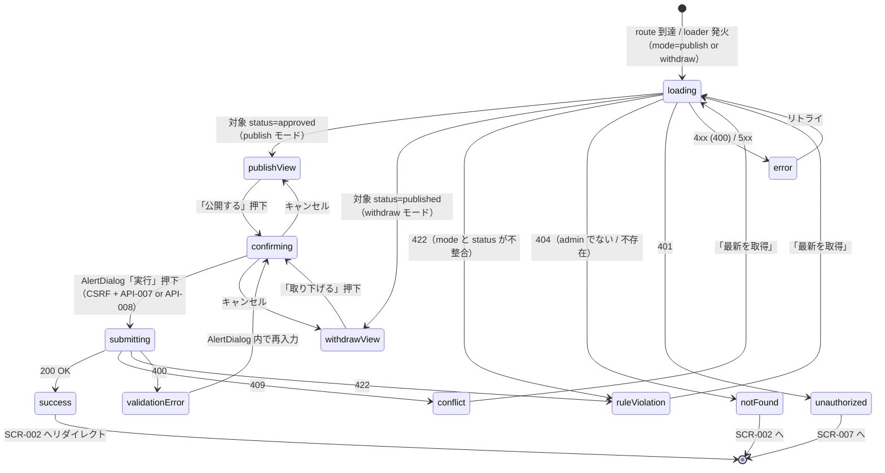

# SCR-013 — 公開操作画面（公開・取り下げ）

## 目的

`admin` 専権で `approved` 投稿を公開（`approved → published`、UC-007）、および `published` 投稿を取り下げ（`published → withdrawn`、UC-008）する画面（REQ-004 / REQ-005、`BR-PUBLISH-01` / `BR-PUBLISH-03`）。投稿者本人視点の `SCR-006` やレビュー視点の `SCR-009` とは独立し、admin の運用文脈（取り下げ後は本文非表示の警告など）に最適化された UI を提供する。

> 注記: 基本設計 `docs/10-basic-design/03-screen-list.md` の SCR-013 定義（admin 公開操作）に従う。RC-005（visibility 変更）は `needs-clarification` のため、本画面では visibility 変更操作を提供しない（DB-003 不変条件 7、Phase 5 / RC-005 確定後に拡張検討）。

## アクター

- 主アクター: `admin`
- 想定権限: `admin` のみ。`reviewer` / `user` / `auditor` は 404、guest は 401（API-007 / API-008 が強制、`BR-PUBLISH-01` / `BR-AUTHZ-01〜03`）
- 想定デバイス: PC 主、モバイル副

## 画面項目

| 項目名 | 型 | 必須 | 初期値 | バリデーション | 参照 API |
| --- | --- | --- | --- | --- | --- |
| 操作モード切替（公開 / 取り下げ） | tabs（`Tabs`、2 値: publish / withdraw） | yes | URL の `mode` クエリに従う（既定値 `publish`） | enum 検証（`publish` / `withdraw`） | — |
| 対象 proposal_id | text（`Input`、URL クエリで受領も可） | yes | URL の `id` クエリ or 検索選択結果 | UUID v7 形式。**送信時は server-side で再検証**（API-007 / API-008） | API-007 / API-008 |
| 対象投稿のメタ情報表示 | `Card` | yes | loader で API-021 (`getProposalForAdmin`) を呼ぶ（B-1 確定、admin 専権、全 visibility・全 status 対応）| 表示のみ。タイトル / 現 status / visibility / author_id / submitted_at / approved_at（DB-003 由来、MAJOR-3 で追加）/ published_at（withdraw 時）/ assignee_id（補助情報）| API-021 |
| 本文プレビュー | text（読み取り専用、`Card` content） | yes | 同上 | 表示のみ。最大 10,000 文字 | 同上 |
| 公開モード：「公開する」ボタン | button（`Button` variant=default） | yes（publish モード） | enabled | 押下で AlertDialog → reason（任意）入力 → API-007 を `expected_version` 付きで呼び出し | API-007 |
| 取り下げモード：reason 入力欄 | textarea（`Textarea`） | yes（withdraw モード） | （空） | trim 後 1〜4000 文字（`BR-PUBLISH-03`、API-008 の必須）。**送信時は server-side で再検証** | API-008 |
| 取り下げモード：「取り下げる」ボタン | button（`Button` variant=destructive） | yes（withdraw モード） | enabled | 押下で確認の強い AlertDialog（「取り下げ後は本文が非表示になります」）→ API-008 を `expected_version` 付きで呼び出し | API-008 |
| 公開モード：reason 入力欄 | textarea（`Textarea`） | no（任意、Q-019 暫定） | （空） | 任意。指定する場合は trim 後 1〜4000 文字 | API-007 |
| 確認 AlertDialog | `AlertDialog` | yes（実行時） | hidden | reason textarea + 「実行」「キャンセル」+ destructive variant（withdraw 時） | — |
| `expected_version` | hidden（数値） | yes（mutation 時） | loader で取得 | server-side で CAS 検証 → 不一致時 409 | API-007 / API-008 |
| 「最新を取得」ボタン | button | no | — | クリックで loader 再実行 | API-021 |
| エラー表示エリア | `Alert` | no | hidden | API エラー時の表示 | — |

> shadcn/ui コンポーネント候補: `Tabs` / `Card` / `Badge` / `Button` / `AlertDialog` / `Textarea` / `Input` / `Skeleton` / `Toast`。
> **server-side 検証の徹底（NFR-003 / PROB-005）**: reason の必須・文字数チェックは API-007 / API-008 側で再実施。UI 側の disabled は UX 補助。
> **CSRF 対策（NFR-006）**: 「公開する」「取り下げる」は mutation。送信時 `SameSite=Lax` cookie + `Origin` / `Sec-Fetch-Site=same-origin` を API 側で検証。
> **重要（REQ-005）**: 取り下げ後、対象投稿の本文は API-010 / API-011 / API-013 のいずれからも 404 で隠蔽される（admin は API-021 経由で経緯確認可能）。本画面の AlertDialog では「取り下げ後は本文が一般閲覧経路から非表示になります」を強調表示する。

## 操作フロー (UC 単位)

### 公開 status=approved → published（UC-007）

1. 利用者がこの画面に到達する条件: admin が `SCR-009`（approved 投稿のレビュー詳細）の「公開する」リンク経由、または `/admin/publish?id=...` で直接到達。loader が cookie + admin role 検証。
2. 主シナリオ:
   1. loader で対象投稿を取得（status=approved を確認、それ以外は 422 表示）。
   2. メタ情報 + 本文プレビューを表示。
   3. reason 入力欄（任意）→「公開する」ボタン押下 → AlertDialog「公開しますか？」。
   4. 「公開」確定 → API-007 を `expected_version` 付きで呼び出し。
   5. 200 OK → status=published に更新、Toast「公開しました」+ `SCR-002`（公開投稿一覧）または `SCR-003`（公開された投稿の詳細）へリダイレクト。
3. 例外シナリオ:
   - 401 → SCR-007 へ。
   - 404（admin でない、または投稿不存在）→ 「このページの操作は実行できません」+ SCR-002 へ戻る。
   - 422（status != approved）→ 「この投稿はすでに別の状態です」+ 「最新を取得」。
   - 409 → 「投稿が更新されました。最新を取得してください」+ 「最新を取得」。
   - 5xx → エラー境界 + リトライ。

### 取り下げ status=published → withdrawn（UC-008）

1. 利用者がこの画面に到達する条件: admin が published 投稿を取り下げる目的で `/admin/withdraw?id=...` で到達。
2. 主シナリオ:
   1. loader で対象投稿を取得（status=published を確認）。
   2. メタ情報 + 本文プレビューを表示。
   3. reason 入力欄（必須）に取り下げ理由を記入（PII を含めない運用ガイドライン、NFR-005）。
   4. 「取り下げる」ボタン押下 → AlertDialog（destructive variant）「取り下げ後は本文が一般閲覧経路から非表示になります。よろしいですか？」。
   5. 「取り下げる」確定 → API-008 を `expected_version` 付きで呼び出し。
   6. 200 OK → status=withdrawn に更新、Toast「取り下げました」+ `SCR-002` へリダイレクト（取り下げ済み投稿は SCR-002 / SCR-003 / SCR-006 のいずれからも 404 で隠蔽、REQ-005）。
3. 例外シナリオ:
   - 400（reason 空 / 4000 文字超）→ AlertDialog 内エラー「理由は 1〜4000 文字で入力してください」。
   - 401 / 404 / 409 / 422 / 5xx は UC-007 と同様。
   - 422 で「`status != 'published'`」を理由とする場合、特に「`approved` から直接 `withdrawn` への遷移は不可」を表示（REQ-005、`BR-PUBLISH-03`）。

## 状態遷移

## エラー・空状態

| 状況 | 表示 | 動線 |
| --- | --- | --- |
| 不存在 / role 不足（404、admin 以外） | 「このページにはアクセスできません」 | SCR-002 へリダイレクト |
| 認証切れ（401） | Toast「セッションが切れました」 | SCR-007 へリダイレクト |
| reason 空 / 4000 文字超（400、withdraw 時） | AlertDialog 内 textarea 直下「取り下げ理由は 1〜4000 文字で入力してください」 | textarea にフォーカス |
| 楽観ロック競合（409） | バナー「投稿が更新されました。最新を取得してください」 | 「最新を取得」ボタン |
| 状態遷移違反（422、`status != 'approved'` for publish / `status != 'published'` for withdraw） | バナー「この投稿はすでに別の状態です（現在: <status>）」 | 「最新を取得」 |
| 状態遷移違反（特に `approved → withdrawn` 直接遷移を試みた場合） | バナー「approved から直接 withdrawn への遷移はできません。先に publish してください」 | mode を `publish` に切替 |
| CSRF 違反（403、API 側で 404 として隠蔽） | バナー「セキュリティ検証に失敗しました」 | 「再読み込み」 |
| ネットワーク / 5xx | エラー境界 | リトライ |

## アクセシビリティ

- フォーカス順序: ヘッダ → 戻るリンク → モード切替 Tabs → 対象投稿メタ情報 → 本文プレビュー → reason 入力欄 → 実行ボタン
- ラベル付け: 各バッジに `aria-label`、reason textarea に `<label>`、AlertDialog は focus trap、destructive variant のボタンには `aria-label="取り下げる（破壊的操作）"` を付与
- キーボード操作: Tab で順次、Enter でボタン発火、Escape で AlertDialog のキャンセル

## 権限による表示分岐

| ロール / 対象 status | approved（publish モード） | published（withdraw モード） | その他 status |
| --- | --- | --- | --- |
| guest | 401 → SCR-007 | 401 | 401 |
| user | 404 → SCR-002 | 404 | 404 |
| reviewer | 404 → SCR-002（`BR-PUBLISH-01` により reviewer は publish 不可） | 404 | 404 |
| admin | 「公開する」表示 | 「取り下げる」表示 | 422 → 「最新を取得」 |
| auditor | 404 → SCR-002 | 404 | 404 |

> 本画面は admin 専権（`BR-PUBLISH-01` / `BR-PUBLISH-03`）。reviewer であっても publish / withdraw は実行不可（API-007 / API-008 が 404 を返す）。

## 参照

- 上流: `docs/02-requirements/02-functional-requirements.md` の REQ-004 / REQ-005 / REQ-010 / REQ-011 / REQ-015、`docs/02-requirements/03-non-functional-requirements.md` の NFR-002〜007、`docs/02-requirements/04-business-rules.md` の `BR-PUBLISH-01` / `BR-PUBLISH-03` / `BR-AUTHZ-01〜03`、`docs/10-basic-design/01-system-overview.md` の UC-007 / UC-008、`docs/10-basic-design/03-screen-list.md`、`docs/00-discovery/07-open-questions.md` の Q-019
- 下流: `docs/20-detail-design/apis/API-007.md`、`API-008.md`、`API-021.md`（admin 専用 proposal viewer、B-1 採番済）、TASK-XXX（Phase 5）
