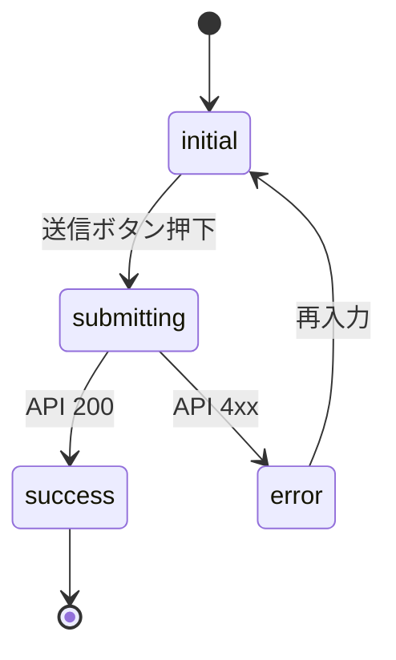

# SCR-XXX — <短い和名>

> 新規画面を作るときはこのファイルをコピーし、`SCR-XXX.md` にリネームして使うこと。
> Front-matter の `id` とファイル名（拡張子除く）は完全一致させる。

## 目的

この画面が利用者に提供する価値を 1〜3 行で記述する。基本設計の対応 UC と一貫させる。

## アクター

- 主アクター:
- 想定権限: (例: 認証済 / 一般ユーザ)
- 想定デバイス: PC / モバイル / 両方

## 画面項目

| 項目名 | 型 | 必須 | 初期値 | バリデーション | 参照 API |
| --- | --- | --- | --- | --- | --- |
| 例: メールアドレス | text | yes | (空) | RFC5322 互換、最大 254 文字 | API-XXX |
| 例: パスワード | password | yes | (空) | 8 文字以上、英数字混在 | API-XXX |
|  |  |  |  |  |  |

## 操作フロー (UC 単位)

### UC-XXX — <ユースケース名>

1. 利用者がこの画面に到達する条件:
2. 主シナリオ:
   1. ...
   2. ...
3. 例外シナリオ:
   - ...

## 状態遷移

## エラー・空状態

| 状況 | 表示 | 動線 |
| --- | --- | --- |
| ネットワーク不通 |  |  |
| 認証切れ |  |  |
| バリデーションエラー |  |  |
| 検索結果 0 件 |  |  |

## アクセシビリティ

- フォーカス順序:
- ラベル付け:
- キーボード操作:

## 参照

- 上流: REQ-XXX, UC-XXX
- 下流: API-XXX, TASK-XXX
